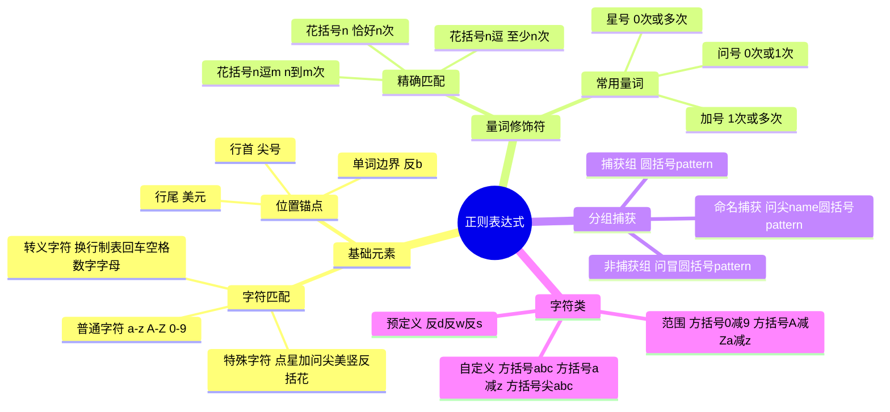
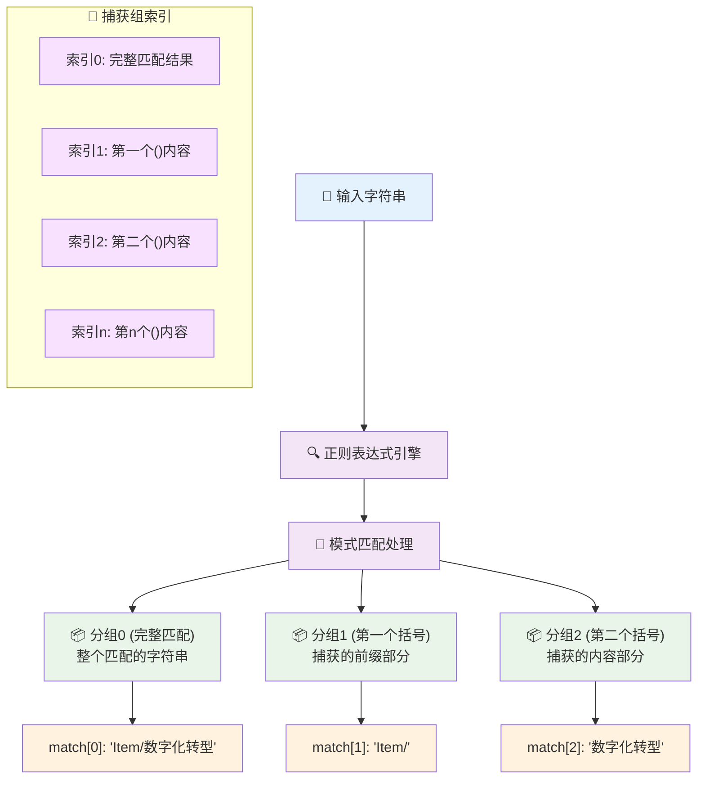
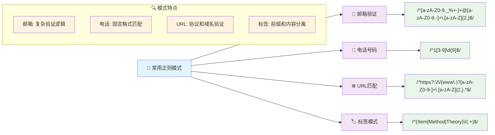
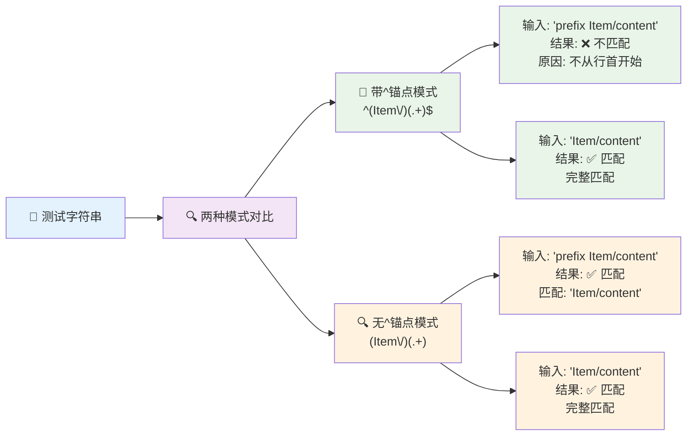
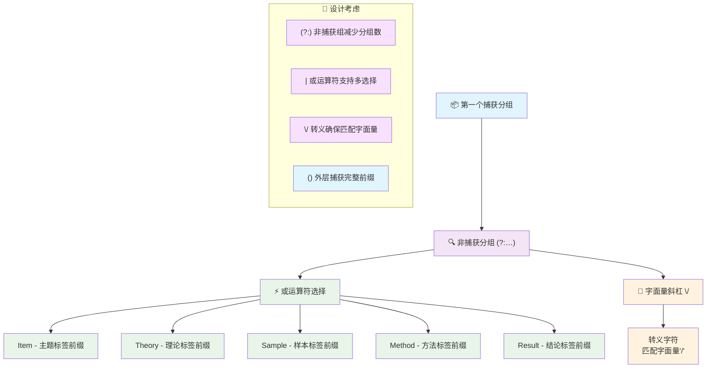
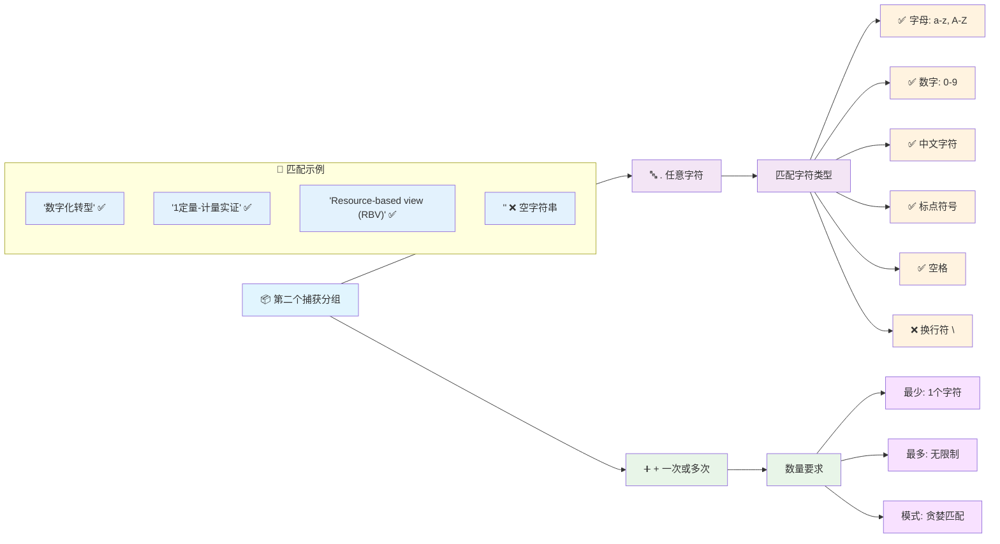
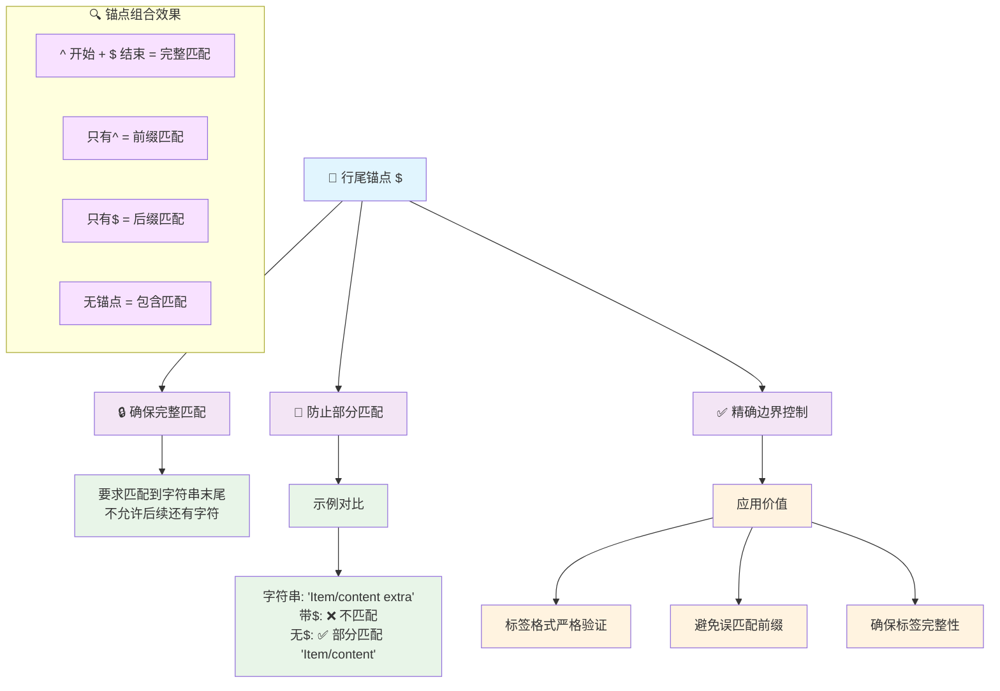
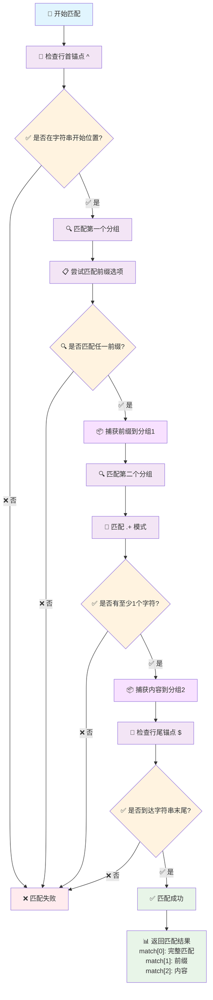
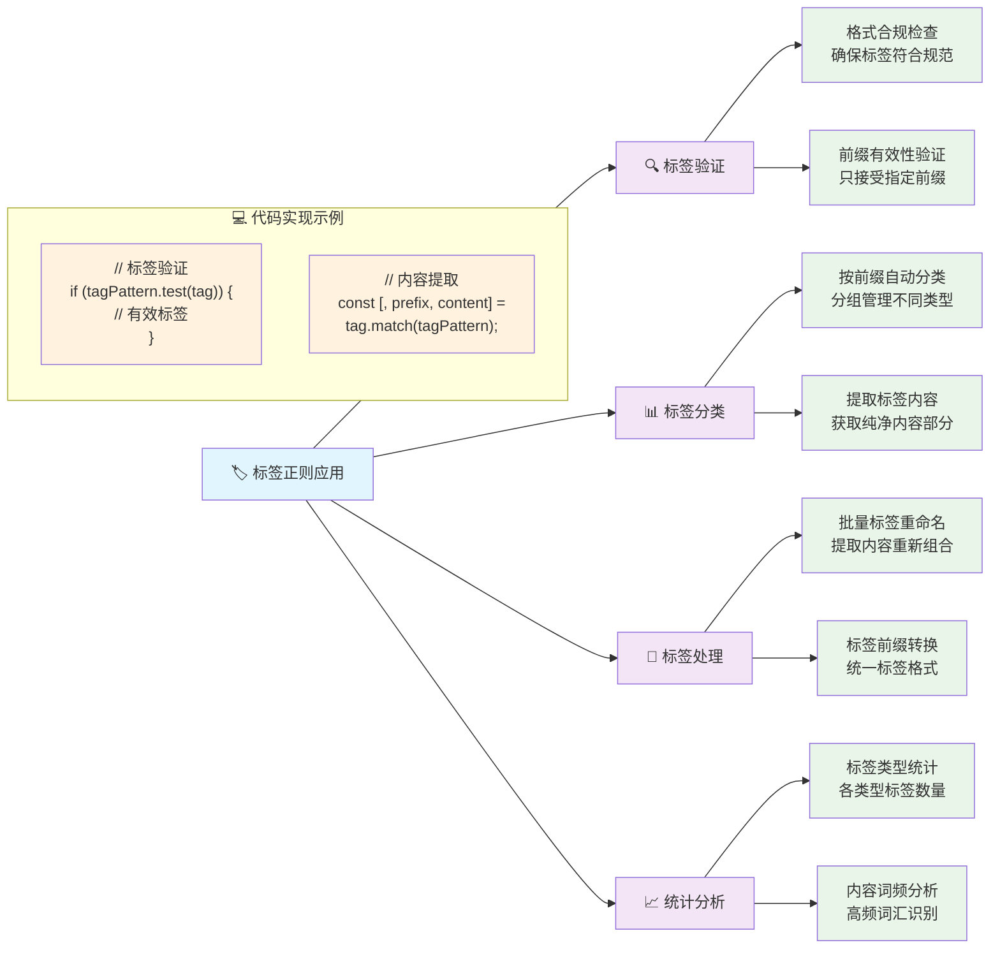
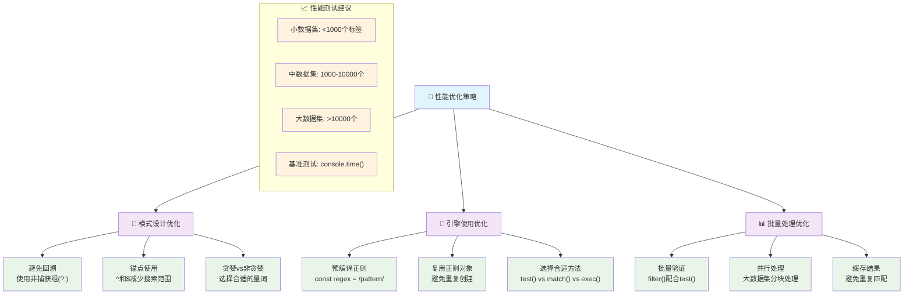

---
System:
- Project
Process:
- 4-WorkProjects
Class:
- 02TS
Project:
- BuildZotero
Title: ZoteroScript-P0-M1标签展示V1
DateCreated: 2026-01-17 17:37
DateModified: 2026-04-18 17:38
Type:
- doc
Status:
- doing
Version:
- v1.0
CardStatus: false
CardType:
- card-fleeting
tags:
- Topic/工具技能/工作笔记
- 标签匹配
- 代码
- 九脚本生态
- 模式识别
- 数据验证
- 正则表达式
- 字符串处理
- JavaScript
- Zotero
- Pattern/Method
RelatedNote:
RelatedProjects:
CardRecord: ''
---

## ZoteroScript-P0-M1 标签展示 V1

### 第一部分：完整代码

```regex
^((?:Item|Theory|Sample|Method|Result)\/)(.+)$
```

#### 应用示例代码

```javascript
// JavaScript中的使用示例
const tagPattern = /^((?:Item|Theory|Sample|Method|Result)\/)(.+)$/;

// 测试标签匹配
const testTags = [
  "Item/数字化转型",
  "Method/1定量-计量实证", 
  "Theory/Resource-based view (RBV)",
  "Sample/1中观-企业",
  "Result/技术创新显著促进企业绩效",
  "无前缀标签",
  "Other/不匹配前缀"
];

testTags.forEach(tag => {
  const match = tag.match(tagPattern);
  if (match) {
    console.log(`✅ 匹配: ${tag}`);
    console.log(`   前缀: ${match[1]}`);
    console.log(`   内容: ${match[2]}`);
  } else {
    console.log(`❌ 不匹配: ${tag}`);
  }
});
```


### 第二部分：正则表达式基础知识

#### 正则表达式核心概念




#### 正则表达式语法表
|元字符|含义|示例|匹配结果|
|---|---|---|---|
|`^`|🎯 **行首锚点**|`^Hello`|只匹配行首的 "Hello"|
|`$`|🎯 **行尾锚点**|`world$`|只匹配行尾的 "world"|
|`()`|📦 **捕获分组**|`(Item)`|捕获 "Item" 到分组 1|
|`(?:)`|🔍 **非捕获分组**|`(?:Item\|Method)`|匹配但不捕获|
|`\|`|⚡ **或运算符**|`Item\|Method`|匹配 "Item" 或 "Method"|
|`+`|➕ **一次或多次**|`a+`|匹配 "a", "aa", "aaa" 等|
|`.`|🌟 **任意字符**|`a.c`|匹配 "abc", "a1c", "a@c" 等|
|`\/`|📁 **转义斜杠**|`Item\/`|匹配字面量 "Item/"|


#### 分组捕获机制图




#### 常用正则表达式模式




### 第三部分：分模块解读

#### 3.1 行首锚点分析

```regex
^
```

**🎯 功能说明：**

- 确保匹配必须从字符串的开始位置开始
- 防止匹配字符串中间或末尾的模式
- 提供精确的位置控制

**📊 有无锚点对比：**

|场景|带^锚点|不带^锚点|区别说明|
|---|---|---|---|
|**测试字符串**|`"prefix Item/content"`|`"prefix Item/content"`|相同输入|
|**匹配结果**|❌ 不匹配|✅ 匹配|^要求从行首开始|
|**匹配位置**|必须从位置 0 开始|可以从任意位置开始|位置严格性|
|**应用场景**|完整标签验证|标签内容查找|用途差异|




#### 3.2 前缀分组捕获分析

```regex
((?:Item|Theory|Sample|Method|Result)\/)
```

**🔍 分组结构解析：**



**💡 非捕获分组的设计优势：**

- **减少内存占用**：不创建额外的捕获组
- **简化分组索引**：保持分组编号的简洁性
- **提高性能**：避免不必要的字符串捕获操作
- **逻辑清晰**：明确表示这部分只用于匹配不用于捕获


#### 3.3 内容捕获分析

```regex
(.+)
```

**📝 内容匹配规则：**



**🎯 .+ 模式的特点：**

- **贪婪匹配**：尽可能匹配更多字符
- **至少一个**：+ 确保标签内容不为空
- **通用性强**：支持中英文、数字、符号的任意组合
- **直到行尾**：配合 $ 锚点匹配到字符串结束


#### 3.4 行尾锚点分析

```regex
$
```

**🎯 结束锚点的作用：**




#### 3.5 完整模式匹配流程
**🔄 正则表达式执行流程：**




#### 3.6 实际应用场景分析
**🎯 正则表达式在 Zotero 脚本中的应用：**




#### 3.7 正则表达式优化和变体
**🔧 模式优化和扩展方案：**

```javascript
// 原始模式
const basic = /^((?:Item|Theory|Sample|Method|Result)\/)(.+)$/;

// 优化方案1: 忽略大小写
const caseInsensitive = /^((?:Item|Theory|Sample|Method|Result)\/)(.*?)$/i;

// 优化方案2: 添加更多前缀
const extended = /^((?:Item|Theory|Sample|Method|Result|Analysis|Review)\/)(.+)$/;

// 优化方案3: 支持可选分隔符
const flexible = /^((?:Item|Theory|Sample|Method|Result)[\/\-_])(.+)$/;

// 优化方案4: 命名捕获组
const named = /^(?<prefix>(?:Item|Theory|Sample|Method|Result)\/)(?<content>.+)$/;

// 优化方案5: 更严格的内容验证
const strict = /^((?:Item|Theory|Sample|Method|Result)\/)([^\s].{2,})$/;
```

**📊 不同模式的特点对比：**

|模式类型|优势|劣势|适用场景|
|---|---|---|---|
|**原始模式**|简洁清晰|功能基础|标准标签验证|
|**忽略大小写**|容错性强|可能过于宽松|用户输入验证|
|**扩展前缀**|覆盖更全|维护复杂|多类型标签系统|
|**灵活分隔符**|兼容性好|规范性弱|迁移兼容处理|
|**命名捕获**|可读性强|浏览器兼容|现代 JavaScript 环境|
|**严格验证**|质量保证|限制较多|生产环境验证|


#### 3.8 性能优化考虑
**⚡ 正则表达式性能优化策略：**




#### 3.9 设计亮点总结
**🌟 正则表达式设计的核心亮点：**

1. **🎯 精确边界控制** - ^和 $ 确保完整匹配，避免部分匹配误判
2. **📦 高效分组捕获** - 两个捕获组精确分离前缀和内容
3. **🔧 非捕获组优化** - (?:) 减少不必要的捕获，提升性能
4. **⚡ 多选择或运算** - |操作符支持五种标签前缀的灵活匹配
5. **🛡️ 内容非空保证** - + 量词确保标签内容至少有一个字符
6. **🌐 通用字符支持** - .匹配任意字符，支持中英文混合内容

**💡 实际应用价值：**

- **标签验证**：确保标签格式符合九脚本体系规范
- **内容提取**：精确分离标签前缀和核心内容
- **批量处理**：支持大量标签的高效筛选和分类
- **数据清洗**：识别和处理符合规范的标签数据

**🎨 在九脚本生态中的重要意义：**

这个正则表达式是九脚本标签体系的核心识别模式，它不仅确保了标签格式的一致性，更为标签的后续处理、分析和管理提供了可靠的技术基础。通过精确的模式匹配，它帮助维护了整个标签生态系统的规范性和可操作性。

无论是在标签验证、内容提取、还是批量处理场景中，这个正则表达式都体现了简洁性和功能性的完美平衡，是学术文献标签管理系统中不可或缺的技术组件。

#代码 #正则表达式 #Zotero #标签匹配 #模式识别 #字符串处理 #数据验证 #JavaScript #九脚本生态
