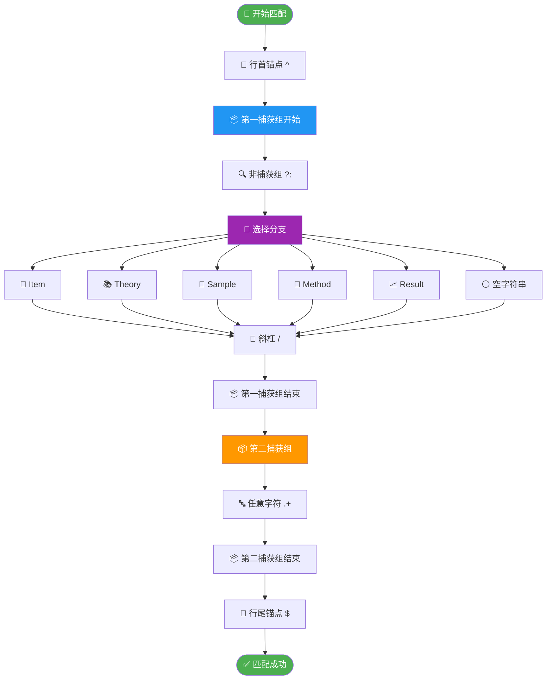
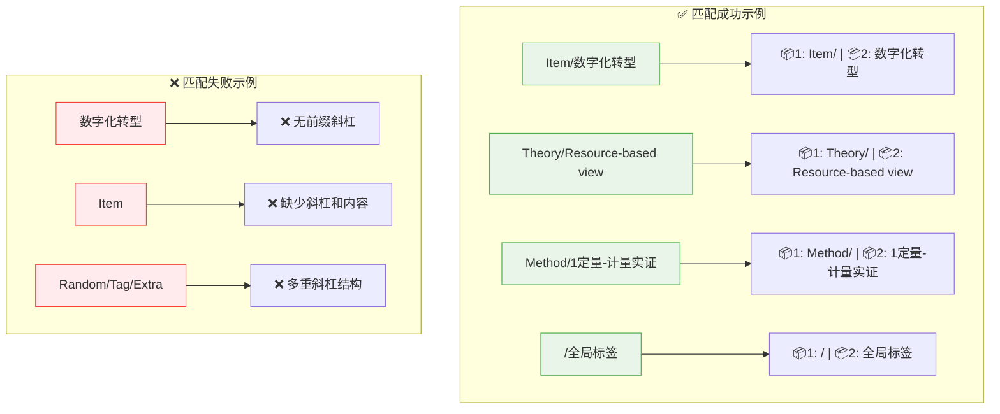
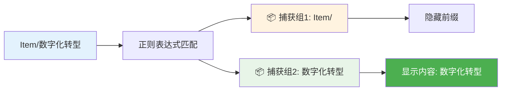
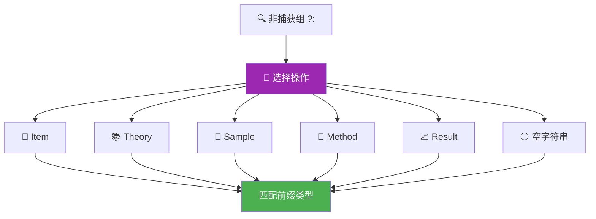
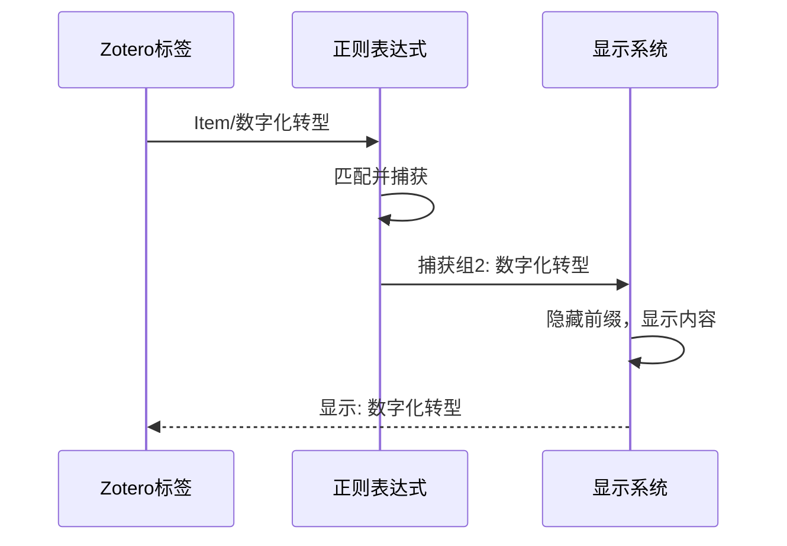

---
System:
Process:
Class:
Project:
  - BuildZotero
Title: ZoteroScript-P0-M1标签展示V2
DateCreated: 2026-01-17 17:37
DateModified: 2026-01-28 13:03
Status:
Version:
Type:
CardStatus:
CardType:
tags: [JavaScript, Zotero, Zotero配置, 九脚本生态, 五维标签, 代码, 字符串处理, 数据验证, 文本匹配, 显示优化, 标签匹配, 标签系统, 模式匹配, 模式识别, 正则表达式, 界面设计, 配置管理]
RelatedNote:
CardRecord:
---


## ZoteroScript-P0-M1 标签展示 V2


## 🔍 正则表达式解读 - 文献标签匹配模式

### 💻 第一部分：完整代码

```regex
/^((?:Item|Theory|Sample|Method|Result|)\/)(.+)$/
```

**应用场景**：Zotero 标签显示配置，用于匹配和捕获五维标签体系中的标签内容

---


### 📊 第二部分：正则表达式流程图

#### 🔄 匹配流程图




#### 🎯 匹配示例图



---


### 📚 第三部分：正则表达式基础知识

#### 🔤 核心元素表
|元素类型|符号|说明|示例|
|---|---|---|---|
|**🎯 位置锚点**|`^`|行首匹配|`^abc` 匹配行首的 abc|
||`$`|行尾匹配|`abc$` 匹配行尾的 abc|
|**📦 分组**|`()`|捕获组|`(abc)` 捕获 abc|
||`(?:)`|非捕获组|`(?:abc)` 匹配但不捕获|
|**🔀 选择**|`\|`|或操作符|`abc\|def` 匹配 abc 或 def|
|**📊 量词**|`+`|一次或多次|`a+` 匹配 a、aa、aaa|
||`*`|零次或多次|`a*` 匹配空、a、aa|
||`?`|零次或一次|`a?` 匹配空或 a|
|**🔤 字符**|`.`|任意字符|`.+` 匹配任意非空字符串|


#### 🏗️ 分组捕获机制



---


### 🔍 第四部分：分模块详细解读

#### 🎯 模块 1：行首锚点 `^`


**作用**：确保匹配从字符串的最开始位置进行，避免匹配到字符串中间的内容

**示例**：

- ✅ `^Item/test` 匹配 "Item/test"
- ❌ `^Item/test` 不匹配 "prefixItem/test"

---


#### 📦 模块 2：第一捕获组 `((?:Item|Theory|Sample|Method|Result|)\/)`

##### 🔍 非捕获组 `(?:Item|Theory|Sample|Method|Result|)`



**核心特性**：

- **📋 预定义前缀**：限定为五种标签类型
- **🔍 非捕获设计**：`(?:)` 用于分组但不单独捕获
- **⚪ 空字符串支持**：允许单独的 `/` 前缀（全局标签）


##### 🔸 强制斜杠 `\/`
**作用**：匹配字面意义的斜杠字符，用反斜杠转义

---


#### 📦 模块 3：第二捕获组 `(.+)`


**功能解析**：

- **`.`**：匹配除换行符外的任意单个字符
- **`+`**：要求至少有一个字符（不允许空内容）
- **`()`**：将匹配的内容作为第二个捕获组

**匹配示例**：

- " 数字化转型 " ✅
- "Resource-based view (RBV)" ✅
- "1 定量 - 计量实证 " ✅
- "" ❌ （空字符串不匹配）

---


#### 🎯 模块 4：行尾锚点 `$`


**作用**：确保匹配在字符串末尾结束，保证完整性

**对比示例**：

- ✅ `Item/test$` 匹配 "Item/test"
- ❌ `Item/test$` 不匹配 "Item/test_suffix"

---


### 🎯 实际应用效果

#### 📊 标签转换示例
|原始标签|匹配结果|显示效果|
|---|---|---|
|`Item/数字化转型`|📦1: `Item/` 📦2: `数字化转型`|数字化转型|
|`Theory/Agency theory`|📦1: `Theory/` 📦2: `Agency theory`|Agency theory|
|`Method/2主要-多元线性回归`|📦1: `Method/` 📦2: `2主要-多元线性回归`|2 主要 - 多元线性回归|
|`/全局标签`|📦1: `/` 📦2: `全局标签`|全局标签|


#### 🔧 配置原理



---


### 💡 总结与价值
这个正则表达式是五维标签系统的显示核心，通过精确的模式匹配实现了：

- **🎯 精准识别**：只匹配符合规范的结构化标签
- **🔍 内容提取**：自动提取标签的实际内容部分
- **🎨 界面优化**：隐藏技术前缀，展现用户友好的标签内容
- **🛡️ 错误防护**：严格的匹配规则避免误匹配

---

#正则表达式 #Zotero配置 #标签系统 #文本匹配 #显示优化 #五维标签 #界面设计 #模式匹配 #字符串处理 #配置管理
