---
System:
- Project
Process:
- 4-WorkProjects
Class:
- 02TS
Project:
- BuildZotero
Title: ZoteroScript-P1-Tag0-文献标签管理体系设计主题架构
DateCreated: 2026-01-17 17:37
DateModified: 2026-04-18 17:38
Type:
- doc
Status:
- doing
Version:
- v1.0
CardStatus: false
CardType:
- card-fleeting
tags:
- Topic/工具技能/工作笔记
- 结构化数据
- 科研工具
- 文献管理
- 效率工具
- 学术研究
- 知识管理
- 自动化
- AI标签
- JavaScript
- Zotero
- Pattern/Method
RelatedNote:
RelatedProjects:
CardRecord: ''
---

## 🏗️ 文献数据结构化系统 - 科研知识管理核心环节

### 📍知识输入流程定位

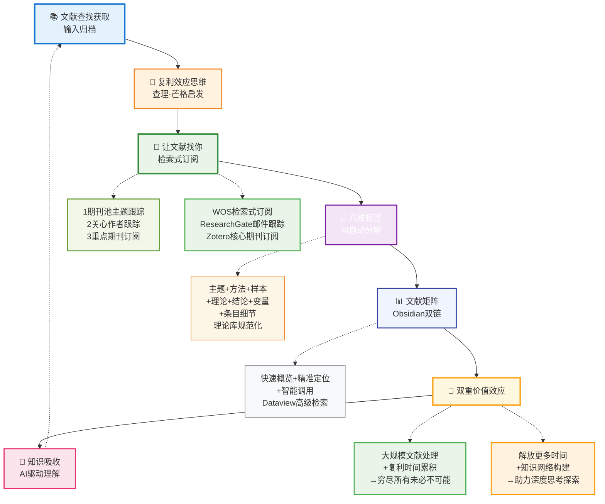

> 🎯 **核心定位**：文献数据结构化是连接 " 原始文献输入 " 与 " 知识网络构建 " 的关键桥梁，通过 AI 驱动的八维标签体系，将海量文献转化为结构化知识单元。

---

### 🏛️ 系统设计全局图

#### 🏷️ 八维标签系统 + 标签维护

##### 🔅简要版

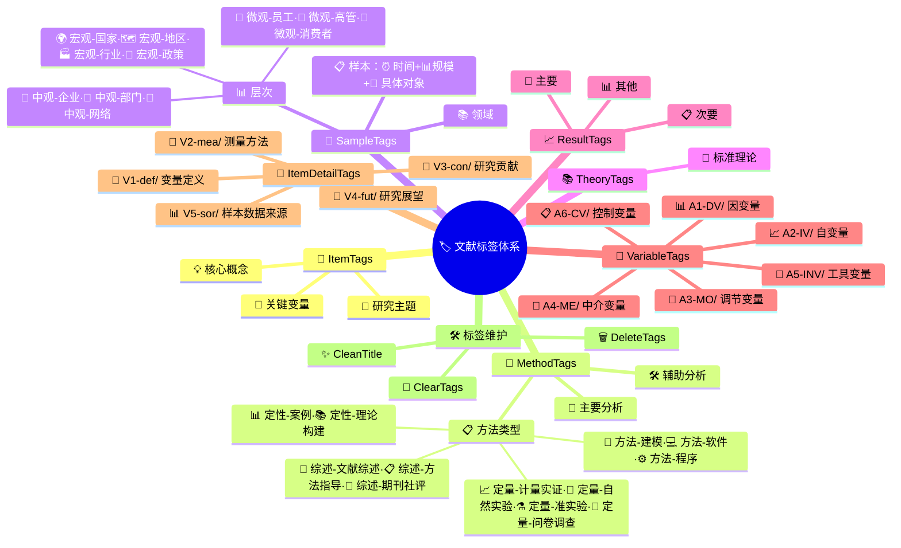

##### 🔆详细版

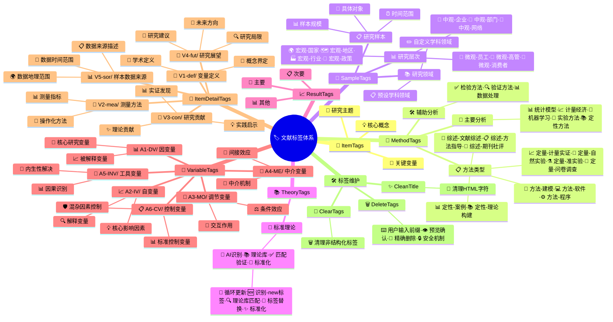

#### 📊 系统架构概览

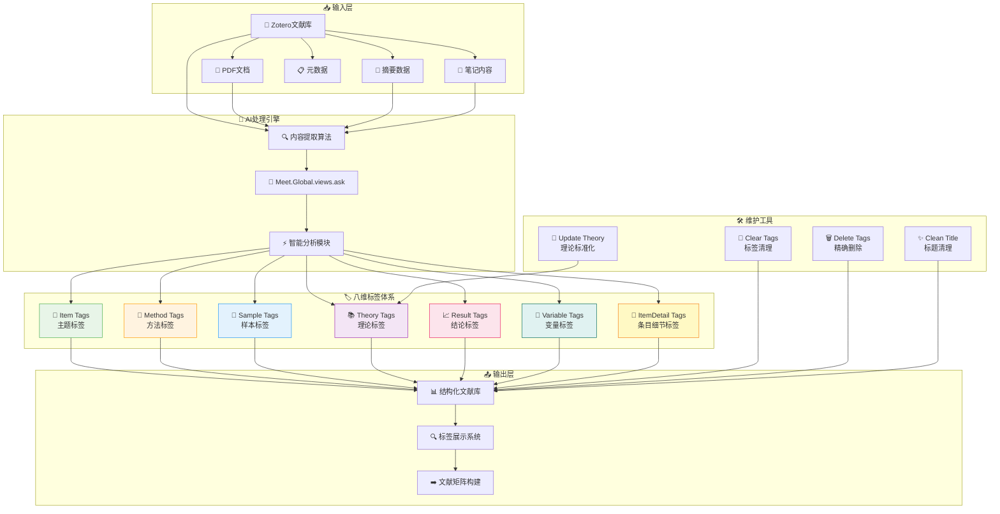

#### ⚡ 标签标记工作流程图

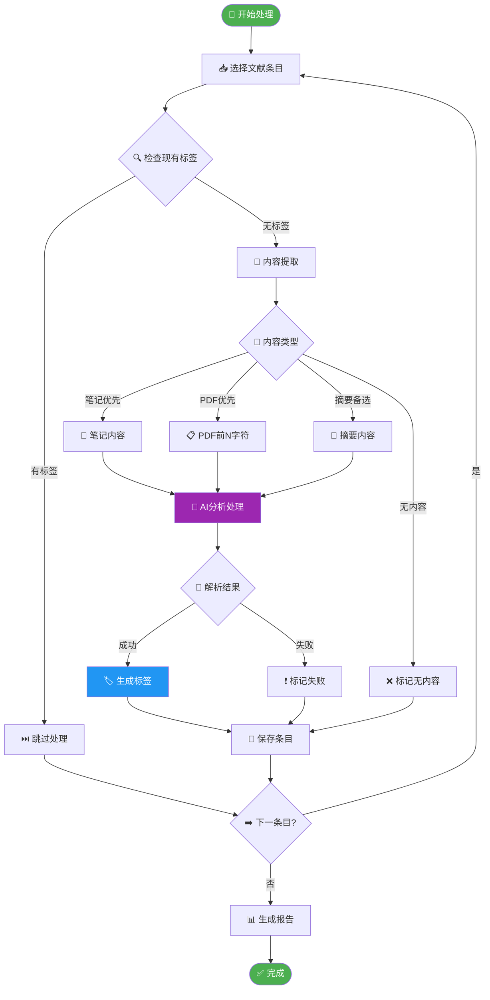

---

### 🌟文献标签管理系统工作流

#### 🔅文献标签全局工作流图简要版

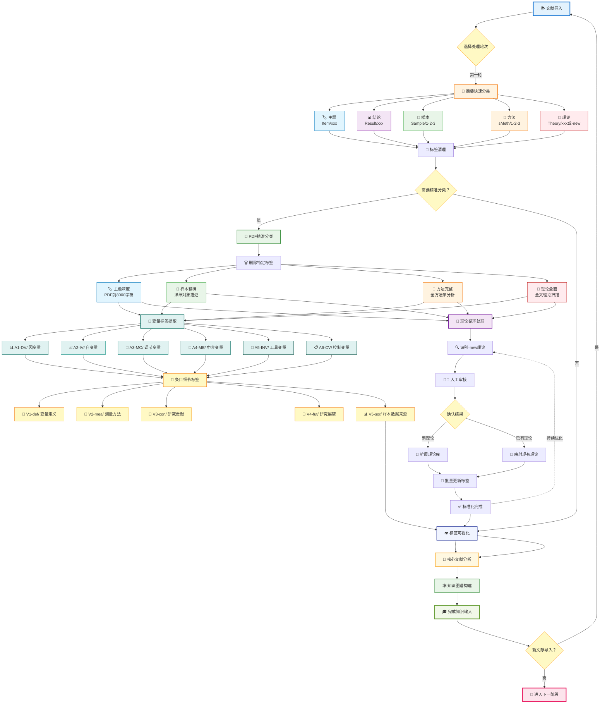

#### 🔆文献标签全局工作流图详细版

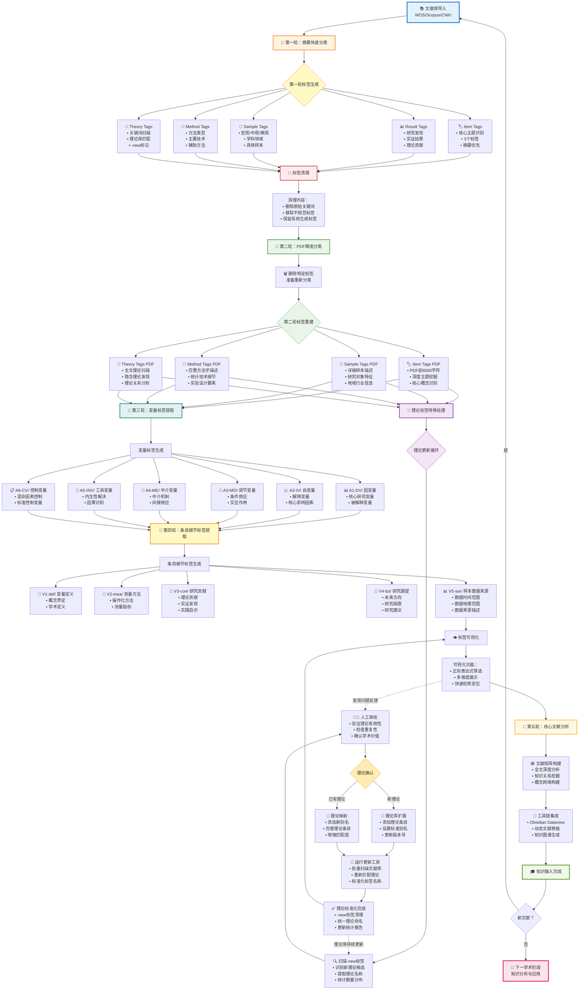

#### 🚀 五轮工作流程

##### 1️⃣第一轮：快速分类（基于摘要）

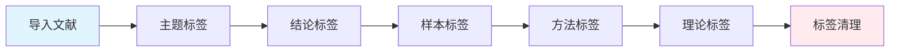

**特点**：

- **处理量**：近万条文献
- **数据源**：文献摘要（>50 字符）
- **目标**：建立基础标签体系
- **效率**：高速批量处理

**操作顺序**：

1. 从 WOS 等数据库导入文献
2. 依次运行 5 个摘要版本标签工具
3. 运行清理标签工具，移除不规范标签（如原始关键词）

**处理逻辑**：

- 优先获取摘要内容进行分析
- 摘要不可用时备选 PDF 前 3000-8000 字符（根据模块不同）
- 无内容文献标记为 " 无内容 " 便于后续处理

##### 2️⃣第二轮：精准分类（基于 PDF）

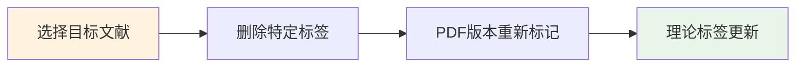

**特点**：

- **处理量**：项目相关文献子集
- **数据源**：PDF 全文内容前 8000-45000 字符（根据模块不同）
- **目标**：精准分类，深度信息提取
- **质量**：高精度标签标注

**操作顺序**：

1. 筛选项目相关文献
2. 使用删除特定标签工具清理旧标签
3. 运行 PDF 版本标签工具重新分类
4. 运行理论标签更新工具标准化理论

**优势分析**：

- 基于更丰富的全文信息
- 能识别摘要中未体现的细节
- 适用于核心文献的深度分析

##### 3️⃣第三轮：变量标签提取

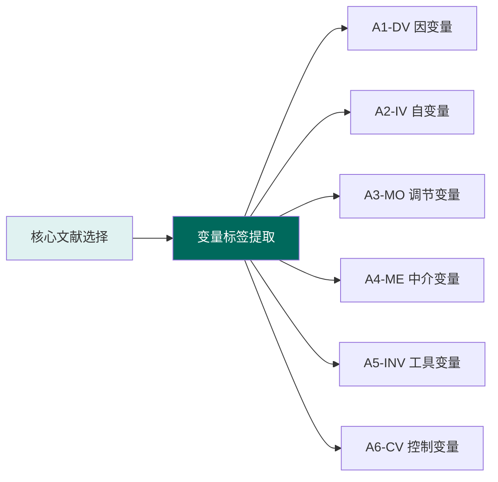

**特点**：

- **处理量**：核心研究文献
- **数据源**：PDF 前 30000 字符或笔记
- **目标**：识别研究变量关系
- **应用**：变量关系分析、模型构建

**实现方式**：

- 使用变量标签提取工具（Tag7）
- 识别 6 类变量：DV、IV、MO、ME、INV、CV
- 支持 " 无 " 值处理（根据版本不同）

##### 4️⃣第四轮：条目细节标签提取

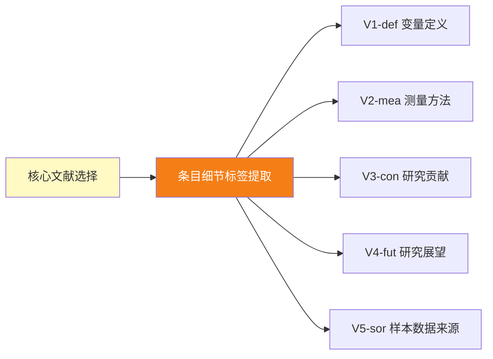

**特点**：

- **处理量**：核心研究文献
- **数据源**：PDF 前 45000 字符或笔记
- **目标**：提取研究详细要素
- **应用**：研究贡献分析、未来方向识别

**实现方式**：

- 使用条目细节标签提取工具（Tag8）
- 识别 5 类信息：变量定义、测量方法、研究贡献、研究展望、样本数据来源

##### 5️⃣第五轮：深度分析（全文矩阵）

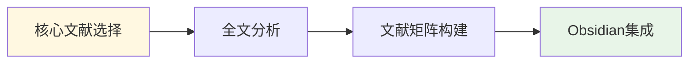

**特点**：

- **处理量**：核心研究文献
- **数据源**：完整文献内容
- **目标**：知识图谱构建
- **应用**：配合 Dataview 生成文献表格

**实现方式**：

- 利用已标记的结构化标签数据
- 通过 Obsidian Dataview 插件生成动态表格
- 实现文献的多维度交叉分析

---

### 📚 模块解读

#### 🏷️ 核心标签生成模块（8 维度）
| 模块                | 功能定位   | 核心特征                         | 标签前缀 | 数量  |
| ----------------- | ------ | ---------------------------- | ------ | --- |
| 📌 **ItemTags**   | 主题标签提取 | 3-6 字符简洁标签，聚焦核心变量与概念         | Item/  | 3   |
| 🔬 **MethodTags** | 研究方法识别 | 三层结构：方法类型 + 主要分析 + 辅助分析      | sMeth/ | 2-5 |
| 👥 **SampleTags** | 样本维度分析 | 三维标签：研究层次 + 学科领域 + 样本描述      | Sample/| 3   |
| 📚 **TheoryTags** | 理论框架匹配 | 140+ 理论库智能匹配，支持新理论识别，理论库循环更新 | Theory/| 1-3 |
| 📈 **ResultTags** | 结论发现提取 | 15-20 字符内精确结论，专注研究发现         | Result/| 3   |
| 🔢 **VariableTags** | 变量关系识别 | 六类变量：DV、IV、MO、ME、INV、CV       | A1-DV/ 等 | 1-6 |
| 📝 **ItemDetailTags** | 研究要素提取 | 五类信息：定义、测量、贡献、展望、数据来源     | V1-def/ 等 | 5   |

#### 🛠️ 系统维护模块

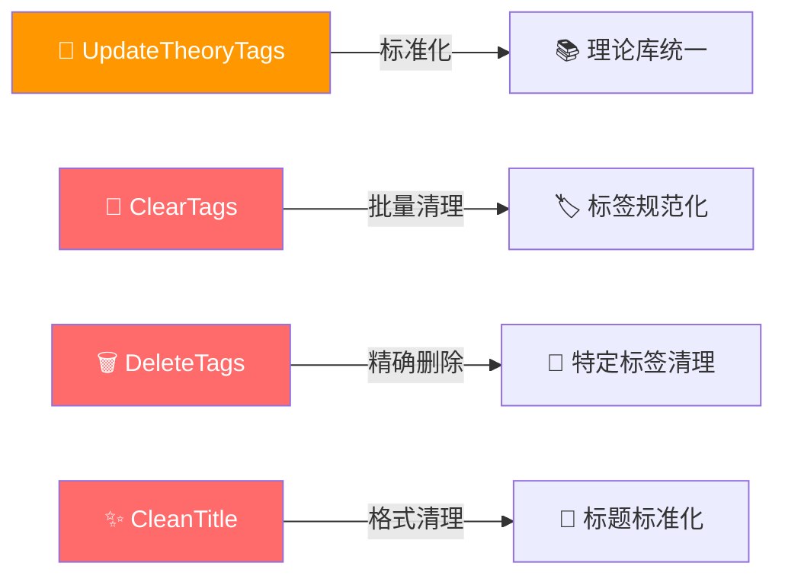

#### 🎨 标签显示配置

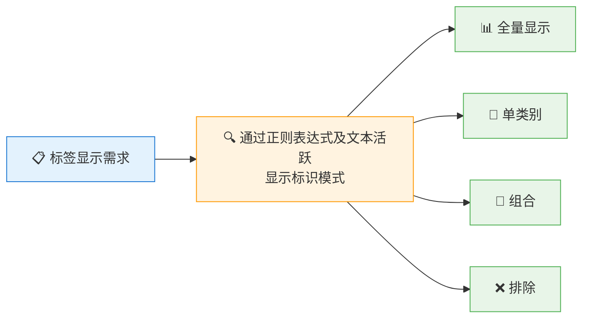

**例：全量正则表达式**：`^((?:Item|Theory|Sample|sMeth|Result|A[1-6]-(?:DV|IV|MO|ME|INV|CV)|V[1-5]-(?:def|mea|con|fut|sor))\/)(.+)$`

|原始标签|显示效果|
|---|---|
|`Item/数字化转型`|数字化转型|
|`Theory/Resource-based view (RBV)`|Resource-based view (RBV)|
|`sMeth/1定量-计量实证`|1 定量 - 计量实证|
|`A1-DV/创新绩效`|创新绩效|
|`V1-def/技术多样性:...`|技术多样性:...|

---

### 💎 系统价值与创新点

#### ✨核心价值

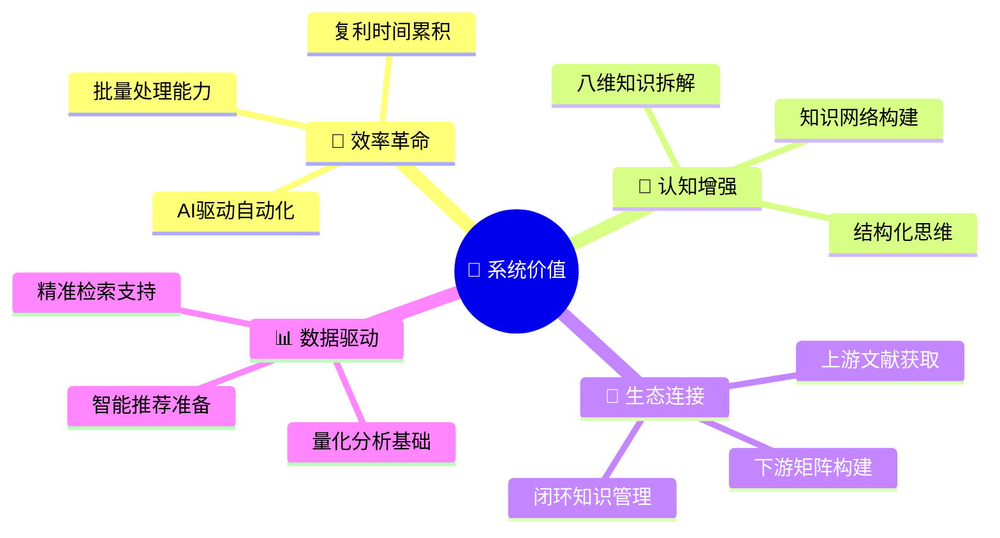

#### ⚡创新特征
- **🎯 八维解构**：将复杂文献分解为主题、方法、样本、理论、结论、变量、条目细节八个标准维度
- **🤖 AI 驱动**：结合大语言模型与专业理论库的混合智能系统
- **🔄 自我进化**：理论库持续更新，标签体系不断优化
- **🏗️ 生态整合**：无缝连接文献获取与知识网络构建

---

### 🔮 未来发展方向

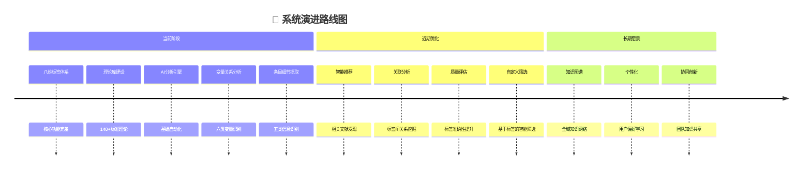

---

**💡 核心价值**：该系统通过 AI 驱动的八维标签体系，将文献转化为结构化知识，为科研工作者提供高效、智能的知识管理工具。

---

#Zotero #知识管理 #AI标签 #文献管理 #科研工具 #自动化 #结构化数据 #JavaScript #学术研究 #效率工具
