---
System:
- Project
Process:
- 4-WorkProjects
Class:
- 02TS
Project:
- BuildZotero
Title: ZoteroScript-P1-Tag0-文献标签管理体系设计局部详解
DateCreated: 2026-01-17 17:37
DateModified: 2026-04-18 17:38
Type:
- doc
Status:
- doing
Version:
- v1.0
CardStatus: false
CardType:
- card-fleeting
tags:
- Topic/工具技能/工作笔记
- Pattern/Method
RelatedNote: []
RelatedProjects: []
CardRecord: null
---

## 文献标签系统模块流程图

### 完整模块流程图

```mermaid
flowchart TD
    subgraph Item["🏷️ 主题标签系统 (Item Tags)"]
        IA[选择文献] --> IB{摘要/PDF版本?}
        IB -->|摘要版| IC[提取摘要内容]
        IB -->|PDF版| ID[提取PDF前8000字符]
        IC --> IE[AI分析核心主题]
        ID --> IE
        IE --> IF[生成3个主题标签]
        IF --> IG["Item/1标签1<br/>Item/2标签2<br/>Item/3标签3"]
    end
    
    subgraph Theory["🧠 理论标签系统 (Theory Tags)"]
        TA[选择文献] --> TB[关键词预检查]
        TB --> TC{包含理论关键词?}
        TC -->|否| TD[Theory/无理论关键词]
        TC -->|是| TE[AI理论识别]
        TE --> TF[理论库匹配]
        TF --> TG{匹配成功?}
        TG -->|是| TH[Theory/1标准理论名]
        TG -->|否| TI[Theory/1识别理论-new]
    end
    
    subgraph Sample["👥 样本标签系统 (Sample Tags)"]
        SA[选择文献] --> SB[AI分析研究对象]
        SB --> SC[三维度识别]
        SC --> SD["Sample/1研究层次<br/>(宏观/中观/微观)"]
        SC --> SE["Sample/2领域-<br/>学科领域"]
        SC --> SF["Sample/3样本-<br/>具体对象"]
    end
    
    subgraph Method["🔬 方法标签系统 (Method Tags)"]
        MA[选择文献] --> MB[AI分析研究方法]
        MB --> MC[方法学识别]
        MC --> MD["sMeth/1方法类型<br/>(定性/定量/综述/方法)"]
        MC --> ME["sMeth/2主要-<br/>核心技术"]
        MC --> MF["sMeth/3辅助-<br/>次要技术"]
    end
    
    subgraph Result["📊 结论标签系统 (Result Tags)"]
        RA[选择文献] --> RB[优先获取摘要]
        RB --> RC[AI分析研究结论]
        RC --> RD[生成3个结论标签]
        RD --> RE["Result/1主要发现<br/>Result/2实证结果<br/>Result/3理论贡献"]
    end
    
    subgraph Variable["🔢 变量标签系统 (Variable Tags)"]
        VA[选择文献] --> VB[AI分析研究变量]
        VB --> VC[六类变量识别]
        VC --> VD["A1-DV/因变量<br/>核心研究变量"]
        VC --> VE["A2-IV/自变量<br/>解释变量"]
        VC --> VF["A3-MO/调节变量<br/>条件效应"]
        VC --> VG["A4-ME/中介变量<br/>中介机制"]
        VC --> VH["A5-INV/工具变量<br/>内生性解决"]
        VC --> VI["A6-CV/控制变量<br/>混杂因素控制"]
    end
    
    subgraph ItemDetail["📝 条目细节标签系统 (ItemDetail Tags)"]
        DA[选择文献] --> DB[AI分析研究要素]
        DB --> DC[五类信息识别]
        DC --> DD["V1-def/变量定义<br/>概念界定"]
        DC --> DE["V2-mea/测量方法<br/>操作化方法"]
        DC --> DF["V3-con/研究贡献<br/>理论贡献/实证发现"]
        DC --> DG["V4-fut/研究展望<br/>未来方向/研究局限"]
        DC --> DH["V5-sor/样本数据来源<br/>时间/地理/来源描述"]
    end
    
    subgraph Update["🔄 理论更新系统 (Update Theory)"]
        UA[扫描-new标签] --> UB[提取理论名称]
        UB --> UC[理论库重新匹配]
        UC --> UD{找到匹配?}
        UD -->|是| UE["删除-new标签<br/>添加标准标签"]
        UD -->|否| UF["保留-new标签<br/>等待人工处理"]
    end
    
    subgraph Management["🛠️ 标签管理系统"]
        MGA[清理标签] --> MGB[删除所有非规范标签]
        MGC[删除特定标签] --> MGD[删除指定前缀标签]
        MGE[标签显示] --> MGF["正则表达式过滤<br/>^(Item|Theory|Sample|sMeth|Result|A[1-6]-(DV|IV|MO|ME|INV|CV)|V[1-5]-(def|mea|con|fut|sor))/"]
    end
    
    subgraph Workflow["🚀 工作流阶段集成"]
        WA[第一轮: 摘要版本] --> WB["所有标签工具<br/>基于摘要快速分类"]
        WB --> WC[标签清理]
        WC --> WD[第二轮: PDF版本]
        WD --> WE[删除特定标签]
        WE --> WF[重新精准分类]
        WF --> WG[第三轮: 变量标签]
        WG --> WH[第四轮: 条目细节]
        WH --> WI[理论标签更新]
        WI --> WJ[标签可视化展示]
    end
```


### 单独模块详细图

#### 主题标签系统

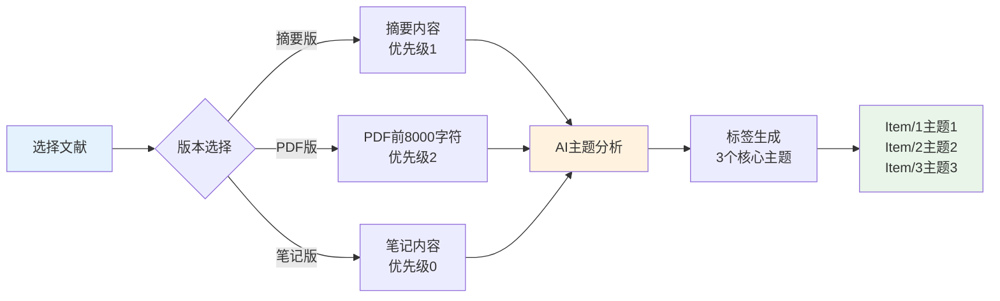


#### 理论标签系统

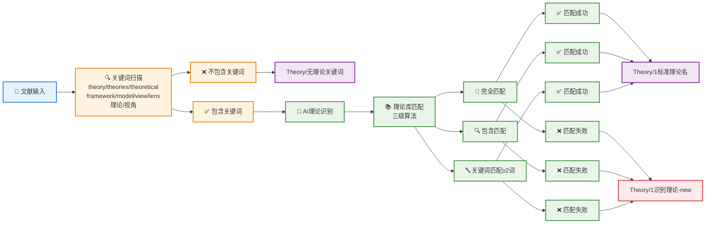

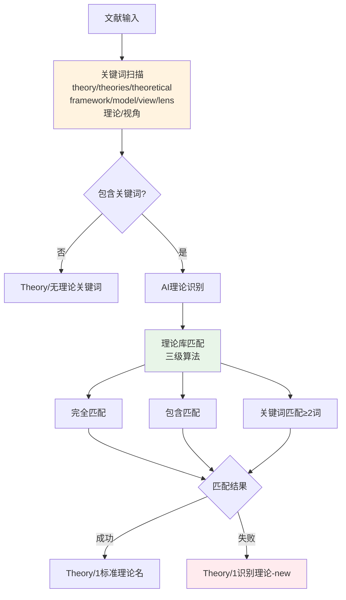


#### 样本标签系统

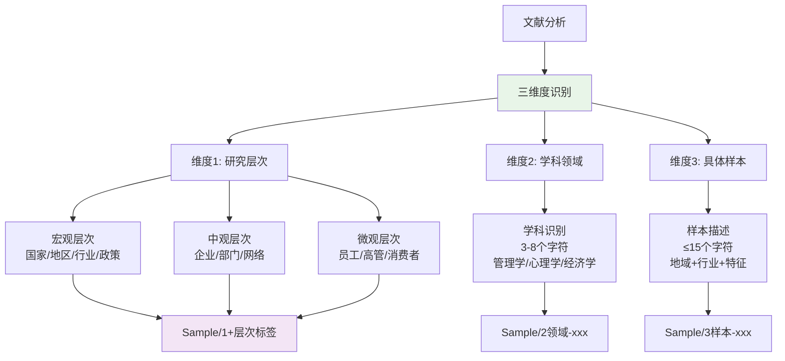


#### 方法标签系统

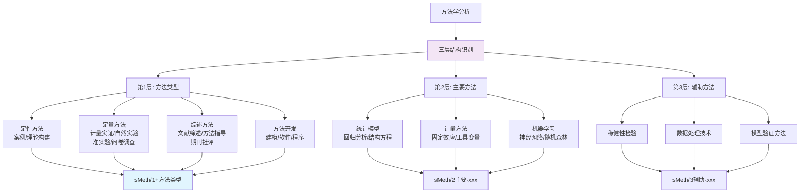


#### 结论标签系统

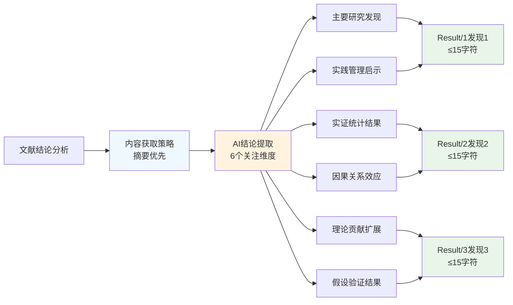


#### 变量标签系统

```mermaid
flowchart TD
    A[变量分析] --> B[AI识别研究变量]
    B --> C[六类变量识别]
    
    C --> C1[因变量DV<br/>核心研究变量<br/>被解释变量]
    C --> C2[自变量IV<br/>解释变量<br/>核心影响因素]
    C --> C3[调节变量MO<br/>条件效应<br/>交互作用]
    C --> C4[中介变量ME<br/>中介机制<br/>间接效应]
    C --> C5[工具变量INV<br/>内生性解决<br/>因果识别]
    C --> C6[控制变量CV<br/>混杂因素控制<br/>标准控制变量]
    
    C1 --> D1[A1-DV/变量名]
    C2 --> D2[A2-IV/变量名]
    C3 --> D3[A3-MO/变量名]
    C4 --> D4[A4-ME/变量名]
    C5 --> D5[A5-INV/变量名]
    C6 --> D6[A6-CV/变量名]
    
    D1 --> E{变量值检查}
    D2 --> E
    D3 --> E
    D4 --> E
    D5 --> E
    D6 --> E
    
    E -->|"无"值处理| F{版本逻辑}
    F -->|V1| G[跳过所有"无"]
    F -->|V2| H[仅DV"无"添加<br/>其他跳过]
    
    G --> I[至少2个标签<br/>DV+IV必需]
    H --> J[至少1个标签<br/>DV必需]
    
    style B fill:#e0f2f1
    style C fill:#fff3e0
    style D1 fill:#e8f5e8
    style D2 fill:#e8f5e8
    style D3 fill:#e8f5e8
    style D4 fill:#e8f5e8
    style D5 fill:#e8f5e8
    style D6 fill:#e8f5e8
```


#### 条目细节标签系统

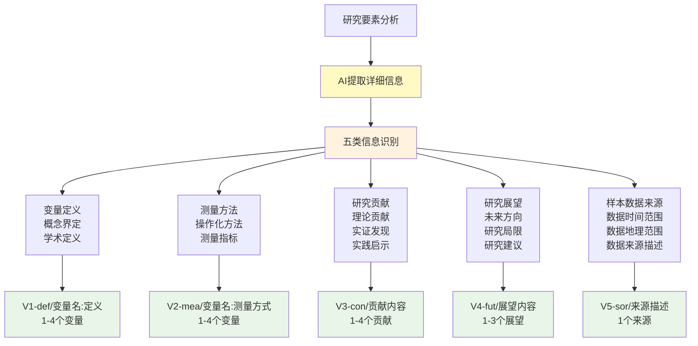


#### 理论更新循环系统

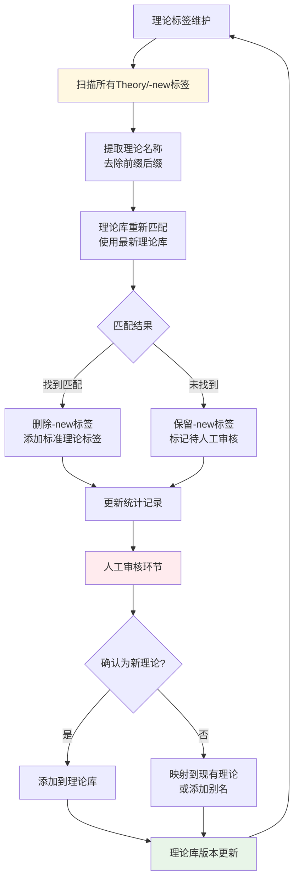


#### 标签管理工具集

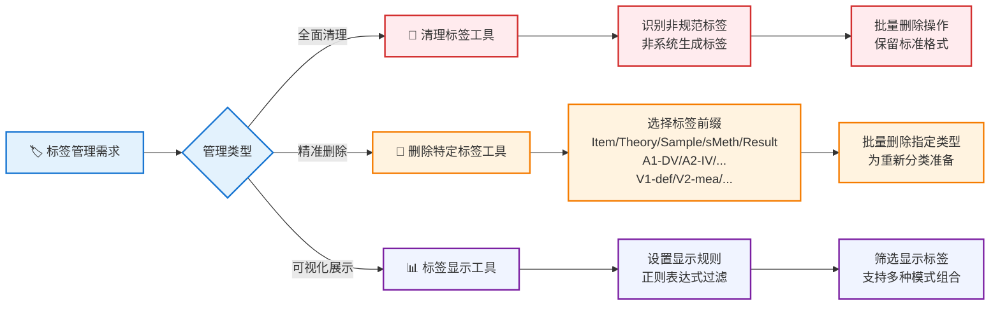

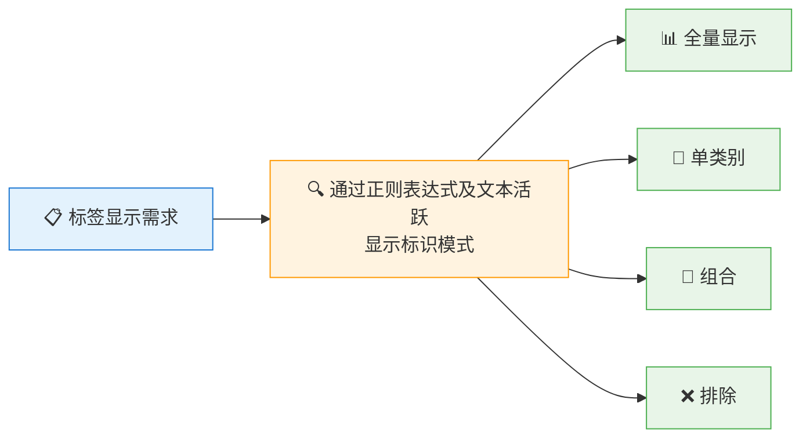


#### 全部流程图

```mermaid
flowchart TD
    subgraph TS1["理论标签系统核心循环"]
        TS1A[文献理论识别] --> TS1B{理论库匹配？}
        TS1B -->|匹配成功| TS1C[Theory/1标准理论名称]
        TS1B -->|匹配失败| TS1D[Theory/1识别理论-new]
        TS1D --> TS1E[累积新理论标签]
        TS1E --> TS1F[研究者审核]
        TS1F --> TS1G{确认为新理论？}
        TS1G -->|是| TS1H[添加到理论库]
        TS1G -->|否| TS1I[映射到现有理论]
        TS1H --> TS1J[运行更新理论标签工具]
        TS1I --> TS1J
        TS1J --> TS1K[批量更新所有-new标签]
        TS1K --> TS1A
    end
    
    subgraph TS2["理论库结构 (140+ 理论)"]
        TS2A[标准理论名称] --> TS2B[多个别名/简称]
        TS2A --> TS2C[英文/中文对照]
        TS2A --> TS2D[理论分类标记]
        
        TS2E[示例理论条目:]
        TS2E --> TS2F[Resource-based view RBV<br/>别名: resource based view, RBV, 资源基础观]
        TS2E --> TS2G[Social exchange theory<br/>别名: SET, exchange theory, 社会交换理论]
    end
    
    subgraph TS3["理论匹配算法 (三级匹配)"]
        TS3A[输入: AI识别的理论名称] --> TS3B[级别1: 完全匹配]
        TS3B --> TS3C{理论名或别名完全相同？}
        TS3C -->|是| TS3D[返回标准理论名]
        TS3C -->|否| TS3E[级别2: 包含匹配]
        TS3E --> TS3F{理论名包含搜索词或反之？}
        TS3F -->|是| TS3D
        TS3F -->|否| TS3G[级别3: 关键词匹配]
        TS3G --> TS3H{≥2个关键词重合？}
        TS3H -->|是| TS3D
        TS3H -->|否| TS3I[未匹配，返回null]
    end
    
    subgraph TS4["理论发现的价值"]
        TS4A[解决理论知识盲区] --> TS4B[科研入门者友好]
        TS4A --> TS4C[理论库持续更新]
        TS4A --> TS4D[避免理论重复标注]
        TS4A --> TS4E[建立个人理论知识库]
        
        TS4F[新理论发现机制] --> TS4G[自动识别潜在新理论]
        TS4F --> TS4H[人工确认避免误判]
        TS4F --> TS4I[理论库动态扩展]
        TS4F --> TS4J[跨学科理论整合]
    end
    
    subgraph TS5["理论标签工作流"]
        TS5A[第一轮: 摘要版本] --> TS5B[快速理论识别<br/>基于摘要关键词]
        TS5B --> TS5C[生成初步理论标签]
        TS5C --> TS5D[第二轮: PDF版本]
        TS5D --> TS5E[深度理论分析<br/>基于全文内容]
        TS5E --> TS5F[更新/补充理论标签]
        TS5F --> TS5G[运行更新理论标签工具]
        TS5G --> TS5H[标准化所有理论标签]
    end
    
    subgraph TS6["关键词触发机制"]
        TS6A[英文关键词] --> TS6B[theory, theories, theoretical<br/>framework, model, view, lens]
        TS6C[中文关键词] --> TS6D[理论, 视角]
        TS6E[触发逻辑] --> TS6F[快速预筛选<br/>避免无关文献的AI调用]
        TS6E --> TS6G[提高处理效率<br/>节省计算资源]
    end
    
    style TS1 fill:#fff3e0
    style TS2 fill:#e8f5e8
    style TS3 fill:#f3e5f5
    style TS4 fill:#f0f8ff
    style TS5 fill:#fff8e1
    style TS6 fill:#f1f8e9
```

```mermaid
flowchart TD
    subgraph SYS["🏗️ 标签显示系统架构"]
        SYS1["正则表达式核心<br/>^(Item|Theory|Sample|sMeth|Result|A[1-6]-(DV|IV|MO|ME|INV|CV)|V[1-5]-(def|mea|con|fut|sor))\\/(.+)$"] --> SYS2["标签格式验证"]
        SYS2 --> SYS3["前缀识别与分类"]
        SYS3 --> SYS4["内容提取与展示"]
        SYS4 --> SYS5["可视化界面呈现"]
    end
    
    subgraph CAT["📚 标签分类展示"]
        CAT1["Item/ 主题标签"] --> CAT1A["创新管理"]
        CAT1 --> CAT1B["组织行为"]
        CAT1 --> CAT1C["战略管理"]
        
        CAT2["Theory/ 理论标签"] --> CAT2A["Resource-based view"]
        CAT2 --> CAT2B["Social exchange theory"]
        CAT2 --> CAT2C["新兴理论-new"]
        
        CAT3["Sample/ 样本标签"] --> CAT3A["1宏观-国家"]
        CAT3 --> CAT3B["2领域-管理学"]
        CAT3 --> CAT3C["3样本-中国上市公司"]
        
        CAT4["sMeth/ 方法标签"] --> CAT4A["1定量-计量实证"]
        CAT4 --> CAT4B["2主要-回归分析"]
        CAT4 --> CAT4C["3辅助-稳健性检验"]
        
        CAT5["Result/ 结论标签"] --> CAT5A["显著正向影响"]
        CAT5 --> CAT5B["中介效应验证"]
        CAT5 --> CAT5C["理论模型支持"]
        
        CAT6["A1-DV/ 变量标签"] --> CAT6A["创新绩效"]
        CAT6 --> CAT6B["组织绩效"]
        
        CAT7["V1-def/ 条目细节标签"] --> CAT7A["技术多样性:..."]
        CAT7 --> CAT7B["组织韧性:..."]
    end
    
    subgraph TOOL["🛠️ 标签管理工具集"]
        TOOL1["清理标签工具"] --> TOOL1A["识别不规范标签"]
        TOOL1A --> TOOL1B["批量删除操作"]
        TOOL1B --> TOOL1C["保留标准格式"]
        
        TOOL2["删除特定标签"] --> TOOL2A["选择标签前缀"]
        TOOL2A --> TOOL2B["批量删除指定类型"]
        TOOL2B --> TOOL2C["重新标记准备"]
        
        TOOL3["更新理论标签"] --> TOOL3A["扫描-new后缀标签"]
        TOOL3A --> TOOL3B["理论库匹配更新"]
        TOOL3B --> TOOL3C["标准化理论名称"]
    end
    
    subgraph FILTER["🔍 标签筛选与检索"]
        FILTER1["全量显示模式<br/>^(Item|Theory|Sample|sMeth|Result|A[1-6]-(DV|IV|MO|ME|INV|CV)|V[1-5]-(def|mea|con|fut|sor))\\/(.+)$"]
        FILTER2["单类别模式<br/>^Item\\/(.+)$ - 仅主题标签"]
        FILTER3["组合模式<br/>^(Item|Theory)\\/(.+)$ - 主题+理论"]
        FILTER4["排除模式<br/>^(?!Result\\/)(.+)$ - 排除结论标签"]
    end
    
    subgraph APP["📊 可视化应用场景"]
        APP1["文献库总览"] --> APP1A["快速了解文献分布"]
        APP1A --> APP1B["识别研究热点"]
        APP1A --> APP1C["发现知识空白"]
        
        APP2["项目文献筛选"] --> APP2A["按主题快速定位"]
        APP2A --> APP2B["按方法类型分组"]
        APP2A --> APP2C["按样本特征过滤"]
        APP2A --> APP2D["按变量关系分析"]
        
        APP3["理论研究"] --> APP3A["理论使用频率统计"]
        APP3A --> APP3B["新理论发现追踪"]
        APP3A --> APP3C["理论演进分析"]
    end
    
    subgraph OBS["🔗 Obsidian集成"]
        OBS1["标签数据导出"] --> OBS2["Dataview插件处理"]
        OBS2 --> OBS3["动态文献表格"]
        OBS3 --> OBS4["知识图谱构建"]
        OBS4 --> OBS5["文献关系网络"]
        OBS5 --> OBS6["研究脉络梳理"]
    end
    
    %% 模块间连接
    SYS --> CAT
    CAT --> TOOL
    TOOL --> FILTER
    FILTER --> APP
    APP --> OBS
    
    classDef system fill:#e1f5fe,stroke:#01579b,stroke-width:2px
    classDef category fill:#fff3e0,stroke:#f57c00,stroke-width:2px
    classDef management fill:#ffebee,stroke:#d32f2f,stroke-width:2px
    classDef search fill:#e8f5e8,stroke:#388e3c,stroke-width:2px
    classDef application fill:#f3e5f5,stroke:#7b1fa2,stroke-width:2px
    classDef integration fill:#f0f8ff,stroke:#1976d2,stroke-width:2px
    
    class SYS,SYS1,SYS2,SYS3,SYS4,SYS5 system
    class CAT,CAT1,CAT2,CAT3,CAT4,CAT5,CAT6,CAT7,CAT1A,CAT1B,CAT1C,CAT2A,CAT2B,CAT2C,CAT3A,CAT3B,CAT3C,CAT4A,CAT4B,CAT4C,CAT5A,CAT5B,CAT5C,CAT6A,CAT6B,CAT7A,CAT7B category
    class TOOL,TOOL1,TOOL2,TOOL3,TOOL1A,TOOL1B,TOOL1C,TOOL2A,TOOL2B,TOOL2C,TOOL3A,TOOL3B,TOOL3C management
    class FILTER,FILTER1,FILTER2,FILTER3,FILTER4 search
    class APP,APP1,APP2,APP3,APP1A,APP1B,APP1C,APP2A,APP2B,APP2C,APP2D,APP3A,APP3B,APP3C application
    class OBS,OBS1,OBS2,OBS3,OBS4,OBS5,OBS6 integration
```


## 文献标签管理系统全景总结

### 系统概述
这是一个完整的学术文献知识输入与管理工具体系，通过自动化标签分类实现大规模文献库的智能管理，支持从粗筛到精准分类的渐进式工作流。系统采用**八维标签体系**，包含主题、方法、样本、理论、结论、变量、条目细节七个维度，以及标签维护工具。


### 一、系统总体流程图

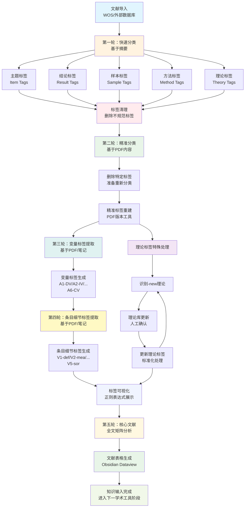


### 二、工具组件详细分析

#### 2.1 标签生成工具矩阵
|工具名称|摘要版本|PDF 版本|特殊功能|应用阶段|标签前缀|
|---|---|---|---|---|---|
|**主题标签**|✅ Item Tags|✅ Item Tags PDF|核心主题识别|第一轮/第二轮|Item/|
|**结论标签**|✅ Result Tags|❌|研究发现提取|第一轮|Result/|
|**样本标签**|✅ Sample Tags|✅ Sample Tags PDF|三维度分析|第一轮/第二轮|Sample/|
|**方法标签**|✅ Method Tags|✅ Method Tags PDF|方法学识别|第一轮/第二轮|sMeth/|
|**理论标签**|✅ Theory Tags|✅ Theory Tags PDF|理论库匹配|第一轮/第二轮|Theory/|
|**变量标签**|❌|✅ Variable Tags|六类变量识别|第三轮|A1-DV/等|
|**条目细节标签**|❌|✅ ItemDetail Tags|五类信息提取|第四轮|V1-def/等|


#### 2.2 标签管理工具
|工具名称|功能描述|使用时机|
|---|---|---|
|**清理标签**|删除所有不规范标签|第一轮后|
|**删除特定标签**|删除指定前缀标签|第二轮前/第三轮前/第四轮前|
|**更新理论标签**|标准化 -new 理论|理论库更新后|
|**标签显示**|正则表达式可视化|持续使用|


### 三、核心工具流程详解

#### 3.1 第一轮：快速分类流程（基于摘要）

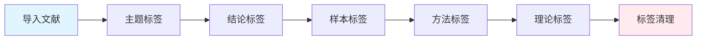

**目标**：对近万条文献进行快速初步分类 **特点**：基于摘要，效率优先，覆盖面广


#### 3.2 第二轮：精准分类流程（基于 PDF）

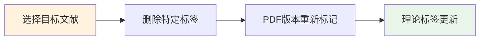

**目标**：对项目相关文献进行精准分类 **特点**：基于 PDF 全文，准确性优先


#### 3.3 第三轮：变量标签提取流程

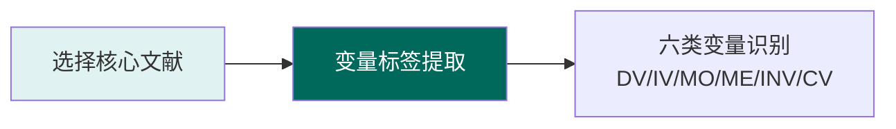

**目标**：识别研究变量关系 **特点**：基于 PDF/笔记，变量关系分析


#### 3.4 第四轮：条目细节标签提取流程

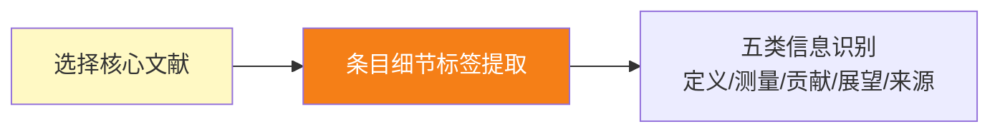

**目标**：提取研究详细要素 **特点**：基于 PDF/笔记，研究要素分析


#### 3.5 理论标签循环更新机制

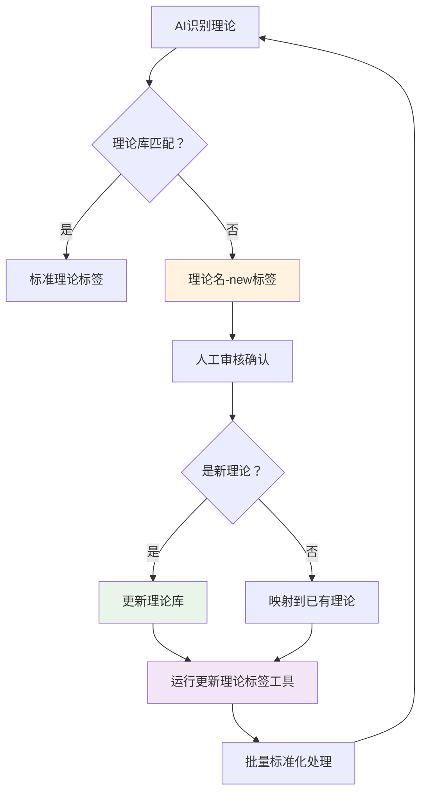


### 四、标签体系架构

#### 八维标签 +1 维护

```mermaid
mindmap
 root((🏷️ 文献标签体系))
   📌 ItemTags
     🔑 关键变量
     🎯 研究主题
     💡 核心概念
   🔬 MethodTags
     📋 方法类型
       📊 定性-案例·📚 定性-理论构建
       📈 定量-计量实证·🔬 定量-自然实验·⚗️ 定量-准实验·📝 定量-问卷调查
       📖 综述-文献综述·📋 综述-方法指导·📰 综述-期刊社评
       🔧 方法-建模·💻 方法-软件·⚙️ 方法-程序
     🎯 主要分析
     🛠️ 辅助分析
   👥 SampleTags
     📊 层次
         🌍 宏观-国家·🗺️ 宏观-地区·🏭 宏观-行业·📜 宏观-政策 
         🏢 中观-企业·🏬 中观-部门·🔗 中观-网络 
         👤 微观-员工·👔 微观-高管·🛒 微观-消费者
     📚 领域
     📋 样本：⏰ 时间+📊规模+🎯 具体对象
   📚 TheoryTags
     📖 标准理论
   📈 ResultTags
     🎯 主要
     📋 次要
     📊 其他
   🔢 VariableTags
     📊 A1-DV/ 因变量
     📈 A2-IV/ 自变量
     🔄 A3-MO/ 调节变量
     🔗 A4-ME/ 中介变量
     🔧 A5-INV/ 工具变量
     📋 A6-CV/ 控制变量
   📝 ItemDetailTags
     🔧 V1-def/ 变量定义
     📐 V2-mea/ 测量方法
     💎 V3-con/ 研究贡献
     🔮 V4-fut/ 研究展望
     📊 V5-sor/ 样本数据来源
   🛠️ 标签维护
     🧹 ClearTags
     🗑️ DeleteTags
     ✨ CleanTitle
```


#### 4.2 标签显示系统
**正则表达式**: `^((?:Item|Theory|Sample|sMeth|Result|A[1-6]-(?:DV|IV|MO|ME|INV|CV)|V[1-5]-(?:def|mea|con|fut|sor))\/)(.+)$`

**功能特点**:

- 🏷️ **标准化格式**: 前缀/内容结构
- 🔍 **快速筛选**: 按类型过滤标签
- 👁️ **可视化管理**: 整体浏览文献分类
- 🎯 **精准检索**: 特定类型标签定位


### 五、工作流五个阶段

#### 阶段一：大规模初筛（摘要版本）
- **处理量**: 近万条文献
- **基础**: 文献摘要
- **目标**: 快速分类，建立基础标签体系
- **效率**: 高效批量处理


#### 阶段二：针对性精筛（PDF 版本）
- **处理量**: 项目相关文献子集
- **基础**: PDF 全文内容
- **目标**: 精准分类，深度信息提取
- **质量**: 高精度标签标注


#### 阶段三：变量标签提取
- **处理量**: 核心研究文献
- **基础**: PDF 前 30000 字符或笔记
- **目标**: 识别研究变量关系
- **应用**: 变量关系分析、模型构建


#### 阶段四：条目细节标签提取
- **处理量**: 核心研究文献
- **基础**: PDF 前 45000 字符或笔记
- **目标**: 提取研究详细要素
- **应用**: 研究贡献分析、未来方向识别


#### 阶段五：核心文献深度分析
- **处理量**: 核心研究文献
- **基础**: 全文内容分析
- **目标**: 文献矩阵，知识图谱构建
- **应用**: 配合 Obsidian Dataview 生成文献表格


### 六、系统优势与创新点

#### 6.1 渐进式工作流设计
- 🚀 **效率优先**: 先摘要后全文，平衡效率与精度
- 🎯 **目标导向**: 根据需求调整精度级别
- 🔄 **循环优化**: 持续改进标签质量


#### 6.2 理论库动态更新机制
- 📚 **标准理论库**: 140+ 理论的完整数据库
- 🆕 **新理论发现**: 自动识别潜在新理论
- 🔄 **迭代更新**: 理论库与标签的双向优化
- 🎓 **学习友好**: 解决科研入门者理论知识不足问题


#### 6.3 智能标签管理
- 🏷️ **多维度标签**: 八个维度全面覆盖文献信息
- 🧹 **标签清理**: 自动化清理不规范标签
- 👁️ **可视化展示**: 正则表达式支持的灵活显示
- 📊 **数据驱动**: 为后续数据分析提供结构化基础


#### 6.4 变量关系分析
- 🔢 **六类变量**: 完整覆盖研究变量类型
- 📊 **变量关系**: 支持变量关系分析和模型构建
- 🎯 **精准识别**: 基于 PDF/笔记的深度分析


#### 6.5 研究要素提取
- 📝 **五类信息**: 变量定义、测量方法、研究贡献、研究展望、数据来源
- 💎 **深度分析**: 支持研究贡献和未来方向的识别
- 📊 **结构化**: 为文献综述和论文写作提供结构化信息
