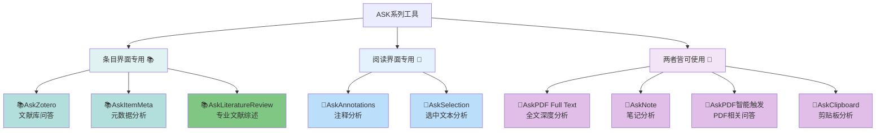
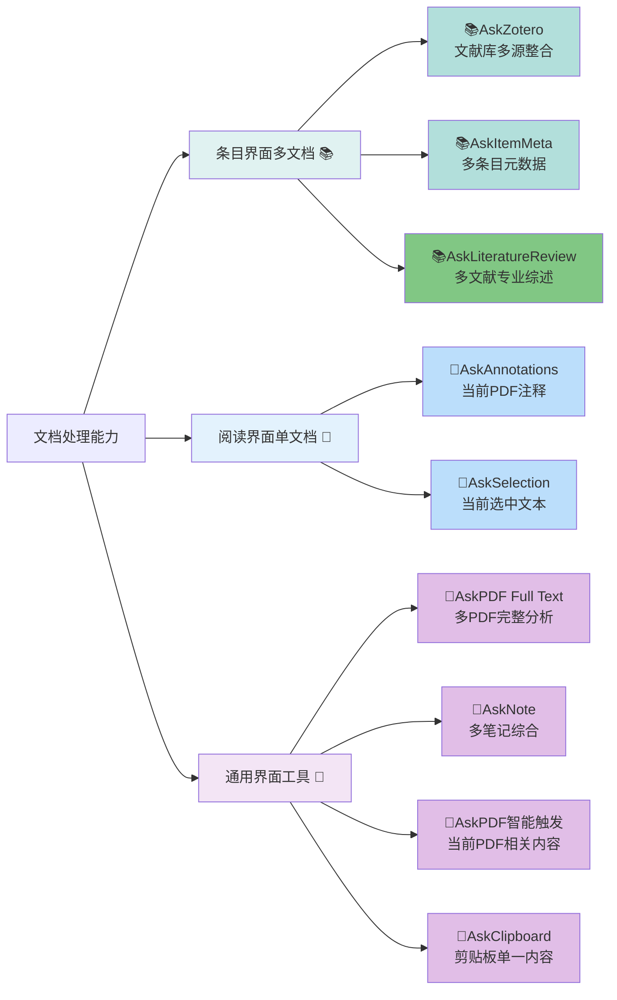
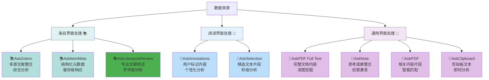
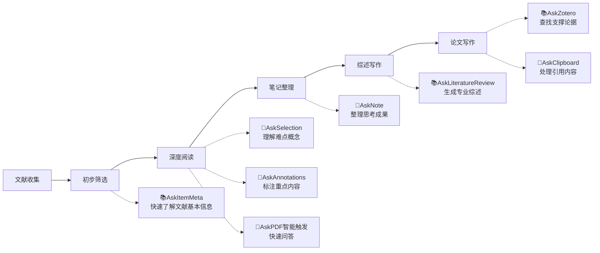
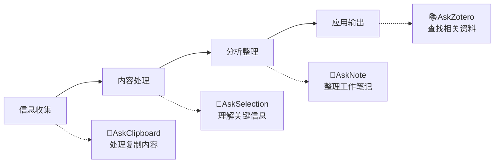
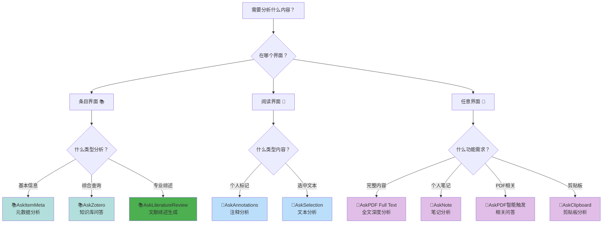

---
System:
  - Project
Process:
  - 4-WorkProjects
Class:
  - 02TS
Project:
  - BuildZotero
Title: ZoteroScript-P6-ASK0-文献阅读交互系统设计
DateCreated: 2026-01-17 17:37
DateModified: 2026-04-18 17:38
Type:
  - doc
Status:
  - doing
Version: v1.0
CardStatus: false
CardType:
  - card-fleeting
tags:
  - Topic/工具技能/工作笔记
  - Pattern/Method
RelatedNote:
RelatedProjects:
CardRecord:
---

## ZoteroScript-P5-ASK0- 文献阅读交互系统设计

### 🎯 ASK 系列核心概览
ASK 系列是一套完整的智能文献分析工具生态，涵盖从文献元数据到全文内容，从个人笔记到专业综述的全方位智能分析需求，为学术研究和知识管理提供一站式解决方案。共计 9 个专业工具，覆盖学术研究的全生命周期。

### 📋 图标分类说明
- **📚** 条目界面多文档工具
- **📖** 阅读界面单文档工具
- **📗** 两界面皆可使用工具

---

### 📊 核心功能对比矩阵
|工具名称|主要功能|触发方式|数据来源|使用界面|文档数量|内容深度|
|---|---|---|---|---|---|---|
|**📚AskZotero**|文献库智能问答|手动触发|文献库检索|条目界面|多文档|片段整合|
|**📗AskPDF Full Text**|PDF 全文深度分析|手动触发|完整 PDF 文本|条目界面|多文档|完整全文|
|**📚AskItemMeta**|文献条目元数据分析|智能触发|条目元数据|条目界面|多文档|元数据层|
|**📗AskNote**|个人笔记分析|手动触发|用户笔记|条目界面|多文档|思考成果|
|**📚AskLiteratureReview**|专业文献综述生成|智能触发|条目元数据|条目界面|多文档|综述级分析|
|**📖AskAnnotations**|PDF 注释标记分析|智能触发|用户注释|阅读界面|单文档|用户精选|
|**📖AskSelection**|选中文本分析|智能触发|选中文本|阅读界面|单文档|精准片段|
|**📗AskPDF**|PDF 相关内容问答|智能触发|相关片段检索|两者皆可|单文档|相关片段|
|**📗AskClipboard**|剪贴板内容分析|智能触发|剪贴板内容|两者皆可|单文档|跨应用|

---

### 🗺️ 使用界面分布图

---

### 📈 文档处理能力分析

---

### 🎨 触发方式与色彩体系
|工具|触发方式|正则表达式|主题色彩|设计理念|
|---|---|---|---|---|
|**📚AskZotero**|手动触发|无|`#0EA293` 青绿色|知识海洋|
|**📚AskItemMeta**|智能触发|`/(这\|本)(个\|些\|篇)(文献\|论文\|文章\|条目)/`|`#0EA293` 青绿色|元数据专业|
|**📚AskLiteratureReview**|智能触发|`/(这\|本)(个\|些\|篇)(文献\|论文\|文章\|条目)/`|`#159895` 深青绿色|综述专业|
|**📖AskAnnotations**|智能触发|`/(选中\|选择的\|选择\|所选)?(注释\|高亮\|标注)/`|`#2196F3` 蓝色|醒目标注|
|**📖AskSelection**|智能触发|`/(这段\|选中)(文本\|话\|文字\|描述)/`|`#2196F3` 蓝色|精准选择|
|**📗AskPDF Full Text**|手动触发|无|`#9C27B0` 紫色|完整分析|
|**📗AskNote**|手动触发|无|`#9C27B0` 紫色|温暖创造|
|**📗AskPDF 智能触发**|智能触发|`/^(本文\|这篇文章\|论文)/`|`#9C27B0` 紫色|自然交流|
|**📗AskClipboard**|智能触发|`/(剪贴板\|复制内容)/`|`#9C27B0` 紫色|信息流动|

---

### 🔄 数据流向与处理深度

---

### 📱 应用场景矩阵

#### 🔍 按使用频次分类
|高频日常使用|中频专项使用|低频深度使用|
|---|---|---|
|**📖AskSelection** 阅读理解助手|**📖AskAnnotations** 复习整理工具|**📗AskPDF Full Text** 深度研究分析|
|**📗AskClipboard** 跨应用分析|**📗AskPDF 智能触发** 文献快速问答|**📚AskZotero** 综合知识查询|
|**📚AskItemMeta** 文献管理助手|**📗AskNote** 思考整理工具|**📚AskLiteratureReview** 专业综述写作|

#### 🎯 按分析深度分类
|表层信息获取|中层内容分析|深层知识挖掘|
|---|---|---|
|**📚AskItemMeta** 基础信息快览|**📖AskSelection** 重点内容解析|**📚AskZotero** 跨文献知识整合|
|**📗AskClipboard** 内容快速处理|**📖AskAnnotations** 个人标记分析|**📗AskPDF Full Text** 全文深度挖掘|
|-|**📗AskPDF 智能触发** 相关内容问答|**📗AskNote** 思想深度整理|
|-|-|**📚AskLiteratureReview** 学术级综述分析|

---

### 🛠️ 工作流程适配建议

#### 📚 学术研究工作流

#### 💼 日常工作流程

---

### 📊 性能与效率对比
|工具|响应速度|内存占用|学习成本|适用频率|专业程度|
|---|---|---|---|---|---|
|**📚AskItemMeta**|⭐⭐⭐⭐⭐|⭐⭐⭐⭐⭐|⭐⭐⭐⭐⭐|⭐⭐⭐⭐⭐|⭐⭐⭐|
|**📖AskSelection**|⭐⭐⭐⭐⭐|⭐⭐⭐⭐|⭐⭐⭐⭐⭐|⭐⭐⭐⭐⭐|⭐⭐⭐|
|**📗AskClipboard**|⭐⭐⭐⭐|⭐⭐⭐⭐|⭐⭐⭐⭐⭐|⭐⭐⭐⭐|⭐⭐⭐|
|**📖AskAnnotations**|⭐⭐⭐⭐|⭐⭐⭐|⭐⭐⭐⭐|⭐⭐⭐|⭐⭐⭐⭐|
|**📗AskPDF 智能触发**|⭐⭐⭐|⭐⭐⭐|⭐⭐⭐⭐|⭐⭐⭐|⭐⭐⭐⭐|
|**📗AskNote**|⭐⭐⭐|⭐⭐|⭐⭐⭐|⭐⭐|⭐⭐⭐⭐⭐|
|**📚AskZotero**|⭐⭐|⭐⭐|⭐⭐⭐|⭐⭐|⭐⭐⭐⭐⭐|
|**📗AskPDF Full Text**|⭐⭐|⭐|⭐⭐|⭐|⭐⭐⭐⭐⭐|
|**📚AskLiteratureReview**|⭐⭐|⭐|⭐⭐|⭐|⭐⭐⭐⭐⭐|

---

### 🎯 选择决策树

---

### 💡 最佳实践建议

#### 🚀 新手入门路径
1. **从简单开始**：📚AskItemMeta → 📖AskSelection → 📗AskClipboard
2. **逐步深入**：📖AskAnnotations → 📗AskPDF 智能触发 → 📗AskNote
3. **高级应用**：📚AskZotero → 📗AskPDF Full Text → 📚AskLiteratureReview

#### 🎓 学术研究进阶
1. **文献管理阶段**：主用 📚AskItemMeta + 📗AskClipboard
2. **深度阅读阶段**：主用 📖AskSelection + 📖AskAnnotations + 📗AskPDF 智能触发
3. **研究分析阶段**：主用 📗AskNote + 📚AskZotero + 📗AskPDF Full Text + 📚AskLiteratureReview

#### ⚡ 效率最大化组合
- **日常高频组合**：📖AskSelection + 📗AskClipboard + 📚AskItemMeta
- **深度研究组合**：📚AskZotero + 📗AskPDF Full Text + 📗AskNote + 📚AskLiteratureReview
- **个性化组合**：📖AskAnnotations + 📗AskNote + 📖AskSelection

---

### 🔮 发展趋势与建议

#### 📈 功能演进方向
- **智能化程度**：从手动触发向智能感知发展
- **集成深度**：从单一功能向生态整合发展
- **个性化水平**：从标准化向个性化适应发展

#### 🎯 使用策略建议
- **按需选择**：根据具体使用场景选择合适的工具
- **组合使用**：发挥不同工具的协同效应
- **持续学习**：随着使用深入逐步掌握高级功能

---

### 📚 参考资料
本指南基于 ASK 系列工具的实际功能特性和使用场景整理，为用户提供系统性的工具选择和使用建议。

通过这个全面的对比指南，用户可以快速了解 ASK 系列工具的全貌，根据自己的需求选择最合适的工具组合，最大化提升学术研究和知识管理的效率。
