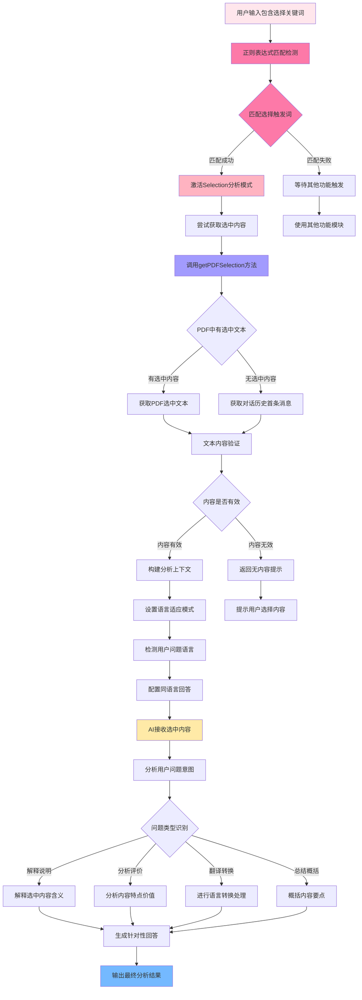

---
System:
  - Project
Process:
  - 4-WorkProjects
Class:
  - 02TS
Project:
  - BuildZotero
Title: ZoteroScript-P6-AskS1-AskSelectionV1
DateCreated: 2026-01-17 17:37
DateModified: 2026-04-18 17:38
Type:
  - doc
Status:
  - doing
Version: v1.0
CardStatus: false
CardType:
  - card-fleeting
tags:
  - Topic/工具技能/工作笔记
  - 代码实现
  - 即时分析
  - 文本选择
  - 学习工具
  - 正则表达式
  - 智能阅读
  - 智能助手
  - AskSelection
  - PDF分析
  - Zotero插件
  - Pattern/Method
RelatedNote:
RelatedProjects:
CardRecord:
---

## ZoteroScript-P 6-AskS1-AskSelectionV1

### 🎯 核心作用
AskSelection 文本选择分析系统是一个专门针对用户选中文本内容进行智能分析的工具。该系统通过正则表达式自动识别用户输入中的文本选择相关关键词（如 " 这段文本 "、" 选中文字 " 等），智能获取用户在 PDF 阅读器中选中的文本内容或对话历史中的文本片段，并通过 AI 进行精准的文本分析和问答。作为即时文本分析的核心工具，AskSelection 将用户的瞬时选择转化为深度洞察，为精准阅读、重点分析和问题解答提供即时智能支持。

---


### 第一部分：完整代码

```javascript
#📖AskSelection[color=#2196F3][trigger=/(这段|选中)(文本|话|文字|描述)/]
Read these content:
${
Meet.Zotero.getPDFSelection() ||
Meet.Global.views.messages[0].content
}$
---
Answer me in the language of my question. This is my question: ${Meet.Global.input}$
```

---


### 第二部分：代码逻辑图



---
