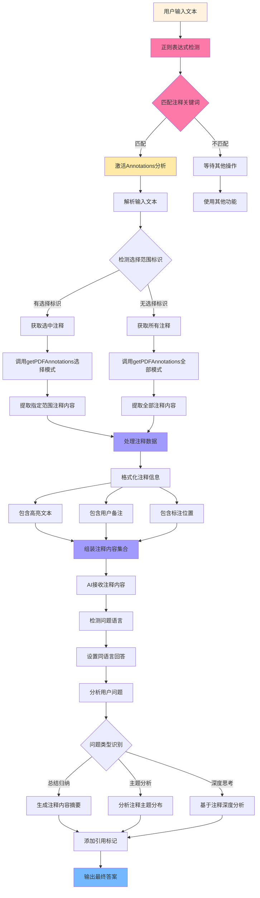

---
System:
  - Project
Process:
  - 4-WorkProjects
Class:
  - 02TS
Project:
  - BuildZotero
Title: ZoteroScript-P6-AskS2-AskAnnotationsV1
DateCreated: 2026-01-17 17:37
DateModified: 2026-04-18 17:38
Type:
  - doc
Status:
  - doing
Version: v1.0
CardStatus: false
CardType:
  - card-fleeting
tags:
  - Topic/工具技能/工作笔记
  - 代码
  - 高亮标注
  - 阅读痕迹
  - PDF注释
  - Zotero插件
  - Pattern/Method
RelatedNote:
RelatedProjects:
CardRecord:
---

## ZoteroScript-P 6-AskS2-AskAnnotationsV1

### 🎯 核心作用
AskAnnotations PDF 注释分析系统是一个专门针对 PDF 文档中用户注释和高亮内容的智能分析工具。通过正则表达式自动识别用户输入中的注释相关关键词（如 " 注释 "、" 高亮 "、" 标注 "），智能提取用户在 PDF 中标记的重要内容，包括高亮文本、注释备注、标注说明等，并通过 AI 进行深度分析和问答。该系统专注于用户个人阅读痕迹的智能化利用，将被动的阅读标记转化为主动的知识问答，为个性化学习、重点内容回顾和深度思考提供强有力的支持。

---


### 第一部分：完整代码

```javascript
#📖AskAnnotations[color=#2196F3][trigger=/(选中|选择的|选择|所选)?(注释|高亮|标注)/]
These are PDF Annotation contents:
${
Meet.Zotero.getPDFAnnotations(Meet.Global.input.match(/(选中|选择的|选择|所选)/))
}$

Please answer me in the language of my question. Make sure to cite results using [number] notation after the reference. 
My question is: ${Meet.Global.input}$
```

---


### 第二部分：代码逻辑图



---
