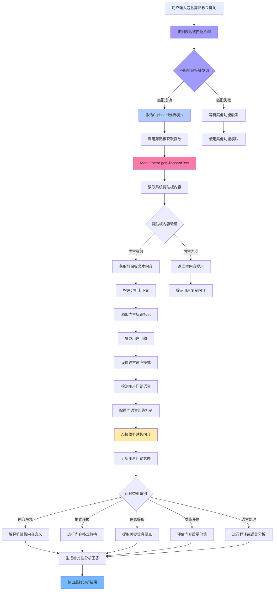

---
System:
  - Project
Process:
  - 4-WorkProjects
Class:
  - 02TS
Project:
  - BuildZotero
Title: ZoteroScript-P6-AskS3-AskClipboardV1
DateCreated: 2026-01-17 17:37
DateModified: 2026-04-18 17:38
Type:
  - doc
Status:
  - doing
Version: v1.0
CardStatus: false
CardType:
  - card-fleeting
tags:
  - Topic/工具技能/工作笔记
  - 代码实现
  - 工作流优化
  - 即时处理
  - 剪贴板分析
  - 跨应用整合
  - 系统集成
  - 信息处理
  - 智能分析
  - AskClipboard
  - Zotero插件
  - Pattern/Method
RelatedNote:
RelatedProjects:
CardRecord:
---

## ZoteroScript-P 6-AskS3-AskClipboardV1

### 🎯 核心作用
AskClipboard 剪贴板分析系统是一个专门针对用户剪贴板内容进行智能分析的工具。该系统通过正则表达式自动识别用户输入中的剪贴板相关关键词（如 " 剪贴板 "、" 复制内容 "），智能获取用户当前剪贴板中的文本内容，并通过 AI 进行深度分析和问答。作为跨应用程序内容分析的桥梁工具，AskClipboard 将用户在任何应用中复制的内容转化为可分析的智能资源，为信息整理、内容分析和知识转换提供无缝的跨平台支持。

---


### 第一部分：完整代码

```javascript
#📗AskClipboard[color=#673AB7][trigger=/(剪贴板|复制内容)/]
This is the content in my clipboard:
${Meet.Zotero.getClipboardText()}$
---
${Meet.Global.input}$
```

---


### 第二部分：代码逻辑图



---
