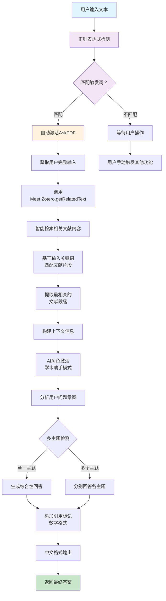

---
System:
  - Project
Process:
  - 4-WorkProjects
Class:
  - 02TS
Project:
  - BuildZotero
Title: ZoteroScript-P6-AskS4-AskPDFV1
DateCreated: 2026-01-17 17:37
DateModified: 2026-04-18 17:38
Type:
  - doc
Status:
  - doing
Version: v1.0
CardStatus: false
CardType:
  - card-fleeting
tags:
  - Topic/工具技能/工作笔记
  - Pattern/Method
RelatedNote:
RelatedProjects:
CardRecord:
---

## ZoteroScript-P6-AskS4-AskPDFV1

### 🎯 核心作用
AskPDF 智能触发问答系统是一个基于自然语言触发的智能文献问答工具，通过正则表达式自动识别用户输入中的文献相关关键词（如 " 本文 "、" 这篇文章 "、" 论文 "），自动激活 PDF 文献分析功能。该系统结合了智能触发机制和上下文相关检索技术，为用户提供更加自然、便捷的文献问答体验，大大降低了学术研究中的操作门槛。

---


### 第一部分：完整代码

```javascript
#📗AskPDF[color=#9C27B0][trigger=/^(本文|这篇文章|论文)/]
You are a helpful assistant. Context information is below.
${
Meet.Zotero.getRelatedText(Meet.Global.input || "概括本文")
}$
Using the provided context information, write a comprehensive reply to the given query. Make sure to cite results using [number] notation after the reference. If the provided context information refer to multiple subjects with the same name, write separate answers for each subject. Use prior knowledge only if the given context didn't provide enough information.

Answer the question: ${Meet.Global.input || "概括本文"}$

Reply in zh-CN.
```

---


### 第二部分：代码逻辑图



---
