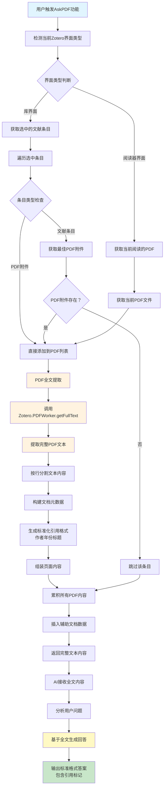

---
System:
- Project
Process:
- 4-WorkProjects
Class:
- 02TS
Project:
- BuildZotero
Title: ZoteroScript-P6-AskS5-AskPDFFullTextV1
DateCreated: 2026-01-17 17:37
DateModified: 2026-04-18 17:38
Type:
- doc
Status:
- doing
Version:
- v1.0
CardStatus: false
CardType:
- card-fleeting
tags:
- Topic/工具技能/工作笔记
- Pattern/Method
RelatedNote:
RelatedProjects:
CardRecord: ''
---

## ZoteroScript-P 6-AskS5-AskPDFFullTextV1

### 🎯 核心作用
AskPDF Full Text 是一个基于 PDF 全文内容的智能学术问答系统，能够直接读取和分析用户选中或当前阅读的 PDF 文献全文内容，通过 AI 技术为用户提供基于完整文献内容的深度问答服务。该系统突破了传统文献片段检索的局限性，利用 PDF 的完整文本信息，为学术研究、文献分析和知识提取提供更加全面和精确的 AI 辅助支持。

---


### 第一部分：完整代码

```javascript
#📗AskPDF Full Text[color=#9C27B0][trigger=]
You are a helpful assistant. Paper's full text from PDF is below.

${
(async () => {
  let pdfItems = []
  if (Zotero_Tabs.selectedType == "library") {
    const items = ZoteroPane.getSelectedItems()
    for (let item of items) {
      if (item.isPDFAttachment()) {
        pdfItems.push(item)
      } else if ((await item.getBestAttachmentState()).exists) {
        pdfItems.push(
          await item.getBestAttachment()
        )
      }
    }
  } else if (Zotero_Tabs.selectedType == "reader"){
    pdfItems = [
      Zotero.Reader.getByTabID(Zotero_Tabs.selectedID)._item
    ]
  }
  let docs = []
  let res = ""
  for (let pdfItem of pdfItems) {
    const fullText = (await Zotero.PDFWorker.getFullText(pdfItem.id, null)).text.split("\n")
    const pageContent = (pdfItem.topLevelItem.firstCreator + " ("+ String(pdfItem.topLevelItem.getField("year")) + ") [" + String(pdfItems.indexOf(pdfItem) + 1) + "] "  + pdfItem.topLevelItem.getDisplayTitle() + "\n"+ fullText)
    res += pageContent + "\n\n"
    docs.push({
      pageContent: pageContent,
      metadata: {
        type: "id",
        id: pdfItem.topLevelItem.id
      }
    })
  }
  Meet.Global.views.insertAuxiliary(docs)
  return res
})()
}$

Using the provided context information, write a comprehensive reply to the given query. 
Make sure to cite results using [number] notation after the reference. Please use the 'author(year)[number]' format when referring to the paper, such as 'Zhao (2025) [2]'.
Answer the question: ${Meet.Global.input || "概括全文"}$.
```

---


### 第二部分：代码逻辑图



---
