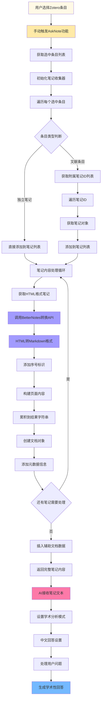

---
System:
Process:
Class:
Project:
  - BuildZotero
Title: ZoteroScript-P6-AskS6-AskNoteV1
DateCreated: 2026-01-17 17:37
DateModified: 2026-02-27 11:57
Type:
Status:
Version:
CardStatus:
CardType:
tags: [笔记分析, 个人知识库, 思考整理, 学术写作, 学术研究, 知识管理, 智能助手, AskNote, BetterNotes, Zotero插件]
RelatedNote:
RelatedProjects:
CardRecord:
---


## ZoteroScript-P 6-AskS6-AskNoteV1

### 🎯 核心作用
AskNote 笔记分析系统是一个专门针对 Zotero 中用户创建的研究笔记进行智能分析的工具。该系统能够自动提取用户在 Zotero 中创建的独立笔记以及附属于文献条目的笔记内容，将 HTML 格式的笔记转换为易于 AI 处理的 Markdown 格式，并通过人工智能进行深度分析和问答。作为个人知识管理的重要组成部分，AskNote 将用户的思考成果、研究心得和学术笔记转化为可查询的智能知识库，为学术研究、知识整理和创意激发提供强有力的支持。

---


### 第一部分：完整代码

```javascript
#📗AskNote[color=#9C27B0][trigger=]
You are a helpful assistant. Paper's note text is below.
${
(async ()=>{
  const items = ZoteroPane.getSelectedItems();
  const noteItems = []
  for (let item of items) {
    if (item.isNote()) { noteItems.push(item) }
    else {
      for (let id of item.getNotes()) {
        noteItems.push(Zotero.Items.get(id))
      }
    }
  }
  let docs = []
  let res = ""
  for (let noteItem of noteItems) {
    const noteText = await Zotero.BetterNotes.api.convert.html2md(noteItem.getNote())
    const pageContent = ("[" + String(noteItems.indexOf(noteItem) + 1) + "] " + noteText)
    res += pageContent + "\n\n"
    docs.push({
      pageContent: pageContent,
      metadata: {
        type: "id",
        id: noteItem.id
      }
    })
  }
  Meet.Global.views.insertAuxiliary(docs)
  return res
})()
}$
Answer this question in an unbiased, comprehensive, and scholarly tone.
Reply in zh-CN.

Question: ${Meet.Global.input}$

Answer:
```

---


### 第二部分：代码逻辑图



---
