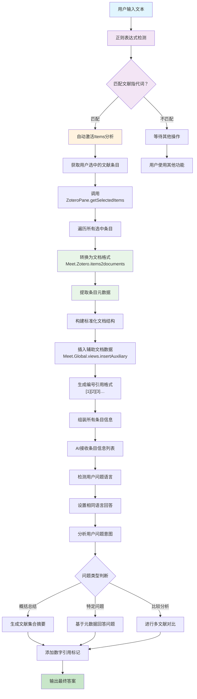

---
System:
- Project
Process:
- 4-WorkProjects
Class:
- 02TS
Project:
- BuildZotero
Title: ZoteroScript-P6-AskS7-AskItemMetaV1
DateCreated: 2026-01-17 17:37
DateModified: 2026-04-18 17:38
Type:
- doc
Status:
- doing
Version:
- v1.0
CardStatus: false
CardType:
- card-fleeting
tags:
- Topic/工具技能/工作笔记
- Pattern/Method
RelatedNote: []
RelatedProjects: []
CardRecord: null
---

## ZoteroScript-P 6-AskS8-AskItemMetaV1

### 🎯 核心作用
Items 文献条目分析系统是一个基于 Zotero 文献条目元数据的智能分析工具，通过正则表达式自动识别用户输入中的文献指代词（如 " 这个文献 "、" 本篇论文 "、" 这些文章 "），自动提取用户选中文献条目的核心信息，包括标题、作者、年份、期刊、摘要等元数据，并通过 AI 进行综合分析和问答。该系统专注于文献条目级别的快速分析，为文献管理、研究规划和学术写作提供高效的元数据驱动支持。

---


### 第一部分：完整代码

```javascript
#📚AskItemMeta[color=#0EA293][trigger=/(这|本)(个|些|篇)(文献|论文|文章|条目)/][trigger=/(这|本)(个|些|篇)(文献|论文|文章|条目)/]
These are Zotero item informations:
${
(async function() {
  let items = ZoteroPane.getSelectedItems()
  const docs = Meet.Zotero.items2documents(items)
  Meet.Global.views.insertAuxiliary(docs)
  return docs.map(
    (doc, index) => "[" + String(index + 1) + "]" + " " +  doc.pageContent
  ).join("\n\n")
})()
}$

---

Please answer me using the lanaguage as same as my question. Make sure to cite results using [number] notation after the reference. 
My question is: ${Meet.Global.input || "summary these papers"}$
```

---


### 第二部分：代码逻辑图



---
