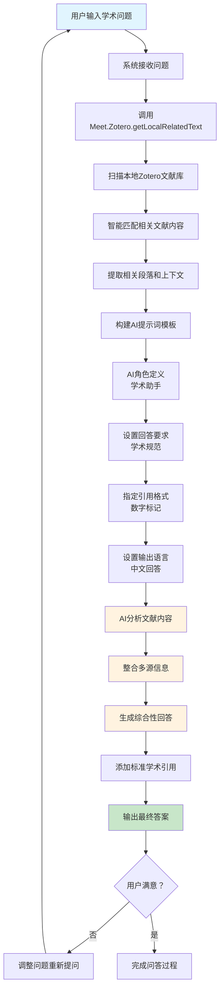

---
System:
Process:
Class:
Project:
  - BuildZotero
Title: ZoteroScript-P6-AskS8-AskZoteroV1
DateCreated: 2026-01-17 17:37
DateModified: 2026-02-27 11:59
Type:
Status:
Version:
CardStatus:
CardType:
tags: []
RelatedNote:
RelatedProjects:
CardRecord:
---


## ZoteroScript-P 6-AskS9-AskZoteroV1

### 🎯 核心作用
AskZotero 是一个基于本地文献库的智能学术问答系统，它能够根据用户输入的学术问题，自动从 Zotero 文献库中检索相关内容，并通过 AI 分析整合多篇文献的信息，生成符合学术规范的综合性回答。该系统将个人文献库转化为智能知识库，为学术研究、文献综述和理论梳理提供强有力的 AI 辅助支持。

---


### 第一部分：完整代码

```javascript
#📚AskZotero[color=#0EA293][trigger=]
You are a helpful assistant. Context informations are below from different papers.
${
Meet.Zotero.getLocalRelatedText(Meet.Global.input)
}$

Using the provided context information come from different paragraphs in different papers, write a comprehensive reply to the given question. Make sure to cite results using [number] notation after the reference. Use the first author and year to represent the article, for example, "Sun et al. (2020)". If the provided context information refer to multiple subjects with the same name, write separate answers for each subject. Use prior knowledge only if the given context didn't provide enough information.

Answer this question in an unbiased, comprehensive, and scholarly tone. 
Reply in zh-CN.

Question: ${Meet.Global.input}$

Answer:
```

---


### 第二部分：代码逻辑图



---
