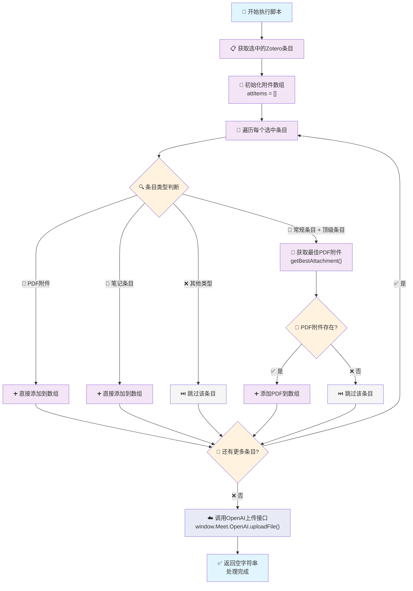
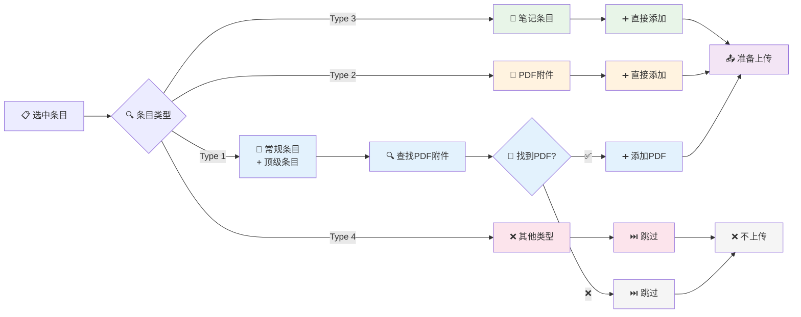
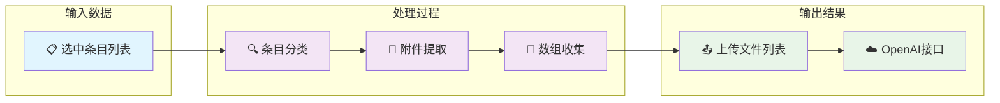

---
System:
- Project
Process:
- 4-WorkProjects
Class:
- 02TS
Project:
- BuildZotero
Title: ZoteroScript-P6-Upload1-UploadFileV1
DateCreated: 2026-01-17 17:37
DateModified: 2026-04-18 17:38
Type:
- doc
Status:
- doing
Version:
- v1.0
CardStatus: false
CardType:
- card-fleeting
tags:
- Topic/工具技能/工作笔记
- 代码
- 批量处理
- 文件上传
- 学术工具
- 自动化脚本
- JavaScript
- OpenAI
- Zotero
- Pattern/Method
RelatedNote:
RelatedProjects:
CardRecord: ''
---

## ZoteroScript-P 6-Upload1-UploadFileV1

### 第一部分：完整代码

```javascript
#📑UploadFile[color=#f9c23c][trigger=]
${
(async () => {
  const attItems = []
  for (let item of ZoteroPane.getSelectedItems()) {
    if (item.isRegularItem() && item.isTopLevelItem()) {
      const pdfItem = await item.getBestAttachment()
      pdfItem && attItems.push(pdfItem)
    } else if (item.isPDFAttachment()) {
      attItems.push(item)
    } else if (item.isNote()) {
      attItems.push(item)
    }
  }
  await window.Meet.OpenAI.uploadFile(attItems)
  return ""
})()
}$
```


### 第二部分：代码逻辑图

#### 主流程图（Mermaid 语法）




#### 条目类型处理流程图




#### 数据流程图


