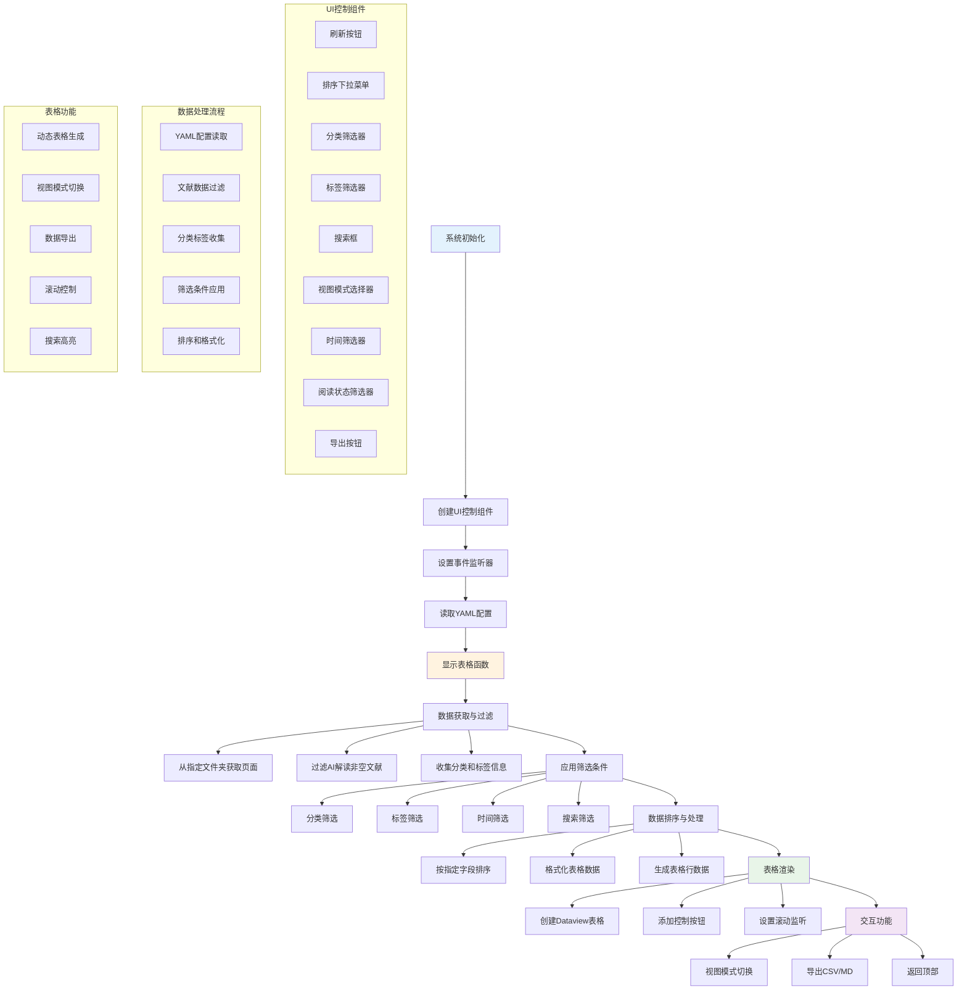
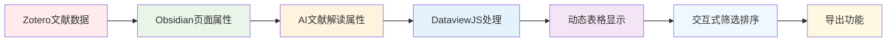

---
System:
Process:
Class:
Project:
  - BuildZotero
Title: ObsidianScript-LR1-文献矩阵0设计架构
DateCreated: 2026-01-17 17:37
DateModified: 2026-01-28 13:03
Status:
Version:
Type:
CardStatus:
CardType:
tags: [DataviewJS, JavaScript, Obsidian, 代码, 学术工具, 文献矩阵, 文献管理, 知识管理]
RelatedNote:
CardRecord:
---


## ObsidianScript-LR1- 文献矩阵 0 设计架构

### 🎯 核心作用
这是一个基于 Obsidian Dataview 插件的智能文献矩阵系统，通过 JavaScript 实现动态文献表格生成。系统能够自动整合 Zotero 导入的文献数据和 AI 文献解读属性，提供多维度筛选、排序、搜索和导出功能，实现从文献标签化到知识图谱构建的完整工作流。

**主要功能**：

- 📊 动态生成包含 30+ 字段的文献矩阵表格
- 🔍 支持标题、分类、标签、时间等多维度筛选
- 📈 提供影响因子、引用量、修改时间等多种排序方式
- 🎯 集成全文搜索功能，支持 AI 解读内容检索
- 💾 一键导出 CSV/Markdown 格式文件
- 👁️ 6 种视图模式适配不同屏幕和使用场景

---


### 第一部分：完整代码

```dataviewjs
//******************** 👇用户可以根据需要自定义的部分👇 ********************// 

// 第一部分表头（文件名除外）
let firstPartHeaders = {
    "文献标题": "title",
    "中文标题": "shortTitle",
    "期刊": "journalAbbreviation",
    "年份": "dateY",
};

// 第二部分表头（secondtPartHeaders, 对应 AI 文献解读中的属性）
let propertiesInAIReading = [
	"领域基础知识",
	"研究背景",
	"作者的问题意识",
	"本文的科学问题",
	"研究目标",
	"研究意义",
	"研究类型",
	"对话与定位的研究领域",
	"研究现状总结",
	"研究批判性分析",
	"理论依据中英文名称",
	"研究假设",
	"研究方法与模型",
	"研究样本以及规模",
	"数据来源",
	"被解释变量中英文名称以及衡量",
	"解释变量中英文名称以及衡量",
	"调节变量中英文名称以及衡量",
	"中介变量中英文名称以及衡量",
	"所有控制变量中英文名称以及衡量",
	"所有控制变量选择依据",
	"其他变量名称以及用途",
	"内生性与稳健性方法",
	"研究结论",
	"研究创新点",
	"理论贡献",
	"其他贡献",
	"未来研究方向提及",
	"未来研究方向思考",
];

// 第三部分表头
let thirdPartHeaders = {
	"作者": "creators",
	"期刊全称": "publicationTitle",
	"影响因子": "libraryCatalog",
    "中科院分区": "callNumber",
    "JCR分区": "JCRQ",
    "引用量": "archiveLocation",
    "星标": "rights",
    "分类": "collection",
    "修改日期": "datetimeModified",
    "官网": "DOI",
    "文库": "itemLink",
    "原文": "pdfLink",
};

// 排序菜单，默认按照【修改日期】降序排列
const options = [{
        value: 'datetimeModified-desc',
        text: '按修改日期降序'
    },
    {
        value: 'datetimeModified-asc',
        text: '按修改日期升序'
    },
    {
        value: 'libraryCatalog-desc',
        text: '按影响因子降序'
    },
    {
        value: 'libraryCatalog-asc',
        text: '按影响因子升序'
    },
    {
        value: 'callNumber-desc',
        text: '按中科院分区降序'
    },
    {
        value: 'callNumber-asc',
        text: '按中科院分区升序'
    },
    {
        value: 'archiveLocation-desc',
        text: '按引用量降序'
    },
    {
        value: 'archiveLocation-asc',
        text: '按引用量升序'
    },
    {
        value: 'rights-desc',
        text: '按星标降序'
    },
    {
        value: 'rights-asc',
        text: '按星标升序'
    },
    {
        value: 'title-desc',
        text: '按文献标题降序'
    },
    {
        value: 'title-asc',
        text: '按文献标题升序'
    },
    {
        value: 'shortTitle-desc',
        text: '按中文标题降序'
    },
    {
        value: 'shortTitle-asc',
        text: '按中文标题升序'
    },
];

//******************** 👆用户可以根据需要自定义的部分👆 ********************// 


// 表头
let headers = ["文件名", ...Object.keys(firstPartHeaders), ...Object.values(propertiesInAIReading), ...Object.keys(thirdPartHeaders)];

function getData4Headers(p, isHeaderInfoInCell) {
    let fileLink = p.file.link;
    // 第一部分表头（文件名除外），支持添加标签列
    let firstPart = Object.values(firstPartHeaders).map(e => {
        if (e === "file.tags") {
            return p[e.split(".")[0]][e.split(".")[1]].filter(e => !["#", "#🤖️", "#🔠", "#📷", "#📝", "#🤖️/AI文献阅读"].includes(e)).join(" ");
        }
        // 导入时已经剔除非数字部分，先判断旧文献有无这些字符后缀，没有则添加 📊
        else if (e === "archiveLocation" && !`${p[e]}`.includes("📊") && !`${p[e]}`.includes("被引") && !`${p[e]}`.includes("citation(s)")) {
            return `${p[e]} 📊`;
        } else {
            return p[e];
        }
    });
    // 第二部分表头（AI 文献解读中的属性）
    let secondPart = Object.values(propertiesInAIReading).map(e => {
        let prefix = "";
        if (!isFixing) {
            prefix = `【${e}】\n`;
        }
        return `${prefix}${p[e]}`;
    });
    // 第三部分表头，支持添加标签列
    let thirdPart = Object.values(thirdPartHeaders).map(e => {
        if (e === "file.tags") {
            return p[e.split(".")[0]][e.split(".")[1]].filter(e => !["#", "#🤖️", "#🔠", "#📷", "#📝", "#🤖️/AI文献阅读"].includes(e)).join(" ");
        }
        // 导入时已经剔除非数字部分，先判断旧文献有无这些字符后缀，没有则添加 📊
        else if (e === "archiveLocation" && !`${p[e]}`.includes("📊") && !`${p[e]}`.includes("被引") && !`${p[e]}`.includes("citation(s)")) {
            return `${p[e]} 📊`;
        } else {
            return p[e];
        }
    });

    return [fileLink, ...firstPart, ...secondPart, ...thirdPart];
}

// 导出 .csv 用
const fs = require('fs');
const path = require('path');

let rows;
const container = dv.container;

// 创建一个 div 容器来包裹下拉菜单和按钮
const controlContainer = document.createElement('div');
controlContainer.style = "display: flex;justify-content: space-between;align-items: center;"

const leftContainer = document.createElement('div');
leftContainer.style = "display: grid;grid-auto-flow: column;gap: 20px;";

// 默认视图（按修改时间降序排列，全部分类）
const defaultViewButton = document.createElement('button');
defaultViewButton.textContent = '刷新全部';
defaultViewButton.onclick = (event) => {
    write2YAML("filterByCollection", "全部分类");
}
leftContainer.appendChild(defaultViewButton);

// 排序下拉菜单
const sortSelector = document.createElement('select');
options.forEach(option => {
    const opt = document.createElement('option');
    opt.className = "select-option"
    opt.value = option.value;
    opt.textContent = option.text;
    sortSelector.appendChild(opt);
});
// 监听排序下拉菜单变化
sortSelector.addEventListener('change', (event) => {
    write2YAML("sort", event.target.value);
});
leftContainer.appendChild(sortSelector);

// 分类下拉菜单
const collectionsSelector = document.createElement('select');
// 监听分类下拉菜单变化
collectionsSelector.addEventListener('change', (event) => {
    write2YAML("filterByCollection", event.target.value);
});
leftContainer.appendChild(collectionsSelector);

// 标签下拉菜单
const tagsSelector = document.createElement('select');
// 监听标签下拉菜单变化
tagsSelector.addEventListener('change', (event) => {
    write2YAML("filterByTag", event.target.value);
});
leftContainer.appendChild(tagsSelector);

controlContainer.appendChild(leftContainer);

// 添加一个搜索框
const searchInput = document.createElement('input');
searchInput.type = 'text';
searchInput.placeholder = '搜索...';
// 监听搜索框按下 Enter 键事件
searchInput.addEventListener('keydown', (event) => {
    if (event.key === 'Enter') {
        if (event.target.value.trim()) {
            write2YAML("search", event.target.value);
        }
    }
});
controlContainer.appendChild(searchInput);

const rightContainer = document.createElement('div');
rightContainer.style = "display: grid;grid-auto-flow: column;gap: 20px;";

// 排序下拉菜单
const viewModeSelector = document.createElement('select');
let viewModeSelector_option = [
    "大表格视图，不锁定表头",
    "大表格视图，锁定表头（大屏）",
    "大表格视图，锁定表头（小屏）",
    "普通视图，不锁定表头",
    "普通视图，锁定表头（大屏）",
    "普通视图，锁定表头（小屏）",
];
viewModeSelector_option.forEach(option => {
    const opt = document.createElement('option');
    opt.className = "select-option"
    opt.value = option;
    opt.textContent = option;
    viewModeSelector.appendChild(opt);
});
// 监听排序下拉菜单变化
viewModeSelector.addEventListener('change', (event) => {
    // 刷新视图按钮状态
    changeViewMode(event.target.value, false);
});
rightContainer.appendChild(viewModeSelector);

controlContainer.appendChild(rightContainer);
container.appendChild(controlContainer);

// 第二行控制栏
const controlContainer2nd = document.createElement('div');
controlContainer2nd.style = "display: flex;justify-content: space-between;align-items: center;margin-top: 15px;"

const leftContainer2nd = document.createElement('div');
leftContainer2nd.style = "display: grid;grid-auto-flow: column;gap: 20px; align-items: center;";

// 阅读完成情况下拉菜单
const modifiedDateNodeSpan = document.createElement('span');
modifiedDateNodeSpan.style.fontSize = "13px";
modifiedDateNodeSpan.textContent = "修改时间:";
leftContainer2nd.appendChild(modifiedDateNodeSpan);

// 修改节点下拉菜单
const modifiedDateNodeSelector = document.createElement('select');
let modifiedDateNodeSelector_option = [
    "不限",
    "今天",
    "过去一天",
    "过去一周",
    "过去一个月",
    "过去一年",
];
modifiedDateNodeSelector_option.forEach(option => {
    const opt = document.createElement('option');
    opt.className = "select-option"
    opt.value = option;
    opt.textContent = option;
    modifiedDateNodeSelector.appendChild(opt);
});
// 监听排序下拉菜单变化
modifiedDateNodeSelector.addEventListener('change', (event) => {
    write2YAML("filterByModifiedDate", event.target.value);
});
leftContainer2nd.appendChild(modifiedDateNodeSelector);

// 阅读完成情况下拉菜单
const statusSpan = document.createElement('span');
statusSpan.style.fontSize = "13px";
statusSpan.textContent = "阅读状态:";
leftContainer2nd.appendChild(statusSpan);

const statusSelector = document.createElement('select');
const statusSelector_option = [{
        value: '全部标签',
        text: '不限'
    },
    {
        value: '#unread',
        text: '未读'
    },
    {
        value: '#reading',
        text: '在读'
    },
    {
        value: '#Done',
        text: '已读'
    },
];
statusSelector_option.forEach(option => {
    const opt = document.createElement('option');
    opt.className = "select-option"
    opt.value = option.value;
    opt.textContent = option.text;
    statusSelector.appendChild(opt);
});
// 监听排序下拉菜单变化
statusSelector.addEventListener('change', (event) => {
    write2YAML("filterByTag", event.target.value);
});
leftContainer2nd.appendChild(statusSelector);

// 查询结果描述。（当查询到结果时）
const resultSpan = document.createElement('span');
resultSpan.style = "display: none;font-size: 13px;font-weight: bold;";
resultSpan.textContent = "";
leftContainer2nd.appendChild(resultSpan);

controlContainer2nd.appendChild(leftContainer2nd);

const rightContainer2nd = document.createElement('div');
rightContainer2nd.style = "display: grid;grid-auto-flow: column;gap: 20px;";

// 添加一个按钮来手动导出 CSV
const exportCSVBtn = document.createElement('button');
exportCSVBtn.textContent = '导出 .csv';
exportCSVBtn.onclick = exportCSV;
rightContainer2nd.appendChild(exportCSVBtn);

// 添加一个按钮来手动导出 Markdown
const exportMarkdownBtn = document.createElement('button');
exportMarkdownBtn.textContent = '导出 .md';
exportMarkdownBtn.onclick = exportCSV;
rightContainer2nd.appendChild(exportMarkdownBtn);

controlContainer2nd.appendChild(rightContainer2nd);
container.appendChild(controlContainer2nd);

// 检查属性空值，仅显示至少有一个属性（AI 文献解读中）不为空的文献
function hasEmptyValue(p) {
    for (let property of propertiesInAIReading) {
        if (p[property]) {
            return true;
        }
    }
    return false;
}

// 搜索
function search(p, searchTerm) {
    // 转为小写
    searchTerm = searchTerm.trim().toLowerCase();
    // 先检索标题，特别适用于针对 Zotero 文献跳转文献矩阵（根据 key）
    if (`${p.file.link}`.toLowerCase().includes(searchTerm)) {
        return true;
    }
    for (let property of propertiesInAIReading) {
        if (`${p[property]}`.toLowerCase().includes(searchTerm)) {
            return true;
        }
    }
    return false;
}

// 存储全部分类信息
let allItemCollections = [];

// 获取全部分类
function getAllItemCollections(p) {
    let itemCollections = p.collection;
    if (itemCollections) {
        itemCollections = `${itemCollections}`.split("、");
        allItemCollections.push(...itemCollections);
        allItemCollections = [...new Set(allItemCollections)];
    }
}

function ceateOptions4CollectionsSelector(targetCollection) {
    // 先清空所有菜单项
    let first = collectionsSelector.firstElementChild;
    while (first) {
        first.remove();
        first = collectionsSelector.firstElementChild;
    }
    // 处理分类
    allItemCollections.forEach((e, index, arr) => {
        e = e.replace(/\[\[/g, "").replace(/\]\]/g, "");
        if (e.includes("|")) {
            let eles = e.split("|");
            // [参考文献|参考文献]
            if (eles.length === 2 && eles[0] === eles[1]) {
                allItemCollections[index] = eles[0].trim();
            }
            // [xxxx.md|参考文献]
            else {
                allItemCollections[index] = eles[1].trim();
            }
        } else {
            allItemCollections[index] = e;
        }
    });

    // 去重，并且排序
    allItemCollections = ["全部分类", ...allItemCollections.sort((a, b) => {
        return a.localeCompare(b, "zh");
    })];
    allItemCollections = [...new Set(allItemCollections)];
    // 添加分类菜单项目
    allItemCollections.forEach((option, index, arr) => {
        const opt = document.createElement('option');
        opt.className = "select-option"
        opt.value = option;
        opt.textContent = option;
        collectionsSelector.appendChild(opt);
        // 当前选择的分类
        if (option === targetCollection) {
            collectionsSelector.selectedIndex = index;
        }
    });
}

// 判断条目是否在目标分类中
function isInTargetCollection(p, targetCollection) {
    let itemCollections = p.collection;
    if (itemCollections) {
        itemCollections = `${itemCollections}`.split("、");
        for (let e of itemCollections) {
            e = e.replace(/\[\[/g, "").replace(/\]\]/g, "");
            if (e.includes("|")) {
                let eles = e.split("|");
                if (eles.length === 2 && eles[0] === eles[1]) {
                    if (eles[0].trim() === targetCollection) {
                        return true;
                    }
                } else if (eles[1].trim() === targetCollection) {
                    return true;
                }
            } else if (e === targetCollection) {
                return true;
            }
        }
        return false;
    }
    return false;
}

// 存储全部分类信息
let allItemTags = [];

// 获取全部标签
function getAllItemTags(p) {
    let itemTags = p.file.tags;
    if (itemTags) {
        allItemTags.push(...itemTags);
        allItemTags = [...new Set(allItemTags)];
    }
}

function ceateOptions4TagsSelector(targetTag) {
    // 先清空所有菜单项
    let first = tagsSelector.firstElementChild;
    while (first) {
        first.remove();
        first = tagsSelector.firstElementChild;
    }
    // 处理分类
    allItemTags = allItemTags.filter(e => !["#", "#🤖️", "#🔠", "#📷", "#📝", "#🤖️/AI文献阅读"].includes(e))

    // 去重，并且排序
    allItemTags = ["全部标签", ...allItemTags.sort((a, b) => {
        return a.localeCompare(b, "zh");
    })];
    allItemTags = [...new Set(allItemTags)];
    // 添加分类菜单项目
    allItemTags.forEach((option, index, arr) => {
        const opt = document.createElement('option');
        opt.className = "select-option"
        opt.value = option;
        opt.textContent = option;
        tagsSelector.appendChild(opt);
        // 当前选择的分类
        if (option === targetTag) {
            tagsSelector.selectedIndex = index;
        }
    });
}

// 判断条目是否在目标标签中
function isInTargetTag(p, targetTag) {
    let itemTags = p.file.tags;
    for (let itemTag of itemTags) {
        if (itemTag === targetTag) {
            return true;
        }
    }
    return false;
}

// 判断条目是否在目标修改时间节点中
function isInTargetModifiedDateNode(p, targetModifiedDateNode) {
    let num4TargeNode = {
        "今天": 0,
        "过去一天": 1,
        "过去一周": 7,
        "过去一个月": 30,
        "过去一年": 365,
    };
    let datetimeModified = p.datetimeModified;
    if (datetimeModified.includes("-")) {
        datetimeModified = datetimeModified.split(" ")[0].trim().replace(/-/g, "/");

        let num = num4TargeNode[targetModifiedDateNode];
        if (num != undefined) {
            let targetDate = getDate4TargetNode(num);
            if (dateDiff(datetimeModified, targetDate)) {
                return true;
            }
        } else {
            return false;
        }
    } else {
        return false;
    }
}

// 获取针对某个节点的回朔日期
function getDate4TargetNode(number) {
    const num = number;
    const date = new Date();
    let year = date.getFullYear();
    let mon = date.getMonth() + 1;
    let day = date.getDate();
    if (day <= num) {
        if (mon > 1) {
            mon = mon - 1;
        } else {
            year = year - 1;
            mon = 12;
        }
    }
    date.setDate(date.getDate() - num);
    year = date.getFullYear();
    mon = date.getMonth() + 1;
    day = date.getDate();
    const s = year + '/' + mon + '/' + day;
    return s;
}

// 判断条目日期是否比节点回朔日期更近
function dateDiff(new_date, old_date) {

    var difftime = (new Date(new_date) - new Date(old_date)) / 1000;
    var days = parseInt(difftime / 86400);
    if (days >= 0) {
        return true
    } else {
        return false
    }
}

// 定义导出 CSV 的函数
function exportCSV() {
    const BOM = "\uFEFF";

    const csvRows = rows.map(row =>
        row.map(cell =>
            `"${(cell ?? "").toString().replace(/"/g, '""')}"`
        ).join(",")
    );

    const csvContent = BOM + csvRows.join("\n");

    // 导出至当前文件夹
    const currentFilePath = dv.current().file.path;
    const currentDir = path.dirname(currentFilePath);
    const filePath = path.join(app.vault.adapter.basePath, currentDir, '智能文献矩阵导出.csv');

    // 采用 UTF-8 编码
    fs.writeFileSync(filePath, csvContent, {
        encoding: 'utf8'
    });
    try {
        // 在本地显示
        showFileInFinder(filePath);
    } catch (e) {

    }
    alert(`✅ 已导出至当前文件夹！文件名为：【文献矩阵导出.csv】。`);
}

function exportMarkdown(data) {
    const mdHeaders = headers.join(' | ');
    const mdSeparator = headers.map(() => '---').join(' | ');
    const mdRows = data.map(row => row.map(cell => (cell ?? "").toString().replace(/\n/g, ' ').replace(/\|/g, '\\|')).join(' | '));

    const mdContent = mdHeaders + '\n' + mdSeparator + '\n' + mdRows.join('\n');

    const currentFilePath = dv.current().file.path;
    const currentDir = path.dirname(currentFilePath);
    const filePath = path.join(app.vault.adapter.basePath, currentDir, '智能文献矩阵导出.md');

    fs.writeFileSync(filePath, mdContent, {
        encoding: 'utf8'
    });

    try {
        showFileInFinder(filePath);
    } catch (e) {

    }
    alert(`✅ 已导出至当前文件夹！文件名为：【文献矩阵导出.md】。`);
}

// 在本地显示文件
function showFileInFinder(filePath) {
    // 本地显示文件用
    const {
        exec
    } = require('child_process');

    exec(`open -R "${filePath}"`, (error, stdout, stderr) => {
        if (error) {
            return;
        }
        if (stderr) {
            return;
        }
    });
}

// 改变视图模式。或者，开始渲染表格时，根据当前 YAML 源码中的视图模式刷新按钮
function changeViewMode(viewMode, isInit) {
    // 获取 Obsidian 的 active 文件
    const activeFile = app.workspace.getActiveFile();
    app.vault.read(activeFile).then(content => {
        // 分离 YAML 区和正文内容
        const yamlRegex = /^---\n([\s\S]*?)\n---/;
        const match = content.match(yamlRegex);
        if (match) {
            // YAML 区内容
            const yamlContent = match[1];
            // 正文区内容
            const bodyContent = content.replace(yamlRegex, '');
            // 修改 YAML 内容
            // 当前是大表格模式
            let newYamlContent = 'cssclasses: tablenowrap, tablepage, hideproperties,\nobsidianUIMode: preview';
            isFixing = false;
            if (!isInit) {
                if (viewMode === "大表格视图，不锁定表头") {
                    newYamlContent = yamlContent.replace(/(cssclasses: ).*/, '$1tablenowrap, tablepage, hideproperties,');
                    viewModeSelector.selectedIndex = 0;
                    isFixing = false;
                } else if (viewMode === "大表格视图，锁定表头（大屏）") {
                    newYamlContent = yamlContent.replace(/(cssclasses: ).*/, '$1fixTableHeader, tablenowrap, wideScreen, tablepage, hideproperties,');
                    viewModeSelector.selectedIndex = 1;
                    isFixing = true;
                } else if (viewMode === "大表格视图，锁定表头（小屏）") {
                    newYamlContent = yamlContent.replace(/(cssclasses: ).*/, '$1fixTableHeader, tablenowrap, narrowScreen, tablepage, hideproperties,');
                    viewModeSelector.selectedIndex = 2;
                    isFixing = true;
                } else if (viewMode === "普通视图，不锁定表头") {
                    newYamlContent = yamlContent.replace(/(cssclasses: ).*/, '$1tablepage, hideproperties,');
                    viewModeSelector.selectedIndex = 3;
                    isFixing = false;
                } else if (viewMode === "普通视图，锁定表头（大屏）") {
                    newYamlContent = yamlContent.replace(/(cssclasses: ).*/, '$1fixTableHeader, wideScreen, tablepage, hideproperties,');
                    viewModeSelector.selectedIndex = 4;
                    isFixing = true;
                } else if (viewMode === "普通视图，锁定表头（小屏）") {
                    newYamlContent = yamlContent.replace(/(cssclasses: ).*/, '$1fixTableHeader, narrowScreen, tablepage, hideproperties,');
                    viewModeSelector.selectedIndex = 5;
                    isFixing = true;
                }
            } else {
                if (yamlContent.includes("tablenowrap") && !yamlContent.includes("fixTableHeader")) {
                    newYamlContent = yamlContent.replace(/(cssclasses: ).*/, '$1tablenowrap, tablepage, hideproperties,');
                    viewModeSelector.selectedIndex = 0;
                    isFixing = false;
                } else if (yamlContent.includes("tablenowrap") && yamlContent.includes("fixTableHeader") && yamlContent.includes("wideScreen")) {
                    newYamlContent = yamlContent.replace(/(cssclasses: ).*/, '$1fixTableHeader, tablenowrap, wideScreen, tablepage, hideproperties,');
                    viewModeSelector.selectedIndex = 1;
                    isFixing = true;
                } else if (yamlContent.includes("tablenowrap") && yamlContent.includes("fixTableHeader") && yamlContent.includes("narrowScreen")) {
                    newYamlContent = yamlContent.replace(/(cssclasses: ).*/, '$1fixTableHeader, tablenowrap, narrowScreen, tablepage, hideproperties,');
                    viewModeSelector.selectedIndex = 2;
                    isFixing = true;
                } else if (!yamlContent.includes("tablenowrap") && !yamlContent.includes("fixTableHeader")) {
                    newYamlContent = yamlContent.replace(/(cssclasses: ).*/, '$1tablepage, hideproperties,');
                    viewModeSelector.selectedIndex = 3;
                    isFixing = false;
                } else if (!yamlContent.includes("tablenowrap") && yamlContent.includes("fixTableHeader") && yamlContent.includes("wideScreen")) {
                    newYamlContent = yamlContent.replace(/(cssclasses: ).*/, '$1fixTableHeader, wideScreen, tablepage, hideproperties,');
                    viewModeSelector.selectedIndex = 4;
                    isFixing = true;
                } else if (!yamlContent.includes("tablenowrap") && yamlContent.includes("fixTableHeader") && yamlContent.includes("narrowScreen")) {
                    newYamlContent = yamlContent.replace(/(cssclasses: ).*/, '$1fixTableHeader, narrowScreen, tablepage, hideproperties,');
                    viewModeSelector.selectedIndex = 5;
                    isFixing = true;
                }
            }

            if (!isInit) {
                // 重新组合内容
                const newContent = `---\n${newYamlContent}\n---${bodyContent}`;
                // 写回文件
                app.vault.modify(activeFile, newContent);
                // 修改 YAML 后，会自动重载表格，查询参数是预置值
            } else {
                displayTable();
            }
        }
    });
}

// 判断是否启用了锁定表格，如果没有，则在每个单元格加入表头信息
let isFixing = false;

// 向 YAML 区写入内容
function write2YAML(mode, term) {
    // 获取 Obsidian 的 active 文件
    const activeFile = app.workspace.getActiveFile();
    app.vault.read(activeFile).then(content => {
        // 分离 YAML 区和正文内容
        const yamlRegex = /^---\n([\s\S]*?)\n---/;
        const match = content.match(yamlRegex);
        if (match) {
            // YAML 区内容
            const yamlContent = match[1];
            // 正文区内容
            const bodyContent = content.replace(yamlRegex, '');
            // 修改 YAML 内容
            let newYamlContent;
            if (mode === "sort") {
                newYamlContent = yamlContent.replace(/(sortBy: ).*/, `$1${term}`);
            } else if (mode === "filterByTag") {
                newYamlContent = yamlContent.replace(/(queryMode: ).*/, `$1${mode}`);
                // 标签必须加双引号，否则只能读到 null
                newYamlContent = newYamlContent.replace(/(queryTerm: ).*/, `$1"${term}"`);
            } else {
                newYamlContent = yamlContent.replace(/(queryMode: ).*/, `$1${mode}`);
                newYamlContent = newYamlContent.replace(/(queryTerm: ).*/, `$1${term}`);
            }
            // 重新组合内容
            const newContent = `---\n${newYamlContent}\n---${bodyContent}`;
            // 写回文件
            app.vault.modify(activeFile, newContent);
        }
    });
}

// 读取 YAML 区
function readFromYAML() {
    // 获取当前文件的元数据
    const file = dv.current().file;

    // 获取 YAML 区中的 queryMode 属性值
    const queryMode = file.frontmatter.queryMode;
    const queryTerm = file.frontmatter.queryTerm;
    const sortBy = file.frontmatter.sortBy;
    const notesFolder = file.frontmatter.notesFolder;

    return {
        queryMode,
        queryTerm,
        sortBy,
        notesFolder,
    }
}

// 初始根据 YAML 刷新视图菜单，并显示表格
changeViewMode(false, true);

// 显示表格
function displayTable() {
    // 清空现有的表格
    container.querySelectorAll('table').forEach(table => table.remove());
    // 清空返回全部按钮
    container.querySelectorAll('.results-Container').forEach(table => table.remove());
    // 清空回到顶部按钮
    container.querySelectorAll('.scrollToTopButton-Container').forEach(table => table.remove());
    // 先隐藏结果显示 span
    resultSpan.style.display = "none";

    // 读取 YAML 属性
    let {
        queryMode,
        queryTerm,
        sortBy,
        notesFolder
    } = readFromYAML();
    // 过滤属性全为空的页面
    let data = dv.pages(`"${notesFolder}"`)
        .filter(p => hasEmptyValue(p));
    // 获取全部分类
    data.forEach(p => getAllItemCollections(p));
    // 创建分类菜单项
    ceateOptions4CollectionsSelector();

    // 获取全部标签
    data.forEach(p => getAllItemTags(p));
    // 创建标签菜单项
    ceateOptions4TagsSelector();

    // 刷新排序菜单选择
    sortSelector.selectedIndex = options.map(e => e.value).indexOf(sortBy);
    // 排序种类
    let _sortBy = sortBy.split("-")[0];
    // 降序或者升序
    let _order = sortBy.split("-")[1];

    // 分类筛选模式
    if (queryMode === "filterByCollection" && queryTerm != "全部分类") {
        data = data.filter(p => isInTargetCollection(p, queryTerm));
        // 创建分类菜单，并选中目标分类
        ceateOptions4CollectionsSelector(queryTerm);
    }
    // 标签筛选模式
    if (queryMode === "filterByTag" && queryTerm != "全部标签") {
        data = data.filter(p => isInTargetTag(p, queryTerm));
        // 创建分类菜单，并选中目标分类
        ceateOptions4TagsSelector(queryTerm);
        // 刷新阅读状态菜单
        if (["#unread", "#reading", "#Done"].includes(queryTerm)) {
            statusSelector.selectedIndex = statusSelector_option.map(e => e.value).indexOf(queryTerm);
        }
    }
    // 修改节点筛选模式
    if (queryMode === "filterByModifiedDate" && queryTerm != "不限") {
        data = data.filter(p => isInTargetModifiedDateNode(p, queryTerm));
        // 刷新修改节点下拉菜单
        modifiedDateNodeSelector.selectedIndex = modifiedDateNodeSelector_option.indexOf(queryTerm);
    }
    // 搜索模式
    if (queryMode === "search" && queryTerm) {
        searchInput.value = queryTerm;
        data = data.filter(p => search(p, queryTerm));
    }
    // 排序、获取数据
    data = data.sort(p => p[_sortBy], _order)
        .map(p => getData4Headers(p));

    rows = [headers, ...data];

    const backButtonContainer = document.createElement('div');
    backButtonContainer.className = 'results-Container';
    backButtonContainer.style = "display: none;margin-top: 15px";

    const resultsMessage = document.createElement('span');
    resultsMessage.className = 'results-description';
    resultsMessage.textContent = '没有找到匹配的结果。';
    backButtonContainer.appendChild(resultsMessage);

    const backButton = document.createElement('button');
    backButton.textContent = '返回全部';
    backButton.onclick = (event) => {
        write2YAML("filterByCollection", "全部分类");
    }
    backButtonContainer.appendChild(backButton)

    container.appendChild(backButtonContainer);

    exportMarkdownBtn.onclick = () => exportMarkdown(data);

    if (data.length > 0) {
        // 显示数据表
        dv.table(headers, data, {
            id: "literature-table"
        });
        // 搜索模式，搜索结果数量描述
        if (queryMode === "search" && queryTerm) {
            resultsMessage.textContent = `搜索【${queryTerm}】，共有【${data.length}】条结果。`;
            backButtonContainer.style.display = "";
        } else {
            resultSpan.style.display = "";
            resultSpan.textContent = `共有【${data.length}】条结果。`;
        }
    } else if (data.length === 0 && queryMode === "search" && queryTerm) {
        // 搜索模式，搜索结果为 0 描述
        resultsMessage.textContent = `搜索【${queryTerm}】，共有【0】条结果。`;
        backButtonContainer.style.display = "";
    } else {
        let descriptionPrefix = {
            "filterByCollection": "查询分类",
            "filterByTag": "查询标签",
            "filterByModifiedDate": "通过修改日期过滤",
        }
        resultsMessage.textContent = `${descriptionPrefix[queryMode]}：【${queryTerm}】，共有【0】条结果。`;
        backButtonContainer.style.display = "";
    }

    // 表格渲染完成后，添加【返回顶部按钮】，并监听表格滚动条滚动
    waitForElement('.dataview.table-view-table', (dataviewTable) => {

        // 添加【返回顶部🔝】DIV 容器
        const scrollToTopButtonContainer = document.createElement('div');
        scrollToTopButtonContainer.className = 'scrollToTopButton-Container';
        scrollToTopButtonContainer.style.display = 'none'; // 初始隐藏
        // 添加【返回顶部🔝】按钮
        const scrollToTopButton = document.createElement("button");
        scrollToTopButton.textContent = '返回顶部';
        scrollToTopButton.style.float = 'right';
        scrollToTopButton.onclick = () => {
            dataviewTable.scrollTop = 0;
            document.querySelector('.markdown-preview-view').scrollTop = 0; // 滚动整个文档的滚动条到顶部
        };
        scrollToTopButtonContainer.appendChild(scrollToTopButton)

        container.appendChild(scrollToTopButtonContainer)

        // 监听表格的滚动事件
        dataviewTable.addEventListener('scroll', () => {
            // 判断是否滚动到最底部
            if (dataviewTable.scrollTop + dataviewTable.clientHeight >= dataviewTable.scrollHeight) {
                scrollToTopButtonContainer.style.display = ''; // 显示按钮
            } else {
                scrollToTopButtonContainer.style.display = 'none'; // 隐藏按钮
            }
        });
    });

    // 等待表格渲染完成
    function waitForElement(selector, callback) {
        const interval = setInterval(() => {
            const element = document.querySelector(selector);
            if (element) {
                clearInterval(interval);
                callback(element);
            }
        }, 100); // 每 100 毫秒检查一次

    }
}
```

---


### 第二部分：代码逻辑图



#### 核心数据流



---


### 第三部分：代码解释

#### 3.1 系统架构设计
这个文献矩阵系统采用**三层架构**设计：

##### **配置层（用户自定义部分）**

```javascript
// 表头配置 - 支持完全自定义
let firstPartHeaders = {
    "文献标题": "title",
    "中文标题": "shortTitle", 
    // ...可根据需求添加或修改
};

// AI解读属性配置 - 对应AI文献阅读的29个标准字段
let propertiesInAIReading = [
    "领域基础知识",
    "研究背景",
    // ...完整的学术文献分析维度
];
```


##### **业务逻辑层（核心处理）**
- **数据获取与过滤**：从 Obsidian 页面属性中提取文献信息
- **多维度筛选**：支持分类、标签、时间、搜索等筛选条件
- **排序与格式化**：按多种字段进行升降序排列
- **表格生成**：动态创建包含所有字段的矩阵表格


##### **界面交互层（用户体验）**
- **控制面板**：双行控制栏，包含所有筛选和操作选项
- **动态更新**：通过修改 YAML Front Matter 实现状态持久化
- **视图模式**：6 种不同的显示模式适配各种使用场景


#### 3.2 核心功能模块

##### **数据处理模块**

```javascript
function getData4Headers(p, isHeaderInfoInCell) {
    // 三部分数据整合：基础信息 + AI解读 + 扩展信息
    let firstPart = Object.values(firstPartHeaders).map(/* 处理基础字段 */);
    let secondPart = Object.values(propertiesInAIReading).map(/* 处理AI解读字段 */);
    let thirdPart = Object.values(thirdPartHeaders).map(/* 处理扩展字段 */);
    
    return [fileLink, ...firstPart, ...secondPart, ...thirdPart];
}
```

**特点**：

- 自动处理标签过滤（排除系统标签）
- 智能格式化引用量显示
- 根据视图模式调整表头显示


##### **筛选系统**

```javascript
// 分类筛选
function isInTargetCollection(p, targetCollection) {
    // 支持Obsidian链接格式 [[文件名|显示名]]
    // 智能解析分类信息
}

// 标签筛选  
function isInTargetTag(p, targetTag) {
    // 精确匹配文件标签
}

// 时间筛选
function isInTargetModifiedDateNode(p, targetModifiedDateNode) {
    // 支持相对时间过滤：今天、过去一周、过去一月等
}
```


##### **搜索引擎**

```javascript
function search(p, searchTerm) {
    searchTerm = searchTerm.trim().toLowerCase();
    // 1. 优先检索文件链接（支持Zotero key跳转）
    if (`${p.file.link}`.toLowerCase().includes(searchTerm)) return true;
    
    // 2. 全文检索AI解读的29个属性
    for (let property of propertiesInAIReading) {
        if (`${p[property]}`.toLowerCase().includes(searchTerm)) return true;
    }
    return false;
}
```


#### 3.3 视图模式系统

##### **6 种视图模式**
1. **大表格视图，不锁定表头** - 适合数据浏览
2. **大表格视图，锁定表头（大屏）** - 适合大屏显示器
3. **大表格视图，锁定表头（小屏）** - 适合笔记本电脑
4. **普通视图，不锁定表头** - 标准显示模式
5. **普通视图，锁定表头（大屏）** - 大屏标准模式
6. **普通视图，锁定表头（小屏）** - 小屏标准模式


##### **CSS 类控制**

```javascript
// 通过动态修改YAML Front Matter中的cssclasses实现视图切换
newYamlContent = yamlContent.replace(
    /(cssclasses: ).*/, 
    '$1fixTableHeader, tablenowrap, wideScreen, tablepage, hideproperties,'
);
```


#### 3.4 状态管理

##### **YAML 驱动的状态持久化**

```javascript
// 所有筛选状态都保存在文件的YAML Front Matter中
function write2YAML(mode, term) {
    // 读取 → 修改 → 写回 → 触发重新渲染
    const newContent = `---\n${newYamlContent}\n---${bodyContent}`;
    app.vault.modify(activeFile, newContent);
}
```

**优势**：

- 状态持久化：重新打开文件时保持上次的筛选状态
- 可版本控制：状态变更可通过 Git 等工具追踪
- 可分享：状态随文件一起分享给其他用户


#### 3.5 导出功能

##### **双格式导出支持**

```javascript
// CSV导出 - 支持Excel等工具
function exportCSV() {
    const BOM = "\uFEFF"; // UTF-8 BOM确保中文正确显示
    const csvContent = BOM + csvRows.join("\n");
    fs.writeFileSync(filePath, csvContent, {encoding: 'utf8'});
}

// Markdown导出 - 保持格式兼容性
function exportMarkdown(data) {
    const mdContent = mdHeaders + '\n' + mdSeparator + '\n' + mdRows.join('\n');
    fs.writeFileSync(filePath, mdContent, {encoding: 'utf8'});
}
```


#### 3.6 用户体验优化

##### **智能界面更新**
- **动态菜单生成**：分类和标签菜单根据实际数据动态创建
- **状态同步**：所有控件状态与 YAML 配置自动同步
- **结果反馈**：实时显示筛选结果数量和状态


##### **性能优化**
- **增量更新**：只重新渲染必要的部分
- **异步处理**：大数据量处理时避免界面冻结
- **内存管理**：及时清理不需要的 DOM 元素


##### **可访问性支持**
- **键盘导航**：支持 Enter 键搜索
- **视觉反馈**：清晰的状态指示和错误提示
- **响应式设计**：适配不同屏幕尺寸

---


### 总结
本系统实现基于 Obsidian Dataview 的智能文献矩阵生成，支持多维度筛选、排序、搜索和导出功能，是文献标签管理系统的重要组成部分。

#Obsidian #DataviewJS #文献管理 #代码 #JavaScript #学术工具 #知识管理 #文献矩阵
