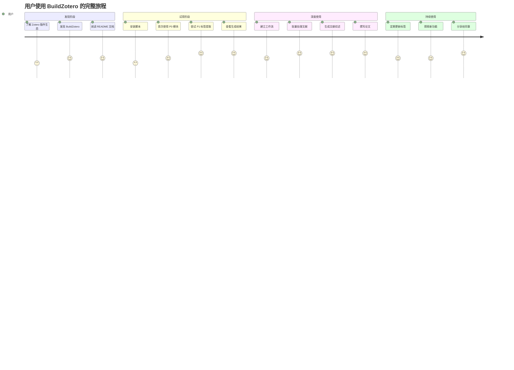
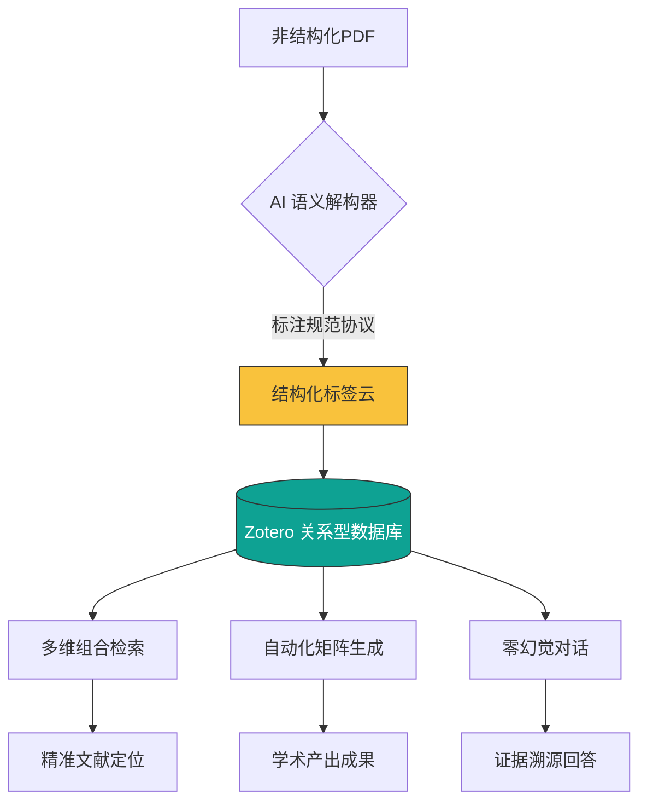
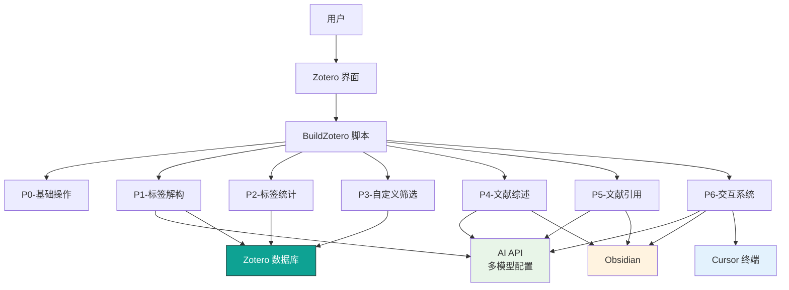
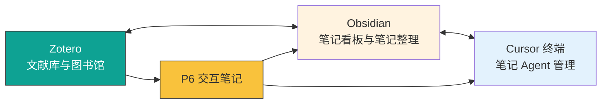

---
System:
- Project
Process:
- 4-WorkProjects
Class:
- 02TS
Project:
- BuildZotero
Title: 01-PRD-产品需求文档
DateCreated: 2026-01-17 17:37
DateModified: 2026-04-18 17:38
Type:
- doc
Status:
- doing
Version:
- v1.0
CardStatus: false
CardType:
- card-fleeting
tags:
- Topic/工具技能/工作笔记
- Pattern/Memo
RelatedNote: []
RelatedProjects: []
CardRecord: null
---

# BuildZotero - 产品需求文档 (PRD) v3.0

**文档版本**: v3.0  
**最后更新**: 2026-02-27 

---

## 📋 文档目录

1. [[#1. 产品概述\|产品概述]]
2. [[#2. AI Agent 架构设计理念\|AI Agent 架构设计理念]]
3. [[#3. 产品核心范式转移 (Paradigm Shift)\|产品核心范式转移]]
4. [[#4. 需求分析与场景定位\|需求分析与场景定位]]
5. [[#5. 用户画像\|用户画像]]
6. [[#6. 核心需求\|核心需求]]
7. [[#7. 功能需求\|功能需求]]
8. [[#8. 技术架构\|技术架构]]
9. [[#9. 数据模型\|数据模型]]
10. [[#10. 产品路线图\|产品路线图]]
11. [[#11. 成功指标\|成功指标]]
12. [[#12. 风险评估\|风险评估]]

---

## 1. 产品概述

### 1.1 产品定位

**BuildZotero** 是基于 Zotero 平台，专属于科研工作者的**文献 AI Agent**。通过深度集成 **Zotero（文献管理与阅读）+ Obsidian（笔记看板与管理）+ Cursor 终端（笔记 Agent 管理）**，构建完整的科研工作流闭环。

**核心定位**：将非结构化学术论文转化为 " 可检索、可维护、可编程 " 的结构化标签数据库，让 AI 成为每一位研究者的 RA（Research Assistant）。

**产品愿景**：**AI4S（AI for Science）**，专属于科研工作者的 AI Agent，深度融入科研工作者的工作流，让 AI 真正赋能科研工作，提升科研效率与质量。

---

### 1.2 核心价值主张

| 价值维度 | 具体描述 | 技术实现 | 量化指标 |
|---------|---------|---------|---------|
| **效率提升** | 自动化文献标签提取，减少手工整理时间 | AI 驱动的多维度内容分析 | 节省 70%+ 文献整理时间 |
| **智能化** | 领域知识注入的 AI 分析 | 8 维标签体系 + Prompt 工程 | 准确率 80-90% |
| **结构化** | 标准化输出格式 | 强制 Markdown 表格格式 | 11 维分析框架 |
| **工作流集成** | 深度集成研究工具链 | Zotero + Obsidian + Cursor 双向链接 | 100% 兼容现有工作流 |
| **知识复利** | 标签体系 = 知识资产 | 结构化知识积累 | 支持大规模文献处理（1000+ 篇） |
| **可维护性** | 白盒化标签管理 | 用户可随时修改标签 | 100% 可维护性 |
| **理论库资产** | 理论库构建与循环更新 | 标准理论库匹配 + 新理论标记 | 理论库持续增值 |

---

### 1.3 产品形态

- **平台**: Zotero 插件生态（嵌入式 AI Agent）
- **技术栈**: JavaScript + AI API（多模型配置）
- **交付方式**: 开源脚本集合
- **用户界面**: Zotero 原生界面 + 脚本触发
- **工作流集成**: Zotero ↔ Obsidian ↔ Cursor（双向链接）

---

### 1.4 项目成就

**项目成就**：获得清华大学、中国科学技术大学等多个实验室邀请进行专项分享，产品被采纳并协助其进行 Zotero 智能文献管理系统的部署。

---

## 2. AI Agent 架构设计理念

### 2.1 AI Agent 落地的核心逻辑

对于大多数 AI Agent 落地，关键不在于 " 炼模型 "，而在于通过**架构设计**，将通用的 " 大模型大脑 " 与具体的 " 业务身体 " 连接，实现**意图识别到任务执行**的完整闭环。

**AI Agent 设计的核心**：为这个 " 天才大脑 " 搭建**传感器（获取数据）**和**执行器（调用工具）**，构建从数据获取到任务执行的完整链路。

---

### 2.2 AI Agent 产品经理的三项核心工作

当你手里有了一个 " 博学的大脑 "，你的工作重点会拆解为以下三个维度：

#### 2.2.1 语境架构师 (Context Architect) —— 决定 " 看什么 "

- **核心任务**：从海量数据库（知识库）中筛选出最相关的片段，精准地摆在这个大脑的 " 办公桌 " 上（Context Window），确保 AI 获得最准确、最相关的上下文信息
- **技术实现**：**RAG (检索增强生成)**、**语义检索**
- **BuildZotero 实践**：
  - 通过 8 维标签体系实现结构化信息提取，将非结构化文献转化为高质量的结构化数据
  - 利用 Zotero 数据库能力，支持大规模文献库（1000+ 篇）的精准检索
  - 基于标签的多维逻辑检索，支持 " 变量 + 方法 + 样本 " 的复合筛选，而非简单的关键词匹配

#### 2.2.2 接口翻译官 (Tool/Interface Integrator) —— 决定 " 怎么干 "

- **核心任务**：定义一套**任务规范**，将 AI 的意图转化为可执行的操作。当 AI 输出特定意图时，系统能够自动捕捉并执行相应的操作
- **技术实现**：**函数调用 (Function Calling)**、**工具规范 (Tools/Function Schema)**、**语义检索 (Semantic Search)**
- **BuildZotero 实践**：
  - 设 Prompt 工程将文献转化为结构化输出计标准化的标注规范（8 维标签体系 + 11 维分析框架），确保 AI 输出的结构化与一致性
  - 实现 Zotero、Obsidian、Cursor 之间的工具调用和接口匹配，打通科研工作流

#### 2.2.3 工作流设计师 (Workflow Designer) —— 决定 " 怎么想 "

- **核心任务**：设计一套智能工作流，引导 AI 按照既定逻辑执行任务。先让它分析 A，再让它验证 A，最后根据 A 执行 B，形成完整的推理链条
- **技术实现**：**MCP (模型上下文协议)**、**智能体工作流 (Agentic Workflows)**
- **BuildZotero 实践**：
  - 设计 " 内容获取层 → Prompt 构建层 → AI 生成层 " 三阶段处理流程，确保每个环节的质量与可控性
  - 实现理论库匹配与循环更新机制，确保理论标签的准确性与知识资产的持续增值
  - 构建从文献解构到综述生成、引用添加的完整工作流，实现科研工作的全流程智能化

---

### 2.3 输入端的挑战与解决方案

**挑战 1：提示工程的设计**
- **解决方案**：设计标准化的学术标注规范（8 维标签体系 + 11 维分析框架），通过精心设计的 Prompt 模板引导 AI 生成结构化输出，确保输出的一致性与准确性

**挑战 2：上下文窗口的限制**
- **解决方案**：
  - **智能内容提取**：优先读取 PDF 核心位置（如 Introduction 和 Methodology 章节），而非全量输入，确保关键信息优先
  - **字符限制策略**：PDF 前 8000 字符策略，在保证关键信息完整性的同时，控制上下文长度
  - **笔记优先机制**：支持笔记优先版本（V-Rnote），优先利用用户已标注的高质量笔记
  - **信息密度压缩**：通过结构化标签压缩信息密度，将数万字的文献浓缩为逻辑化的 " 知识组件 "，大幅提升信息利用效率

**模型特性**：模型是**无状态 (Stateless)** 的，所谓的记忆是通过在每一轮 **Prompt** 中通过 " 历史回填 " 实现的**上下文窗口 (Context Window)** 模拟。因此，如何高效利用有限的上下文窗口，成为 AI Agent 设计的核心挑战。

---

### 2.4 输出端的挑战与解决方案

**挑战 1：AI 幻觉（Hallucination）**
- **解决方案**：
  - **私有知识库**：完全基于用户文献库，而非互联网通用知识，确保知识来源的准确性与可控性
  - **全链路证据溯源**：所有生成内容均带 `[number]` 锚点，支持一键回溯来源，实现从生成内容到原始文献的完整追溯链
  - **白盒化维护**：标签在 Zotero 中完全可见、可改，用户可随时手动核准，确保 100% 准确性

**挑战 2：函数调用 (Function Calling) 或工具调用的接口匹配**
- **解决方案**：
  - **MCP (模型上下文协议)**：设计标准化的接口协议，确保不同工具之间的无缝对接
  - **语义级匹配**：通过标签体系实现语义级别的精准匹配，而非简单的字符串匹配
  - **工具规范 (Tools/Function Schema)**：嵌入 zotero 中，可以直接修改 zotero 的元数据设置

---

## 3. 产品核心范式转移 (Paradigm Shift)

在进入具体功能前，必须明确 BuildZotero 相比传统 AI 阅读工具的核心差异化优势：

| **维度** | **传统 AI 阅读工具 (如 NotebookLM/ChatPDF)** | **BuildZotero (本产品)** |
|---------|-------------------------------------------|------------------------|
| **交互逻辑** | **点状会话 (Stateless)**：问完即走，知识随 Session 结束而损耗 | **结构化索引 (Stateful)**：AI 提取转化为 Zotero 标签，永久资产化 |
| **检索能力** | **关键词检索**：必须记得文献名才能找到 | **多维逻辑检索**：支持 " 变量 + 方法 + 样本 " 的交叉筛选，即使不记得文献名也能定位 |
| **处理规模** | **小批量**：受限于单次上传文件数和 Context Window | **超大规模**：利用 Zotero 数据库能力，支持对数千篇文献进行统一打标与检索 |
| **可维护性** | **黑盒不可改**：AI 总结错了，用户很难修正 | **白盒化维护**：标签与 PDF 联动，支持用户手动核准，系统持续进化 |
| **数据资产** | **临时数据**：每次查询都是独立的，无法积累 | **永久资产**：标签体系是知识的结构化积累，可复用、可扩展 |
| **输出格式** | **自由文本**：每次输出格式可能不同，难以后续处理 | **结构化数据**：强制 Markdown 表格格式，可解析、可复用 |
| **工作流集成** | **独立工具**：无法与现有研究工具链集成 | **深度集成**：Zotero + Obsidian + Cursor 双向链接，打通科研工作流 |
| **理论库管理** | **无理论库**：无法验证理论标签的正确性 | **理论库循环更新**：标准理论库匹配 + 新理论标记，理论库持续增值 |

---

### 3.1 核心差异化优势

#### 3.1.1 结构化索引 vs 关键词检索

- **传统方式**：用户必须记住文献名称或关键词才能找到文献
- **BuildZotero**：支持基于标签的多维逻辑检索，即使不记得文献名也能通过 " 变量 + 方法 + 样本 " 的组合找到相关文献

#### 3.1.2 永久资产 vs 临时会话

- **传统方式**：每次查询都是独立的，知识无法积累
- **BuildZotero**：标签体系是永久的知识资产，可复用、可扩展，支持知识网络构建

#### 3.1.3 白盒维护 vs 黑盒不可改

- **传统方式**：AI 总结错了，用户很难修正
- **BuildZotero**：标签在 Zotero 中完全可见、可改，用户可随时手动核准，确保 100% 准确性

#### 3.1.4 工作流深度集成 vs 独立工具

- **传统方式**：无法与现有研究工具链集成，形成信息孤岛
- **BuildZotero**：Zotero ↔ Obsidian ↔ Cursor 双向链接，打通科研工作流，让 AI 真正地赋能科研工作

#### 3.1.5 理论库循环更新 vs 无理论库

- **传统方式**：无法验证理论标签的正确性，理论查找困难
- **BuildZotero**：理论标签基于标准理论库进行标准匹配，AI 从文献中总结出的理论标签会加上 `new` 标记，用户可核对后纳入标准理论库，实现理论库的循环更新与持续增值

---

## 4. 需求分析与场景定位

### 4.1 使用场景

**主要使用场景**: 个人学术研究（博士研究生、科研人员）

**使用规模**:
- 个人文献库: 500-2000+ 篇文献
- 使用频率: 日常研究工作中频繁使用
- 应用场景: 文献标注、综述撰写、引用管理、知识检索

#### 4.1.1 产品定位

**产品定位**: **个人学术研究工具 / 开源项目**

- **通用 AI 工具**: ChatGPT、Claude、豆包等，面向通用知识问答
- **垂直领域工具**: BuildZotero，面向学术研究领域的深度分析
- **差异化**: 不是替代通用 AI 工具，而是针对学术研究场景的专业化 AI Agent

**市场定位说明**: 本项目为个人项目/开源项目，目前未市场化。上述市场分析仅用于理解产品定位和未来发展方向，不作为商业化依据。

---

### 4.2 核心用户场景挖掘（5 大核心场景）

通过针对科研群体的需求调研，我们发现科研工作者通常有以下核心需求：

#### 场景 1：在海量文献中查找所需文献

**痛点描述**：
- 海量文献通常专业且复杂，仅依靠现有元数据（标题、作者、摘要）难以精准定位所需文献
- 需要查找的信息维度多样：研究方法、样本特征、理论框架、核心变量、创新点等
- 传统方式需要逐篇打开、阅读，耗时耗力，往往花费大量时间仍无法找到目标文献
- 即使做了文献笔记，经过一段时间后也常常无法找回，存在 " 在哪里看过但就是找不到 " 的困扰

**BuildZotero 解决方案**：
- ✅ **多维逻辑检索**：通过 P3 模块，支持 " 变量 + 方法 + 样本 " 的交叉筛选，即使不记得文献名也能精准定位
- ✅ **结构化标签体系**：通过 P1 模块提取 8 维标签，将文献的核心信息结构化，实现从 " 条目逻辑 " 到 " 标签逻辑 " 的转换
- ✅ **原生功能赋能**：通过注入结构化标签，极大程度发挥 Zotero 高级检索（Advanced Search）的实战价值，将单一关键词搜索升级为复合逻辑筛选

---

#### 场景 2：进行文献筛选，需要同时对多篇文献进行比较

**痛点描述**：
- 需要同时对十几篇甚至数十篇文献进行比较分析，但逐篇阅读工作量巨大
- 现有 AI 阅读工具受限于上下文窗口，难以同时处理多篇文献
- 此类工作专业且复杂，通用 AI 阅读工具难以完成高质量的分析任务
- 相关笔记和标注无法直接保存到文献管理系统中，即使复制到 Zotero 笔记文件，也难以管理和查找
- 手工标注不仅工作量大，且缺乏系统性，难以长期维护，不具备可持续性

**BuildZotero 解决方案**：
- ✅ **批量标签提取**：通过 P1 模块，一次性将成百上千篇文献的标签信息提取，实现大规模文献的批量处理
- ✅ **结构化内容输出**：提取的结构化内容可编程化，可作为各种软件的输入源，实现文献研究的任意可视化
- ✅ **全景情报看板**：通过 P2 模块，实现全局态势感知（Situational Awareness），将文献库情报表格化、看板化呈现，打破 " 单点检索 " 的局限
- ✅ **白盒化维护**：标签在 Zotero 中完全可见、可改，支持长期维护和可持续性，确保知识资产的持续增值

---

#### 场景 3：文献综述撰写

**痛点描述**：
- 现有 AI 工具在进行文献综述这种高难度知识工作时，最大的困难是缺乏可靠的上下文信息
- 单篇文献通常篇幅极长且知识深度强，直接输入全文作为上下文通常会超过模型上下文窗口限制
- 通用 RAG 技术虽然可行，但质量通常不高，需要用户自行对文献按照学术体系进行结构化处理
- 将文献浓缩为具有逻辑性的标签后，一旦输入的知识库是用户自己的，且是高度结构化的逻辑标签，文献综述的生成质量即可得到保障

**BuildZotero 解决方案**：
- ✅ **逻辑驱动的智能生产**：利用 " 预先治理、逻辑对齐 " 的输入策略，显著提升 RAG 在文献综述场景下的严谨性。由于输入端是高度逻辑化的 " 知识组件 "，生成内容的逻辑深度远超常规 AI 阅读工具
- ✅ **大规模输入能力**：系统一次性可同时处理 200-300 篇文献作为输入，这是现有 AI 阅读工具及其他 AI 科研工具无法达到的规模
- ✅ **私有知识库**：所有生成内容均基于用户自己的文献库，而非互联网通用知识，确保知识来源的准确性与可控性
- ✅ **全链路证据溯源**：提供回溯链接，每一句话均可一键跳转到文献条目，支持核对与互动阅读
- ✅ **11 维分析框架**：通过 P4 模块，生成标准化的 11 维文献综述矩阵，涵盖研究背景、构念定义、测量方法、理论视角等核心维度

---

#### 场景 4：为自己的论文内容添加引用

**痛点描述**：
- 此功能是目前所有科研工具均无法提供的，因为其技术要求极高
- 通用 AI 工具更无法实现，因为需要深度理解用户文献库的结构与内容
- 需要能够自主制定文献引用来源，精准找到所需文献，并满足各种引用格式要求

**BuildZotero 解决方案**：
- ✅ **基于结构化标签的精准匹配**：通过 8 维结构化标签，无论是利用 Zotero 平台自带的高级检索功能，还是基于 P3 的 AI 二次整理，均可精准找到所需文献
- ✅ **多种匹配策略**：支持精准匹配（1-2 个最相关文献）和穷尽式（所有相关文献）两种策略，满足不同场景需求
- ✅ **灵活的引用格式**：引用可满足用户的任何要求，无论是年份、学者、特定期刊、特定等级，用户均可随时跳转到所需文献
- ✅ **科研工作习惯适配**：针对科研工作习惯，提供不同的文献引用方式，可默认根据年度及评级添加最适合的引用，也可将所有引用来源添加，由用户筛选
- ✅ **多种版本支持**：无论是文献综述还是文献引用，均提供多种版本，满足不同写作场景的需求

---

#### 场景 5：交互式文献问答与知识库查询

**痛点描述**：
- 类似于现有 AI 阅读工具，用户希望在阅读时随时与 AI 交互，获得问答、解释、总结等服务
- 但现有工具无法将交互笔记直接添加到 Zotero 中，而是保存在其他软件中，形成信息孤岛
- 交互系统不仅应能阅读单篇文献，还应能作为知识库，基于用户整个文献库进行问答

**BuildZotero 解决方案**：
- ✅ **嵌入式交互系统**：通过 P6 模块，实现嵌入式交互系统，交互笔记直接添加在 Zotero 中，而非其他软件，确保信息的一致性
- ✅ **直接跳转特定段落**：由于是嵌入式设计，支持直接跳转到特定段落，实现从问答到原文的快速定位
- ✅ **知识库问答**：能够作为用户的知识库，将整个文献库作为知识来源，基于文献库内容进行问答，而非依赖互联网通用知识
- ✅ **多源输入支持**：可自由选择输入来源，无论是 Zotero 中的文献、标记、标注，还是剪贴板内容、外部文件，均可进行交互
- ✅ **工作流集成**：P6 的交互笔记以及 Zotero 中的任何内容与 Obsidian 均实现双向链接，同步更新，充分利用 Zotero 与 Obsidian 的特性，打通科研工作流

---

### 4.3 核心痛点分析

#### 4.3.1 科研群体痛点（基于需求调研）

| 痛点 | 现状 | 影响 | AI 工具视角 |
|------|------|------|-------------|
| **文献整理耗时** | 手动标注每篇文献需 10-30 分钟 | 研究效率低下，无法处理大规模文献 | 通用 AI 工具无法批量处理，缺乏结构化输出 |
| **信息提取不系统** | 缺乏结构化标签体系 | 难以进行跨文献比较和分析 | 通用 AI 工具输出自由文本，无法结构化 |
| **综述撰写困难** | 需要手动梳理文献关系 | 文献综述撰写耗时 1-2 周 | 通用 AI 工具缺乏领域知识，无法生成标准化综述 |
| **引用管理繁琐** | 手动查找和添加引用 | 容易遗漏关键文献 | 通用 AI 工具无法访问用户文献库，无法精准匹配 |
| **知识孤岛** | 文献信息分散，难以形成知识网络 | 无法发挥文献的复利价值 | 通用 AI 工具是临时查询，无法积累知识 |
| **文献检索困难** | 必须记住文献名才能找到 | 经常出现 " 我记得读过但找不到 " 的情况 | 缺乏多维逻辑检索能力 |
| **理论查找困难** | 理论是知识前沿，除了在权威文献中，知识库以及 AI 检索都无法穷尽 | 没有人能够知道所有理论，自然也就无法对输出内容进行验证 | 缺乏理论库匹配与循环更新机制 |

---

### 4.4 竞品分析

#### 4.4.1 文献管理工具竞品

| 产品 | 优势 | 劣势 | 我们的差异化 |
|------|------|------|------------|
| **Zotero 原生** | 免费、开源、跨平台 | 缺乏 AI 能力、标签体系简单 | 多维标注体系架构、8 维标签体系 |
| **Mendeley** | 社交功能、云同步 | 标签功能弱、AI 能力有限 | 专业化 AI 分析、深度分析 |
| **EndNote** | 功能全面、引用格式丰富 | 价格昂贵、学习曲线陡 | 免费开源、模块化设计 |

---

#### 4.4.2 AI 工具竞品（核心对比）

| 产品 | 类型 | 优势 | 劣势 | 我们的差异化 |
|------|------|------|------|------------|
| **豆包** | 通用 AI | 信息全面、实时更新 | 缺乏领域深度、输出不结构化 | **专业化 AI Agent**、结构化输出、领域知识注入 |
| **ChatGPT** | 通用 AI | 通用知识丰富 | 无法访问用户文献库 | **用户文献库**、深度集成 Zotero |
| **Claude** | 通用 AI | 长文本处理强 | 缺乏工作流集成 | **工作流深度集成**、模块化设计 |
| **NotebookLM** | AI 阅读工具 | 对话式阅读 | 点状会话、无法积累 | **结构化索引**、永久资产化 |

---

#### 4.4.3 核心竞争优势

1. ✅ **专业化 AI Agent** - 不是通用 AI，而是学术研究领域的专业化 AI Agent
   - 8 维标签体系 = 领域知识的结构化编码
   - 11 维分析框架 = 学术研究的标准化分析维度
   - 理论库匹配 = 领域知识的积累和复用

2. ✅ **结构化信息提取** - 不是自由文本输出，而是多维度结构化提取
   - 多维度标签提取（主题、方法、理论、变量等）
   - 关系识别（变量关系、理论关系、研究关系）
   - 精准筛选（基于标签的语义筛选）

3. ✅ **工作流深度集成** - 不是独立工具，而是深度集成到研究工具链
   - Zotero 原生集成，自动处理文献库
   - Obsidian 双向链接，构建知识网络
   - Cursor 终端集成，笔记 Agent 管理
   - 模块化设计，按需组合

4. ✅ **知识复利效应** - 不是一次性查询，而是知识的持续积累
   - 标签体系 = 知识资产，可复用
   - 版本管理，知识演进可追溯
   - 批量处理，发挥规模效应
   - 理论库循环更新，持续增值

5. ✅ **白盒化维护** - 不是黑盒不可改，而是完全可维护
   - 标签在 Zotero 中完全可见、可改
   - 用户可随时手动核准，确保 100% 准确性
   - 支持版本管理和回滚

---

## 5. 用户画像

### 5.1 核心用户

#### 用户画像 1: 博士研究生（主要用户）

**基本信息**:
- 年龄: 25-30 岁
- 身份: 博士研究生
- 研究领域: 管理学、经济学、社会学等

**使用场景**:
- 需要管理 500-2000 篇文献
- 撰写博士论文文献综述
- 需要快速理解新文献的核心内容

**核心需求**:
- 快速提取文献关键信息（主题、方法、理论、变量）
- 生成结构化的文献综述矩阵
- 自动添加文献引用

**痛点**:
- 文献整理占用大量时间
- 难以系统化梳理文献关系
- 引用格式容易出错
- 经常出现 " 我记得读过但找不到 " 的情况

**BuildZotero 解决方案**:
- ✅ 自动化标签提取，节省 70%+ 时间
- ✅ 多维逻辑检索，即使不记得文献名也能找到
- ✅ 结构化综述矩阵，系统化梳理文献关系
- ✅ 自动引用添加，格式标准化

---

#### 用户画像 2: 青年学者

**基本信息**:
- 年龄: 30-40 岁
- 身份: 助理教授、副教授
- 研究领域: 多领域交叉研究

**使用场景**:
- 管理多个研究项目的文献
- 撰写研究论文和基金申请书
- 指导学生进行文献综述

**核心需求**:
- 批量处理大量文献
- 识别研究议程和理论框架
- 生成高质量的研究综述

**痛点**:
- 时间有限，需要高效工具
- 需要保持对领域前沿的跟踪
- 需要产出高质量的研究成果
- 需要知识积累和复用

**BuildZotero 解决方案**:
- ✅ 批量处理，支持大规模文献库
- ✅ 知识资产化，标签体系可复用
- ✅ 研究议程识别，自动识别核心研究流派
- ✅ 白盒化维护，确保知识准确性
- ✅ 理论库循环更新，持续增值

---

### 5.2 用户旅程



---

## 6. 核心需求

### 6.1 功能需求优先级

#### P0 - 核心功能（必须有）

1. **文献标签自动提取** (P1 模块)
   - 8 维标签体系（主题、方法、样本、理论、结论、变量、条目细节）
   - AI 驱动的智能内容理解
   - 支持批量处理
   - **白盒化维护**：用户可随时修改标签
   - **理论库匹配**：标准理论库匹配 + 新理论标记

2. **文献综述生成** (P4 模块)
   - 11 维文献综述矩阵
   - 多种输出格式（5 列、2 列）
   - 智能排序（星级优先、年份优先）
   - 基于已校准标签生成，确保准确性
   - 大规模输入能力（一次性处理 200-300 篇文献）

3. **文献引用添加** (P5 模块)
   - 智能匹配相关文献
   - 多种引用格式
   - 精准匹配算法
   - 基于标签的多维度匹配
   - 灵活的引用策略（精准匹配 vs 穷尽式）

---

#### P1 - 重要功能（应该有）

1. **标签统计与可视化** (P2 模块) - **全景情报看板与统计透视**
2. **自定义筛选** (P3 模块) - **多维逻辑检索**
3. **基础操作工具** (P0 模块)
4. **交互式查询** (P6 模块) - **证据溯源型对话**

---

#### P2 - 增强功能（可以有）

1. 协作功能
2. 可视化增强
3. 模板系统
4. API 集成

---

### 6.2 非功能需求

| 需求类型 | 具体要求 | 优先级 |
|---------|---------|--------|
| **性能** | 单篇文献处理时间 < 30 秒 | P0 |
| **准确性** | 标签提取准确率 > 80% | P0 |
| **可用性** | 学习曲线 < 1 小时 | P0 |
| **兼容性** | 支持 Zotero 6.0+ | P0 |
| **可扩展性** | 支持 1000+ 文献批量处理 | P1 |
| **稳定性** | 错误率 < 5% | P0 |
| **可维护性** | 标签 100% 可修改 | P0 |
| **工作流集成** | Zotero ↔ Obsidian ↔ Cursor 双向链接 | P0 |
| **模型配置灵活性** | 不同任务可自由切换模型 | P1 |

---

## 7. 功能需求

### 7.1 P0 - 基础操作模块

**功能描述**: 提供文献管理的基础工具

| 功能 | 描述 | 输入 | 输出 | 优先级 |
|------|------|------|------|--------|
| M1- 标签展示 | 自定义标签属性列的需要展示的标签，可根据当前的需求自定义，比如，当前学者正在做方法论上的研究，那么就可以只显示方法标签，如果正在做专题研究，则可以显示主题、变量等标签，所有的标签高度自定义，按照正则表达式，随意组合和展示 | 文献库的所有文献 | 标签列表 | P1 |
| M2- 标签清理 | 智能清理无效标签 | 选中文献 | 清理后的标签 | P1 |
| M3- 标签删除 | 批量删除指定标签 | 选中文献 + 标签前缀 | 删除结果 | P1 |
| M4- 标题清理 | 规范化文献标题 | 选中文献 | 清理后的标题 | P1 |

---

### 7.2 P1 - 文献标签解构模块（核心）

**功能描述**: 通过 AI 自动提取文献的多维信息标签，实现语义解构与自动化打标

**核心目标**: 利用 Prompt 工程将 PDF 全文强制映射为一套标准化的学术标注规范（逻辑结构协议）

**多维标注体系与标准化治理**:
- **分析规范设计**：独立设计一套包含 11 个核心维度的学术分析协议（Standardized Protocol），涵盖核心变量（IV/DV）、理论架构、研究方法与样本特征等，形成标准化的学术分析框架
- **数据结构化映射**：利用提示词工程驱动 LLM 将长文本核心逻辑映射为 Zotero 的标准化标签体系，实现了从 " 非结构化文献 " 向 " 标准化知识组件 " 的物理级转换，确保数据质量的确定性

| 功能            | 标签类型      | 输出格式                   | 优先级 | 标注规范设计                      |
| ------------- | --------- | ---------------------- | --- | --------------------------- |
| Tag1- 主题标签    | 研究主题与核心概念 | `Item/序号`              | P0  | 关键变量、核心概念                   |
| Tag 2- 方法标签   | 研究方法与技术   | `sMeth/1-6`            | P0  | 方法论指纹：研究类型、主要分析、辅助分析        |
| Tag 3- 样本标签   | 研究层次与样本特征 | `Sample/1-3`           | P0  | 研究层次、研究领域、研究样本              |
| Tag 4- 理论标签   | 理论框架与机制   | `Theory/序号`            | P0  | **标准理论库匹配 + 新理论标记**         |
| Tag 5- 结论标签   | 研究发现与结论   | `Result/序号`            | P0  | 主要结论、次要结论                   |
| Tag 6- 变量标签   | 变量定义与关系   | `A1-DV/`, `A2-IV/` 等   | P0  | **因果链条**：因变量、自变量、中介变量、调节变量等 |
| Tag 7- 条目细节标签 | 研究贡献与展望   | `V1-def/`, `V3-con/` 等 | P0  | 变量定义、测量方法、研究贡献、未来展望         |

**版本体系**:
- **V 系列**: 标准版本（PDF 优先）
- **V-R 系列**: 重新处理版本（支持标签更新）
- **V-Rnote 系列**: 笔记优先版本（优先使用用户笔记）

**资产维护特性**: 
- ✅ 生成的标签直接写入 Zotero 数据库
- ✅ **用户可在阅读过程中随时手动修改标签，确保数据库的 100% 准确性**
- ✅ 支持增量更新，避免重复处理

**理论库构建与循环更新机制**:
- ✅ **标准理论库匹配**：理论标签基于标准理论库进行标准匹配，确保理论标签的准确性与一致性
- ✅ **新理论标记**：AI 从文献中总结出的理论标签将加上 `new` 标记，便于用户识别与核对
- ✅ **用户核对机制**：用户可根据文献内容核对新理论，确保理论标签的正确性
- ✅ **理论库更新**：经用户确认的新理论可纳入标准理论库，实现理论库的持续扩展
- ✅ **循环更新机制**：通过持续的匹配、标记、核对、更新循环，理论库不断更新与完善，形成持续增值的知识资产
- ✅ **标签正确性保障**：通过标准匹配与用户核对双重机制，确保所有理论标签的正确性，解决理论查找困难的问题
- ✅ **知识资产化**：理论库作为用户的知识资产，可复用、可扩展，实现知识的持续积累与增值

---

### 7.3 P2 - 文献标签统计模块（全景情报看板与统计透视）

**功能描述**: 提供标签统计与可视化能力

**全景情报看板与统计透视**:
- **全局态势感知（Situational Awareness）**：P2 统计模块打破了 " 单点检索 " 的局限，通过将文献库情报表格化、看板化呈现，实现了从 " 条目逻辑 " 到 " 标签逻辑 " 的全量透视，帮助研究者快速掌握研究领域的整体态势
- **动态回溯与穿透**：支持对研究议题分布、方法论占比等核心指标进行统计。所有统计结果均支持秒级回溯（Traceability），确保研究者在掌握宏观趋势的同时，能瞬间下钻定位至具体的文献来源，实现从宏观到微观的无缝切换

| 功能 | 描述 | 输出 | 优先级 |
|------|------|------|--------|
| Table1- 统计条目 | 生成文献条目统计表格 | Markdown 表格 | P1 |
| Table2- 统计标签 | 生成标签使用频率统计 | Markdown 表格 | P1 |

---

### 7.4 P3 - 文献自定义筛选模块（多维逻辑检索）

**功能描述**: 基于标签规则进行精准筛选，实现 " 逻辑组合寻找文献 "

**核心目标**: 利用打标后的结构化数据，实现多维复合索引系统

**原生功能赋能与二层检索架构**:
- **激活原生搜索价值**：通过注入结构化标签，极大程度发挥 Zotero 高级检索（Advanced Search）的实战价值，将原本单一的关键词搜索升级为 " 变量 + 方法 + 样本 " 的复合逻辑筛选，实现精准定位
- **二层检索逻辑（Two-tier Retrieval）**：支持流程化、高度自定义的二次检索与标注。该设计确保了 AI 结构化标签与用户原有标签架构的解耦（Decoupling），用户可完全自主地进行标签清理与删除管理，不干扰原有的分类秩序，实现灵活性与可控性的平衡

**典型场景**:
> " 帮我找出所有：**[变量包含：数字化]** 且 **[方法包含：双重差分]** 且 **[样本包含：制造业]** 的文献。"

| 功能 | 筛选规则 | 输出 | 优先级 |
|------|---------|------|--------|
| TagM1- 变量定义与衡量 | 基于 `V1-def/`, `V2-mea/` 标签 | 筛选结果 | P1 |
| TagM2- 主题变量分类 | 基于变量标签 | 筛选结果 | P1 |
| TagM3- 控制变量类型 | 基于 `A6-CV/` 标签 | 筛选结果 | P1 |
| TagM4- 地区固定效应 | 基于地区、年份、行业关键词 | 筛选结果 | P1 |

**价值点**: 彻底解决 " 我记得读过这类文章，但死活找不到 " 的科研痛点。

---

### 7.5 P4 - 文献综述模块（结构化综述矩阵生成）

**功能描述**: 自动化生成结构化文献综述，将 " 数据库数据 " 转化为 " 学术产出文稿 "

**核心目标**: 不再是基于摘要乱写，而是读取已校准的 P1 标签，自动填充 11 维综述矩阵

**逻辑驱动的智能生产**:
- **高质量生成任务**：利用 " 预先治理、逻辑对齐 " 的输入策略，显著提升 RAG 在文献综述、文档问答场景下的严谨性。由于输入端是高度逻辑化的 " 知识组件 "，生成内容的逻辑深度与准确性远超常规 AI 阅读工具
- **全链路证据溯源**：确保所有生成任务均具备物理级溯源能力，支持一键回溯来源，从根源抑制 AI 幻觉，确保科研产出的 100% 确定性，满足学术研究的严谨性要求
- **大规模输入能力**：系统一次性可同时处理 200-300 篇文献作为输入，这是现有 AI 阅读工具及其他 AI 科研工具无法达到的规模，实现真正的批量智能分析

| 功能 | 输出格式 | 分析维度 | 优先级 |
|------|---------|---------|--------|
| LR0- 摘要简洁 | 清理后的摘要 | - | P1 |
| LR1- 矩阵标签生成 | 5 列/2 列表格 | 11 维 | P0 |
| LR2- 矩阵标签要点 | 3-7 列表格 | 要点式 | P1 |
| LR3- 矩阵标签测量 | 6 列表格 | 变量定义与衡量 | P1 |
| LR4- 文献综述 | 4 列表格 | 研究议程 | P1 |

**11 维分析框架**:
1. 研究背景 2. 构念定义 3. 测量方法 4. 理论视角 5. 对象层次
6. 研究情境 7. 研究方法 8. 前因因素 9. 作用后果 10. 中介机制 11. 调节因素

**LR4- 议程识别**: 基于标签分布，自动识别该领域的 3-5 个核心研究议程（Research Agendas）

---

### 7.6 P5 - 文献引用模块

**功能描述**: 智能添加文献引用

| 功能 | 核心原则 | 引用数量 | 引用格式 | 优先级 |
|------|---------|---------|---------|--------|
| Cite1-V1-AY | 精准匹配 | 1-2 个 | (作者, 年份, 期刊) 编号 | P0 |
| Cite1-V1-AYN | 穷尽式 | 所有相关 | (作者, 年份, 期刊) 编号 | P1 |
| Cite1-V1-YJ | 穷尽式 | 1-2 个 | (年份, 期刊) 编号 | P1 |

**技术特点**:
- ✅ 基于标签的多维度匹配
- ✅ 星级优先 + 年份优先 + 期刊质量排序
- ✅ 在用户写作时，根据语义自动从库中匹配最合适的文献
- ✅ 灵活的引用策略：可以默认根据年度以及评级来添加最适合的引用，也可以将所有的引用来源添加，由用户筛选
- ✅ 满足用户的任何要求：无论是年份、学者、特定期刊、特定等级，用户也可以随时跳转到所需文献

---

### 7.7 P6 - 交互系统模块（证据溯源型对话）

**功能描述**: 提供对话式交互能力，基于已治理的库，进行零幻觉的对话

**核心目标**: 对话不仅基于 PDF 全文，还参考 P1 提取的结构化标签，回答必须带 `[number]` 锚点

**逻辑驱动的智能生产与问答**:
- **高质量生成任务**：利用 " 预先治理、逻辑对齐 " 的输入策略，显著提升 RAG 在文献综述、文档问答场景下的严谨性。由于输入端是高度逻辑化的 " 知识组件 "，生成内容的逻辑深度与准确性远超常规 AI 阅读工具
- **全链路证据溯源**：确保所有生成任务均具备物理级溯源能力，支持一键回溯来源，从根源抑制 AI 幻觉，确保科研产出的 100% 确定性，满足学术研究的严谨性要求

| 功能 | 描述 | 优先级 |
|------|------|--------|
| ASK- 文献阅读交互 | 对话式文献查询与问答 | P1 |
| Upload- 文件上传 | 支持文件上传与处理 | P2 |

**AskZotero**: 对话不仅基于 PDF 全文，还参考 P1 提取的结构化标签，回答必须带 `[number]` 锚点，确保可追溯性

**核心特性**:
- ✅ **嵌入式交互系统**：交互笔记直接添加在 Zotero 中，而非其他软件，确保信息的一致性，避免信息孤岛
- ✅ **直接跳转特定段落**：由于是嵌入式设计，支持直接跳转到特定段落，实现从问答到原文的快速定位
- ✅ **知识库问答**：能够作为用户的知识库，将整个文献库作为知识来源，基于文献库内容进行问答，而非依赖互联网通用知识
- ✅ **多源输入支持**：可自由选择输入来源，无论是 Zotero 中的文献、标记、标注，还是剪贴板内容、外部文件，均可进行交互，实现灵活的数据接入
- ✅ **工作流集成**：P6 的交互笔记以及 Zotero 中的任何内容与 Obsidian 均实现双向链接，同步更新，充分利用 Zotero 与 Obsidian 的特性，打通科研工作流

---

## 8. 技术架构

### 8.1 多维标注体系驱动的 Prompt 工程架构

**BuildZotero 采用多维标注体系驱动的 Prompt 工程架构**，这是产品的核心技术架构。核心贡献是解决了 " 数据质量的确定性 " 问题：通过标准化的标注规范，强制让 AI 将非结构化文献转化为高质量的结构化数据，确保后续检索、分析、生成等环节的准确性与可靠性。

不同于通用的向量检索，BuildZotero 采用的是 "**元数据 + 语义标签 + 全文**" 的三位一体架构，实现从多维度、多层次的信息提取与利用。

---

#### 8.1.1 技术架构图



---

#### 8.1.2 三阶段处理流程


**内容获取层（Content Retrieval）**:
- **多源数据获取**: PDF 全文（前 8000 字符）> 用户笔记 > 摘要 > 元数据
- **内容提取策略**: 优先使用最准确的信息源
- **增量处理**: 只处理新文献，支持大规模文献库

**Prompt 构建层（Prompt Engineering）**:
- **结构化 Prompt**: 11 维分析框架构建标准化分析维度
- **标注规范设计**: 8 维标签体系 = 学术研究的标准化分析维度（逻辑结构协议）
- **领域知识注入**: 学术写作规范、研究设计知识、理论框架理解
- **输出格式约束**: 强制 Markdown 表格格式，确保可解析性

**AI 生成层（Generation）**:
- **结构化输出**: 强制 Markdown 表格格式
- **质量控制**: 标签验证、异常检测、用户反馈
- **多策略生成**: 精准匹配 vs 穷尽式（根据场景选择）

---

#### 8.1.3 模型配置策略（节省 Tokens 费用）

**不同任务配置不同的大模型以节省 Tokens 费用**：

| 模块 | 默认模型 | 说明 | 可切换模型 |
|------|---------|------|-----------|
| **P0- 基础操作** | DeepSeekV3 | 轻量级任务，无需复杂推理 | 所有任务都可以自由切换模型 |
| **P1- 文献标签解构** | DeepSeekV3 | 结构化提取任务，需要高准确率 | DeepSeekR1, Gemini 2.5, Gemini 3.0 |
| **P2- 标签统计** | DeepSeekV3 | 统计任务，无需复杂推理 | DeepSeekR1, Gemini 2.5 |
| **P3- 自定义筛选** | DeepSeekV3 | 筛选任务，无需复杂推理 | DeepSeekR1, Gemini 2.5 |
| **P4- 文献综述** | DeepSeekR1 / Gemini 2.5 / Gemini 3.0 | 需要复杂推理和高质量生成 | 所有支持的模型 |
| **P5- 文献引用** | DeepSeekR1 / Gemini 2.5 / Gemini 3.0 | 需要复杂推理和精准匹配 | 所有支持的模型 |
| **P6- 交互系统** | 根据交互任务自定义 | 根据任务复杂度选择合适模型 | 所有支持的模型 |

**注意**：所有任务均可自由切换模型，上述配置仅为默认推荐，用户可根据实际需求灵活调整。

---

#### 8.1.4 BuildZotero vs 通用 AI 工具

| 维度 | 通用 AI（如 ChatGPT、豆包） | BuildZotero（专业 AI Agent） |
|------|------------------|----------------------|
| **数据源** | 互联网通用知识 | 用户文献库（领域知识） |
| **处理方式** | 自由文本对话 | 结构化多维度分析 |
| **Prompt 设计** | 用户自由输入 | 11 维分析框架（标准化标注规范） |
| **输出格式** | 自由文本 | 结构化表格（Markdown） |
| **领域知识** | 通用知识 | 学术研究专业知识 |
| **工作流集成** | 独立工具 | 深度集成 Zotero/Obsidian/Cursor |
| **数据资产** | 临时数据 | 永久资产（标签体系） |
| **可维护性** | 黑盒不可改 | 白盒化维护（100% 可修改） |
| **理论库管理** | 无理论库 | 理论库循环更新机制 |
| **模型配置** | 单一模型 | 多模型配置策略（节省 Tokens） |

---

### 8.2 技术栈

| 层级 | 技术选型 | 说明 |
|------|---------|------|
| **核心架构** | 多维标注体系驱动的 Prompt 工程 | 核心技术架构（知识的逻辑设计） |
| **平台层** | Zotero | 文献管理平台（数据源） |
| **脚本层** | JavaScript | Zotero 脚本语言 |
| **AI 层** | 大语言模型 API（多模型配置） | DeepSeekV3, DeepSeekR1, Gemini 2.5, Gemini 3.0 等 |
| **数据层** | Zotero SQLite | 本地数据库（标签存储） |
| **集成层** | Obsidian API, Cursor 终端 | 知识管理工具（输出） |

---

### 8.3 系统架构



---

### 8.4 工作流集成架构

**Zotero ↔ Obsidian ↔ Cursor 双向链接**：



**核心特性**：
- ✅ **双向链接同步**：P6 的交互笔记以及 Zotero 中的任何内容与 Obsidian 均实现双向链接，同步更新，确保信息的一致性
- ✅ **工具特性互补**：充分利用 Zotero 与 Obsidian 的特性：Zotero 作为文献库与图书馆，Obsidian 作为笔记看板与笔记整理平台
- ✅ **工作流打通**：利用 Cursor 进行笔记管理及操作，将整个科研工作流打通，让 AI 真正赋能科研工作，实现从文献管理到知识生产的完整闭环

---

## 9. 数据模型

### 9.1 标签体系结构（8 维标注规范）

```
标签层级:
├── 变量标签 (A 系列) - 因果链条
│   ├── A1-DV/ (因变量)
│   ├── A2-IV/ (自变量)
│   ├── A3-MO/ (调节变量)
│   ├── A4-ME/ (中介变量)
│   ├── A5-INV/ (工具变量)
│   └── A6-CV/ (控制变量)
├── 内容标签 (V 系列) - 条目细节
│   ├── V1-def/ (定义)
│   ├── V2-mea/ (衡量)
│   ├── V3-con/ (贡献)
│   ├── V4-fut/ (展望)
│   └── V5-sor/ (来源)
└── 分类标签 - 研究要素
    ├── Item/ (主题)
    ├── Theory/ (理论) - 标准理论库匹配 + new 标记
    ├── Result/ (结论)
    ├── Sample/ (样本)
    └── sMeth/ (方法)
```

---

### 9.2 11 维分析框架（综述标注规范）

1. **研究背景** (如政策变革、技术范式转移、宏观经济冲击等)
2. **构念定义** (如核心定义、维度划分、内涵演变等)
3. **测量方法** (如量化指标、档案数据、调查问卷、定性编码等)
4. **理论视角** (如资源基础观、动态能力理论、组织学习理论等)
5. **对象层次** (如国家、区域、产业、企业、团队、个人等)
6. **研究情境** (如发达经济体 vs. 新兴市场、高科技产业 vs. 传统产业等)
7. **研究方法** (如定量研究、定性研究、混合方法、实验设计等)
8. **前因因素** (如外部环境因素、组织内部资源、高管团队特征等)
9. **作用后果** (如财务绩效、创新绩效、市场绩效、组织生存等)
10. **中介机制** (如吸收能力、知识整合、组织学习、动态能力等)
11. **调节因素** (如环境不确定性、制度环境、组织冗余等)

---

### 9.3 理论库数据结构

**标准理论库**：
- 理论名称（标准化）
- 理论分类（如组织理论、战略理论等）
- 理论来源（权威文献）
- 理论描述

**新理论标记**：
- `Theory/new-序号`：AI 从文献中总结出的新理论标签
- 用户核对后，可纳入标准理论库
- 理论库循环更新，持续增值

---

## 10. 产品路线图

### 10.1 当前版本 (v1.0) - 已完成 ✅

- ✅ P0- 基础操作模块
- ✅ P1- 文献标签解构模块（8 维标签体系）
- ✅ P2- 文献标签统计模块
- ✅ P3- 文献自定义筛选模块（多维逻辑检索）
- ✅ P4- 文献综述模块（11 维分析框架）
- ✅ P5- 文献引用模块
- ✅ P6- 交互系统模块

---

### 10.2 Q1 2026 - 增强功能

- 🔲 **性能优化**: 批量处理速度提升 50%
- 🔲 **准确性提升**: 标签提取准确率提升至 85%+
- 🔲 **用户体验**: 简化安装和配置流程
- 🔲 **文档完善**: 视频教程、最佳实践指南
- 🔲 **理论库完善**: 理论库匹配准确率提升，新理论识别优化

---

### 10.3 Q2 2026 - 协作功能

- 🔲 **多人协作**: 共享标签库、协作标注
- 🔲 **版本控制**: 标签版本历史、回滚功能
- 🔲 **权限管理**: 团队权限、角色管理

---

### 10.4 Q3 2026 - 可视化增强

- 🔲 **知识图谱**: 交互式文献关系图谱
- 🔲 **数据可视化**: 标签使用趋势、研究热点分析
- 🔲 **仪表盘**: 个人/团队研究进度看板

---

### 10.5 Q4 2026 - 生态扩展

- 🔲 **API 开放**: RESTful API 接口
- 🔲 **插件市场**: 第三方插件支持
- 🔲 **移动端**: 移动设备访问支持

---

## 11. 成功指标（需求验证效果）

### 11.1 数据资产化指标（需求验证）

- **数据资产化率**: 个人文献库中已完成 "8 维标签体系 " 解构的文献占比（目标 > 90%）
- **标签覆盖率**: 平均每篇文献的标签数量（目标 > 5 个）
- **标签准确率**: 手动修改标签的比例（反映系统准确性，目标 < 20%）

---

### 11.2 检索效能指标（需求验证）

- **检索查准率 (Precision)**: 通过 " 逻辑组合标签 " 找到目标文献的成功率（目标 > 85%）
- **检索查全率 (Recall)**: 相关文献被检索到的比例（目标 > 80%）
- **检索时间**: 从输入查询到找到目标文献的平均时间（目标 < 10 秒）

---

### 11.3 综述产出效能指标（需求验证）

- **综述产出效能**: 从选中 50 篇文献到生成完整 11 维综述矩阵的时间（目标 < 5 分钟）
- **综述质量**: 生成综述的可用性和准确性（科研群体需求验证）
- **引用准确率**: 自动添加引用的准确率（目标 > 90%）
- **大规模处理能力**: 一次性处理 200-300 篇文献的能力（目标：100% 成功率）

---

### 11.4 知识维护指标（需求验证）

- **知识维护频次**: 手动微调/修正标签的次数（反映了系统的可维护性）
- **标签复用率**: 相同标签在不同文献中的复用率（反映知识积累效果）
- **版本管理使用率**: 使用版本管理功能的频率

---

### 11.5 理论库指标（需求验证）

- **理论库匹配准确率**: 标准理论库匹配的准确率（目标 > 95%）
- **新理论识别率**: AI 识别新理论的比例（目标 > 80%）
- **理论库增长率**: 理论库每月新增理论数量（反映理论库的持续增值）

---

### 11.6 工作流集成指标（需求验证）

- **双向链接成功率**: Zotero ↔ Obsidian ↔ Cursor 双向链接的成功率（目标 > 95%）
- **同步延迟**: 内容同步的延迟时间（目标 < 5 秒）
- **工作流使用率**: 用户使用完整工作流的比例（目标 > 70%）

---

### 11.7 需求验证效果

| 指标 | 实际效果 | 说明 |
|------|--------|------|
| 效率提升 | 70%+ | 文献整理时间从 10-30 分钟/篇缩短到 3-5 分钟/篇（基于科研群体需求验证） |
| 标签准确率 | 80-90% | 通过持续优化 Prompt 和科研群体反馈提升 |
| 综述撰写时间 | 1-2 周 → 2-3 天 | 通过自动化矩阵生成大幅缩短时间 |
| 检索成功率 | > 85% | 通过多维逻辑检索显著提升文献查找效率 |
| 科研产出效率 | 10 倍以上 | 通过大规模批量解构与 P2 自动化统计看板，实现了对领域研究现状（State of the art）的秒级捕捉 |
| 资产增值 | 持续增值 | 实现了从 " 一次性 AI 对话 " 向 " 持续性数据资产运营 " 的模式转变，Token 投入转化为随文献库增大而增值的数字资产库 |
| 理论库增值 | 持续增长 | 理论库循环更新机制，理论库持续增值，解决了理论查找困难的问题 |

---

## 12. 风险评估与对策

### 12.1 技术风险

#### 风险 1：AI 提取不准确

**影响**: 高  
**概率**: 中

**对策**:
- ✅ 坚持 " 白盒原则 "，标签在 Zotero 中是完全可见、可改的
- ✅ 强调系统是 " 辅助治理 " 而非 " 自动代笔 "
- ✅ 提供版本管理功能，支持回滚
- ✅ 持续优化 Prompt，提升准确率
- ✅ 理论库匹配机制，确保理论标签的正确性

---

#### 风险 2：上下文长度限制

**影响**: 中  
**概率**: 中

**对策**:
- ✅ 采用 P1-V 系列的多级处理逻辑
- ✅ 优先读取 PDF 核心位置（如 Intro 和 Method 章节），而非无脑全量输入
- ✅ PDF 前 8000 字符策略，确保关键信息
- ✅ 支持笔记优先版本（V-Rnote），利用用户笔记
- ✅ 通过结构化标签压缩信息密度，将几万字的文献浓缩为逻辑化的 " 知识组件 "

---

#### 风险 3：性能瓶颈

**影响**: 中  
**概率**: 中

**对策**:
- ✅ 批量处理优化、异步处理
- ✅ 增量更新机制，避免重复处理
- ✅ 错误重试机制，提升稳定性
- ✅ 多模型配置策略，根据任务复杂度选择合适的模型，节省 Tokens 费用

---

#### 风险 4：工作流集成失败

**影响**: 中  
**概率**: 低

**对策**:
- ✅ 设计标准化的接口协议（MCP）
- ✅ 实现双向链接机制，确保数据同步
- ✅ 提供详细的集成文档和示例
- ✅ 持续测试和优化集成功能

---

### 12.2 产品风险

#### 风险 1：用户学习曲线陡

**影响**: 中  
**概率**: 中

**对策**:
- ✅ 完善文档、视频教程、示例
- ✅ 提供清晰的工作流指南
- ✅ 模块化设计，按需使用
- ✅ 提供快速入门指南

---

#### 风险 2：标签准确率低

**影响**: 高  
**概率**: 中

**对策**:
- ✅ 持续优化 Prompt、用户反馈
- ✅ 白盒化维护，用户可随时修改
- ✅ 版本迭代，持续改进
- ✅ 理论库匹配机制，确保理论标签的正确性

---

#### 风险 3：大厂功能覆盖

**影响**: 中  
**概率**: 低

**对策**:
- ✅ 大厂工具追求通用性（读个大意），本产品追求学术深度（IV/DV/测度方法）
- ✅ 通过 " 垂直领域的标注规范设计 " 构建竞争壁垒
- ✅ 深度集成 Zotero，形成生态壁垒
- ✅ 保持创新、快速迭代
- ✅ 理论库循环更新机制，形成独特的知识资产

---

### 12.3 市场风险

#### 风险 1：用户增长缓慢

**影响**: 中  
**概率**: 中

**对策**:
- ✅ 社区推广、学术会议展示
- ✅ 开源免费，降低使用门槛
- ✅ 提供详细文档和教程
- ✅ 项目成就：获得清华大学、中国科学技术大学等多个实验室邀请进行专项分享

---

#### 风险 2：开源维护成本高

**影响**: 低  
**概率**: 中

**对策**:
- ✅ 建立社区、培养贡献者
- ✅ 模块化设计，降低维护成本
- ✅ 版本化管理，支持回滚

---

## 附录

### A. 术语表

- **PRD**: Product Requirements Document（产品需求文档）
- **AI Agent**: 人工智能代理，能够自主执行任务的智能系统
- **AI4S**: AI for Science，专属于科研工作者的 AI Agent
- **标注规范（逻辑结构协议）**: 标准化的分析维度体系，BuildZotero 中的 8 维标签体系和 11 维分析框架，用于将非结构化文献转化为结构化数据
- **Prompt 工程**: 通过精心设计的 Prompt 模板引导 AI 生成结构化输出的技术
- **专业化 AI Agent**: 面向学术研究领域的 AI 辅助分析系统，vs 通用 AI（如 ChatGPT）
- **结构化信息提取**: 基于多维度标签体系的信息提取，vs 自由文本输出
- **8 维标签体系**: 主题、方法、样本、理论、结论、变量、条目细节、自定义标签（领域知识的结构化编码）
- **11 维分析框架**: 文献综述的 11 个标准化分析维度（学术研究的标准化分析框架）
- **V 系列**: 标准版本
- **V-R 系列**: 重新处理版本
- **V-Rnote 系列**: 笔记优先版本
- **白盒化维护**: 标签在 Zotero 中完全可见、可改，用户可随时手动核准
- **多维逻辑检索**: 支持 " 变量 + 方法 + 样本 " 的交叉筛选，即使不记得文献名也能定位
- **理论库循环更新**: 标准理论库匹配 + 新理论标记，理论库持续增值
- **工作流集成**: Zotero ↔ Obsidian ↔ Cursor 双向链接，打通科研工作流
- **模型配置策略**: 不同任务配置不同的大模型以节省 Tokens 费用

---

### B. 参考文档

- [[../README\|README.md]] - 产品概述与使用指南
- [[../Scripts/所有最新版本代码集合\|所有最新版本代码集合.md]] - 代码索引
- [[../Scripts/Zotero-Script-P1-Tag0-文献标签管理体系设计主题架构\|文献标签管理体系设计主题架构.md]] - 系统架构设计
- [[06-技术架构与产品优势分析\|技术架构与产品优势分析.md]] - 技术架构深度分析

---

**文档状态**: ✅ 已完成（v3.0）  
**最后更新**: 2026-01-14
