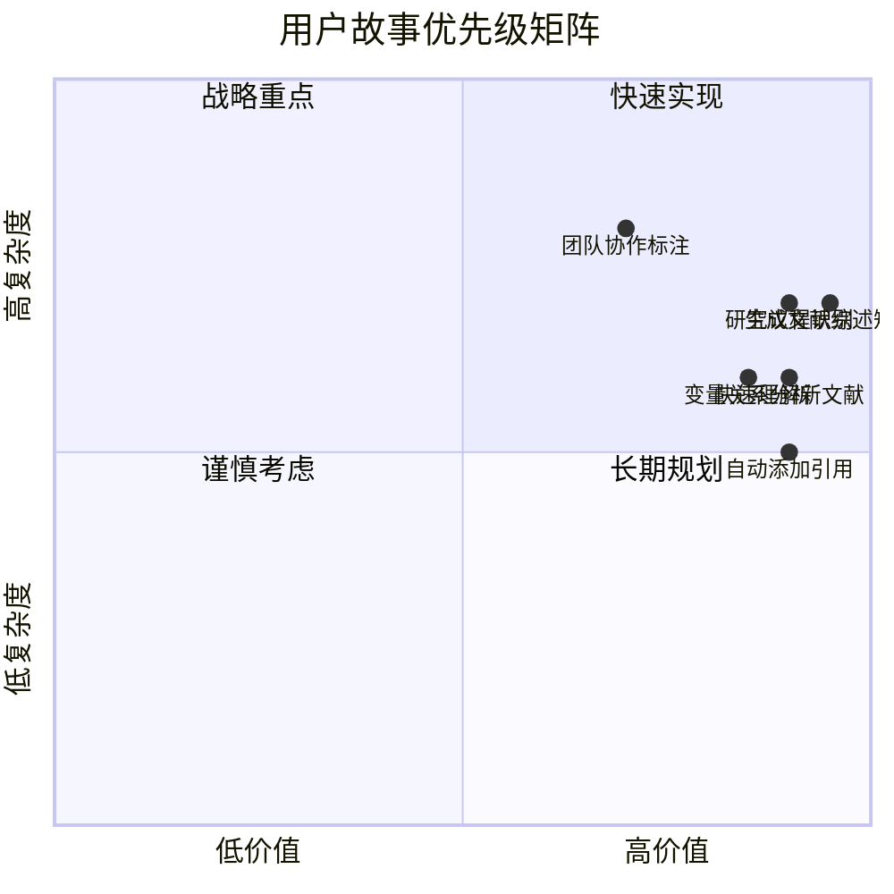

---
System:
- Project
Process:
- 4-WorkProjects
Class:
- 02TS
Project:
- BuildZotero
Title: 03-用户故事
DateCreated: 2026-01-17 17:37
DateModified: 2026-04-18 17:38
Type:
- doc
Status:
- doing
Version:
- v1.0
CardStatus: false
CardType:
- card-fleeting
tags:
- Topic/工具技能/工作笔记
- Pattern/Memo
RelatedNote: []
RelatedProjects: []
CardRecord: null
---

# BuildZotero - 用户故事 (User Stories)
**文档版本**: v3.0  
**创建日期**: 2026-01-12  
**最后更新**: 2026-01-14  
**项目性质**: 个人项目 / 开源项目

---

## 📋 用户故事总览
本文档包含 BuildZotero 系统的所有用户故事，基于科研群体需求调研设计，按照使用场景组织。

**核心场景**：基于 PRD v3.0 中定义的 5 大核心用户场景：
1. 在海量文献中查找所需文献
2. 进行文献筛选，需要同时对十几篇文献进行比较
3. 文献综述
4. 为自己的论文内容添加引用
5. 交互系统

| 用户角色 | 故事数 | 优先级 |
|---------|--------|--------|
| 博士研究生 | 15 | P0 |
| 青年学者 | 12 | P0 |
| 研究团队 | 8 | P1 |
| 学术写作助手 | 6 | P1 |

---

## 👤 用户角色 1: 博士研究生

### 故事 1: 快速理解新文献
**作为** 一名博士研究生  
**我希望** 能够快速提取文献的核心信息（主题、方法、理论）  
**以便于** 我可以在短时间内理解大量文献，提高阅读效率

**验收标准**:
- ✅ 能够自动提取文献的主题标签 (Tag1)
- ✅ 能够识别研究方法 (Tag3)
- ✅ 能够提取理论框架 (Tag5)，支持理论库匹配和新理论标记
- ✅ 处理时间 < 30 秒/篇
- ✅ 理论标签基于标准理论库匹配，新理论自动标记为 `Theory/new-序号`

**优先级**: P0  
**功能模块**: P1-Tag1, P1-Tag3, P1-Tag5

---

### 故事 2: 批量标注文献
**作为** 一名博士研究生  
**我希望** 能够批量处理文献并自动添加标签  
**以便于** 我可以在短时间内完成大量文献的标注工作

**验收标准**:
- ✅ 支持批量选择文献（10-50 篇）
- ✅ 能够自动运行所有标签提取模块
- ✅ 提供处理进度反馈
- ✅ 错误处理机制完善

**优先级**: P0  
**功能模块**: P1- 全部模块

---

### 故事 3: 生成文献综述矩阵
**作为** 一名博士研究生  
**我希望** 能够自动生成结构化的文献综述矩阵  
**以便于** 我可以快速梳理研究领域的发展脉络，撰写博士论文的文献综述章节

**验收标准**:
- ✅ 生成 11 维文献综述矩阵
- ✅ 支持多种输出格式（5 列、2 列）
- ✅ 包含要点、发现、脉络、段落、核心文献
- ✅ 引用格式正确

**优先级**: P0  
**功能模块**: P4-LR1

---

### 故事 4: 自动添加文献引用
**作为** 一名博士研究生  
**我希望** 能够为论文段落自动添加合适的文献引用  
**以便于** 我可以专注于写作内容，而不需要手动查找和添加引用

**验收标准**:
- ✅ 能够理解段落语义
- ✅ 智能匹配相关文献
- ✅ 支持多种引用格式
- ✅ 引用准确率 > 85%

**优先级**: P0  
**功能模块**: P5-Cite1

---

### 故事 5: 变量关系分析
**作为** 一名博士研究生  
**我希望** 能够自动提取文献中的变量定义和关系  
**以便于** 我可以理解研究模型，构建自己的理论框架

**验收标准**:
- ✅ 提取因变量、自变量、调节变量、中介变量
- ✅ 识别变量定义和测量方法
- ✅ 生成变量关系表格
- ✅ 支持变量筛选

**优先级**: P0  
**功能模块**: P1-Tag7, P3-TagM1

---

### 故事 6: 研究样本特征统计
**作为** 一名博士研究生  
**我希望** 能够统计研究样本的特征（层次、领域、规模）  
**以便于** 我可以了解研究领域的研究范围和样本特征

**验收标准**:
- ✅ 提取样本标签 (Tag4)
- ✅ 生成样本特征统计表格
- ✅ 支持样本筛选
- ✅ 可视化展示

**优先级**: P1  
**功能模块**: P1-Tag4, P2-Table2

---

### 故事 7: 理论框架梳理与理论库构建
**作为** 一名博士研究生  
**我希望** 能够自动识别和梳理文献中的理论框架，并构建自己的理论库  
**以便于** 我可以理解理论发展脉络，找到理论空白，并确保理论标签的正确性

**验收标准**:
- ✅ 提取理论标签 (Tag5)
- ✅ 支持标准理论库匹配
- ✅ 新理论自动标记为 `Theory/new-序号`
- ✅ 用户可以核对新理论并纳入标准理论库
- ✅ 理论库循环更新，持续增值
- ✅ 生成理论关系图
- ✅ 识别新理论

**优先级**: P0  
**功能模块**: P1-Tag5

---

### 故事 8: 研究结论对比
**作为** 一名博士研究生  
**我希望** 能够对比不同文献的研究结论  
**以便于** 我可以识别研究共识和争议点

**验收标准**:
- ✅ 提取结论标签 (Tag6)
- ✅ 生成结论对比表格
- ✅ 识别共识和争议
- ✅ 支持结论筛选

**优先级**: P1  
**功能模块**: P1-Tag6

---

### 故事 9: 文献库数据清洗
**作为** 一名博士研究生  
**我希望** 能够清理文献库中的无效标签和重复信息  
**以便于** 我可以保持文献库的整洁和规范

**验收标准**:
- ✅ 清理无效标签
- ✅ 删除重复标签
- ✅ 规范化标题格式
- ✅ 提供清理报告

**优先级**: P1  
**功能模块**: P0-M2, P0-M3, P0-M4

---

### 故事 10: 多维逻辑检索文献
**作为** 一名博士研究生  
**我希望** 能够通过"变量 + 方法 + 样本"的组合找到相关文献  
**以便于** 即使不记得文献名，也能通过逻辑组合找到所需文献

**验收标准**:
- ✅ 支持基于标签的多维逻辑检索
- ✅ 支持"变量 + 方法 + 样本"的交叉筛选
- ✅ 激活 Zotero 高级检索的实战价值
- ✅ 支持二层检索逻辑（Two-tier Retrieval）
- ✅ 检索查准率 > 85%

**优先级**: P0  
**功能模块**: P3-全部模块

---

### 故事 11: 快速查询文献
**作为** 一名博士研究生  
**我希望** 能够通过对话方式快速查询文献信息  
**以便于** 我可以快速找到需要的文献和内容

**验收标准**:
- ✅ 支持自然语言查询
- ✅ 能够查询文献内容、注释、笔记
- ✅ 支持多种查询方式（选中文本、PDF、笔记等）
- ✅ 回答必须带 `[number]` 锚点，确保可追溯性
- ✅ 交互笔记直接添加在 Zotero 中
- ✅ 支持直接跳转特定段落
- ✅ 能够作为自己的知识库，基于文献库内容回答
- ✅ 响应时间 < 5 秒

**优先级**: P1  
**功能模块**: P6-ASK

---

### 故事 12: 工作流集成（Zotero ↔ Obsidian ↔ Cursor）
**作为** 一名博士研究生  
**我希望** 能够将 Zotero、Obsidian、Cursor 打通，形成完整的工作流  
**以便于** 我可以充分利用各工具的特性，让 AI 真正地赋能科研工作

**验收标准**:
- ✅ P6 交互笔记与 Obsidian 双向链接，同步更新
- ✅ Zotero 中的任何内容与 Obsidian 双向链接
- ✅ 利用 Cursor 进行笔记 Agent 管理
- ✅ 打通整个科研工作流

**优先级**: P1  
**功能模块**: P6-交互系统

---

## 👨‍🏫 用户角色 2: 青年学者

### 故事 11: 研究议程识别
**作为** 一名青年学者  
**我希望** 能够识别研究领域的主要研究议程  
**以便于** 我可以找到研究空白，确定研究方向

**验收标准**:
- ✅ 生成研究议程矩阵
- ✅ 识别 3-5 个逻辑平行的研究议程
- ✅ 包含议程角色、核心问题、研究内容
- ✅ 支持多维度分析

**优先级**: P0  
**功能模块**: P4-LR4

---

### 故事 12: 变量定义与衡量方法整理
**作为** 一名青年学者  
**我希望** 能够整理特定变量的定义与衡量方法  
**以便于** 我可以选择合适的测量方法，设计研究方案

**验收标准**:
- ✅ 生成变量定义与衡量表格
- ✅ 包含测量方法、核心内涵、常用指标
- ✅ 包含数据来源、应用层次、优缺点
- ✅ 支持变量筛选

**优先级**: P0  
**功能模块**: P4-LR3, P3-TagM1

---

### 故事 13: 批量处理研究项目文献
**作为** 一名青年学者  
**我希望** 能够批量处理多个研究项目的文献  
**以便于** 我可以高效管理多个研究项目的文献库

**验收标准**:
- ✅ 支持项目分类
- ✅ 批量处理不同项目的文献
- ✅ 生成项目级别的统计报告
- ✅ 支持项目间文献比较

**优先级**: P1  
**功能模块**: P1- 全部, P2- 全部

---

### 故事 14: 指导学生进行文献综述
**作为** 一名青年学者  
**我希望** 能够使用工具指导学生进行文献综述  
**以便于** 我可以提高指导效率，帮助学生快速掌握文献综述方法

**验收标准**:
- ✅ 提供清晰的工作流指南
- ✅ 生成标准化的综述模板
- ✅ 支持学生独立使用
- ✅ 提供最佳实践示例

**优先级**: P1  
**功能模块**: P4- 全部, P5-Cite1

---

### 故事 15: 基金申请书撰写支持
**作为** 一名青年学者  
**我希望** 能够快速生成研究领域的综述和分析  
**以便于** 我可以在基金申请书中展示对研究领域的深入理解

**验收标准**:
- ✅ 生成高质量的研究综述
- ✅ 识别研究空白和前沿
- ✅ 展示研究方法和理论框架
- ✅ 支持多种输出格式

**优先级**: P0  
**功能模块**: P4- 全部

---

## 👥 用户角色 3: 研究团队

### 故事 16: 团队协作标注
**作为** 一名研究团队成员  
**我希望** 能够与团队成员协作标注文献  
**以便于** 我们可以共享标注结果，避免重复工作

**验收标准**:
- ✅ 支持共享标签库
- ✅ 支持协作标注
- ✅ 提供标注冲突解决机制
- ✅ 支持标注历史记录

**优先级**: P2  
**功能模块**: 待开发

---

### 故事 17: 团队文献库统计
**作为** 一名研究团队负责人  
**我希望** 能够统计团队文献库的使用情况  
**以便于** 我可以了解团队的研究重点和文献使用趋势

**验收标准**:
- ✅ 生成团队级别的统计报告
- ✅ 支持标签使用趋势分析
- ✅ 支持成员贡献统计
- ✅ 可视化展示

**优先级**: P2  
**功能模块**: P2- 全部（扩展）

---

## 📝 用户角色 4: 学术写作助手

### 故事 18: 自动生成引用列表
**作为** 一名学术写作助手  
**我希望** 能够自动生成符合格式要求的引用列表  
**以便于** 我可以快速完成论文的引用部分

**验收标准**:
- ✅ 支持多种引用格式（APA, MLA, Chicago 等）
- ✅ 自动生成引用列表
- ✅ 引用格式正确
- ✅ 支持批量处理

**优先级**: P1  
**功能模块**: P5-Cite1（扩展）

---

## 🎯 用户故事优先级矩阵

---

## 📊 用户故事完成度
| 用户角色 | 计划故事 | 已完成 | 进行中 | 待开发 | 完成率 |
|---------|---------|--------|--------|--------|--------|
| 博士研究生 | 10 | 10 | 0 | 0 | 100% |
| 青年学者 | 5 | 5 | 0 | 0 | 100% |
| 研究团队 | 2 | 0 | 0 | 2 | 0% |
| 学术写作助手 | 1 | 0 | 0 | 1 | 0% |
| **总计** | **18** | **15** | **0** | **3** | **83%** |

---

## 🔄 用户故事迭代计划

### Sprint 1 (已完成)
- ✅ 快速理解新文献
- ✅ 批量标注文献
- ✅ 生成文献综述矩阵
- ✅ 自动添加文献引用
- ✅ 变量关系分析

### Sprint 2 (已完成)
- ✅ 研究样本特征统计
- ✅ 理论框架梳理
- ✅ 研究结论对比
- ✅ 文献库数据清洗
- ✅ 快速查询文献

### Sprint 3 (已完成)
- ✅ 研究议程识别
- ✅ 变量定义与衡量方法整理
- ✅ 批量处理研究项目文献
- ✅ 指导学生进行文献综述
- ✅ 基金申请书撰写支持

### Sprint 4 (规划中)
- 🔲 团队协作标注
- 🔲 团队文献库统计
- 🔲 自动生成引用列表

---

**文档状态**: ✅ 已完成（v3.0）  
**最后更新**: 2026-01-14
