---
System:
Process:
Class:
Project:
Title: 04-产品架构文档
DateCreated: 2026-01-17 17:37
DateModified: 2026-01-28 13:03
Status:
Version:
Type:
CardStatus:
CardType:
tags: []
RelatedNote:
CardRecord:
---

## BuildZotero - 产品架构文档 (Product Architecture)

**文档版本**: v3.0  
**创建日期**: 2026-01-12  
**最后更新**: 2026-01-14  
**项目性质**: 个人项目 / 开源项目

**核心架构**：多维标注体系驱动的 Prompt 工程架构，通过 8 维标签体系（标准化标注规范）实现智能化的文献内容提取。

**产品定位**：基于 Zotero，专属于科研工作者的文献 AI Agent，连通 Zotero + Obsidian + Cursor。

---

### 📋 文档目录

1. [[#1. 架构概述\|架构概述]]
2. [[#2. 系统架构\|系统架构]]
3. [[#3. 模块架构\|模块架构]]
4. [[#4. 数据架构\|数据架构]]
5. [[#5. 技术架构\|技术架构]]
6. [[#6. 集成架构\|集成架构]]
7. [[#7. 安全架构\|安全架构]]

---

### 1. 架构概述

#### 1.1 架构原则

BuildZotero 采用以下架构原则：

1. **多维标注体系驱动**: 通过 8 维标签体系（标准化标注规范）实现结构化信息提取
2. **模块化设计**: 每个模块独立运行，可灵活组合
3. **版本化管理**: 支持多版本并存，便于迭代和回滚
4. **AI 驱动**: 核心能力基于大语言模型和 Prompt 工程，多模型配置策略
5. **白盒化维护**: 标签在 Zotero 中完全可见、可改，用户可随时手动核准
6. **工作流深度集成**: 与 Zotero、Obsidian、Cursor 双向链接，打通科研工作流
7. **可扩展性**: 支持功能扩展和定制
8. **知识资产化**: 标签体系是永久的知识资产，可复用、可扩展
9. **理论库循环更新**: 标准理论库匹配 + 新理论标记，理论库持续增值
10. **模型配置策略**: 不同任务配置不同的大模型以节省 Tokens 费用

#### 1.2 架构层次

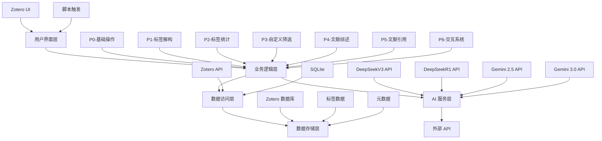

---

### 2. 系统架构

#### 2.1 整体架构（多维标注体系驱动）

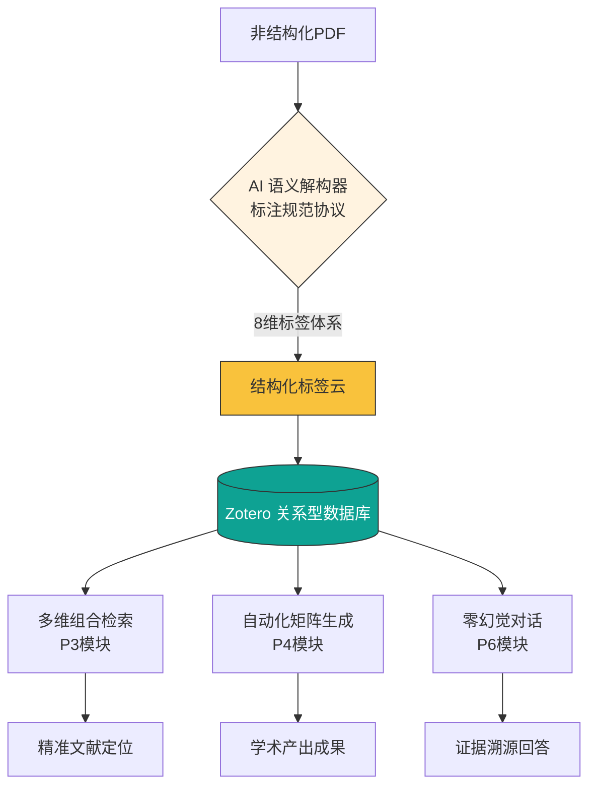

**核心流程**：
1. **内容获取层**：从 Zotero 提取 PDF/笔记/摘要
2. **Prompt 构建层**：基于 8 维标签体系（标注规范）构建结构化 Prompt
3. **AI 生成层**：调用大语言模型生成结构化标签
4. **数据存储层**：标签写入 Zotero 数据库（永久资产）
5. **应用层**：多维检索、矩阵生成、对话查询

#### 2.2 多维标注体系驱动的架构组件

| 组件 | 职责 | 技术栈 | 标注规范设计 |
|------|------|--------|------------|
| **脚本引擎** | 执行 JavaScript 脚本 | Zotero Script API | - |
| **标注规范设计器** | 定义 8 维标签体系 | Prompt 工程 | 8 维标签体系（标准化标注规范） |
| **语义解构器** | AI 驱动的标签提取 | 大语言模型 API | 11 维分析框架 |
| **数据存储** | 标签数据持久化 | Zotero SQLite | 关系型数据库 |
| **多维检索** | 基于标签的逻辑检索 | Zotero API | 标签组合查询 |
| **模块路由** | 路由请求到对应模块 | JavaScript |
| **AI 服务** | 调用大语言模型 API | HTTP API |
| **数据访问** | 访问 Zotero 数据库 | Zotero API |
| **输出处理** | 格式化输出结果 | Markdown, JSON |

---

### 3. 模块架构

#### 3.1 模块依赖关系

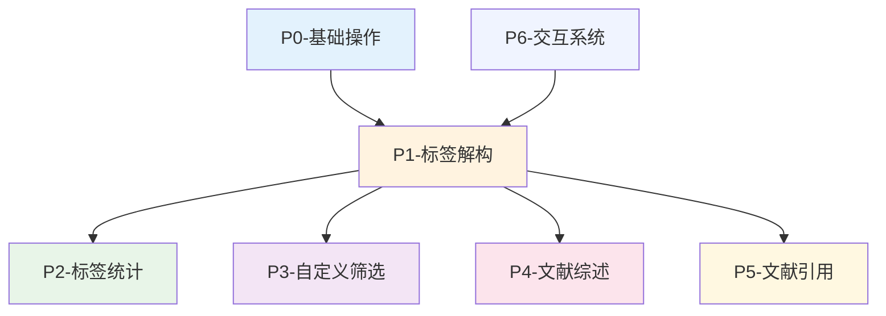

#### 3.2 模块内部架构

##### P1- 文献标签解构模块

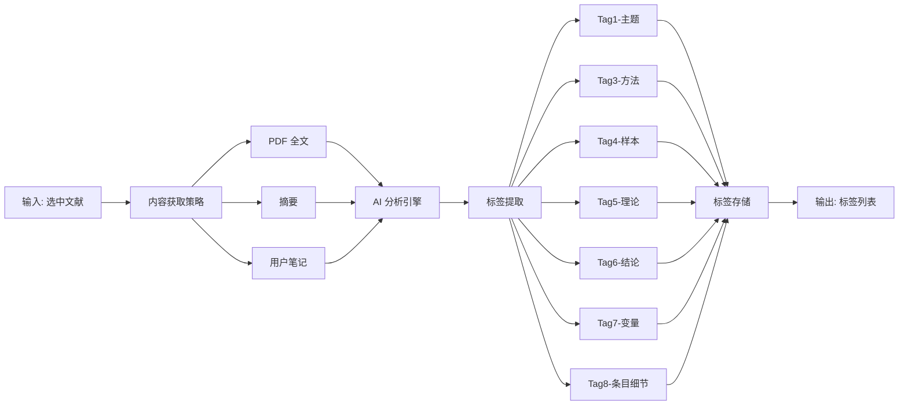

##### P4- 文献综述模块

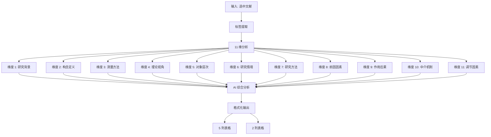

---

### 4. 数据架构

#### 4.1 数据模型

##### 标签数据模型

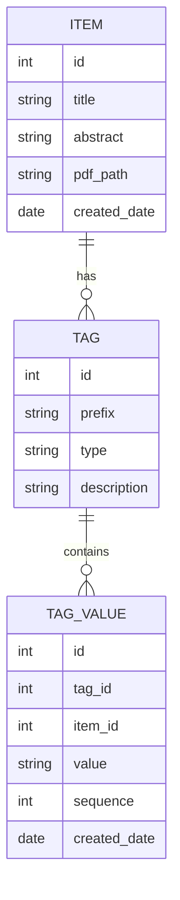

##### 标签体系结构

```
标签体系
├── 变量标签 (A 系列)
│   ├── A1-DV/ (因变量)
│   ├── A2-IV/ (自变量)
│   ├── A3-MO/ (调节变量)
│   ├── A4-ME/ (中介变量)
│   ├── A5-INV/ (工具变量)
│   └── A6-CV/ (控制变量)
├── 内容标签 (V 系列)
│   ├── V1-def/ (变量定义)
│   ├── V2-mea/ (测量方法)
│   ├── V3-con/ (研究贡献)
│   ├── V4-fut/ (研究展望)
│   └── V5-sor/ (样本数据来源)
└── 分类标签
    ├── Item/ (主题)
    ├── Theory/ (理论)
    ├── Result/ (结论)
    ├── Sample/ (样本)
    └── sMeth/ (方法)
```

#### 4.2 数据流

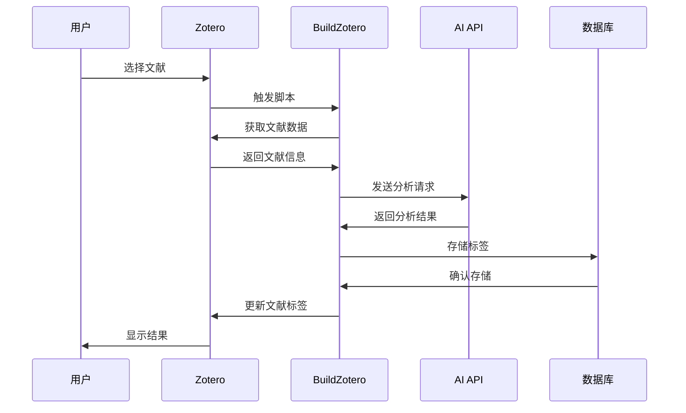

---

### 5. 技术架构

#### 5.1 技术栈

| 层级 | 技术 | 版本 | 说明 |
|------|------|------|------|
| **平台** | Zotero | 6.0+ | 文献管理平台 |
| **脚本语言** | JavaScript | ES6+ | Zotero 脚本语言 |
| **AI 服务** | DeepSeekV3 API | Latest | 轻量级任务（P0/P1/P2/P3） |
| **AI 服务** | DeepSeekR1 API | Latest | 复杂推理任务（P4/P5） |
| **AI 服务** | Gemini 2.5 API | Latest | 复杂推理任务（P4/P5） |
| **AI 服务** | Gemini 3.0 API | Latest | 复杂推理任务（P4/P5） |
| **AI 服务** | 自定义模型 | - | P6 交互系统（根据任务选择） |
| **数据存储** | SQLite | 3.x | Zotero 本地数据库 |
| **集成工具** | Obsidian | Latest | 知识管理工具 |
| **输出格式** | Markdown | - | 文档格式 |

#### 5.2 API 设计

##### AI API 调用模式

```javascript
// 标准 AI API 调用模式
async function callAI(prompt, content) {
  const request = {
    model: "gpt-4",
    messages: [
      { role: "system", content: prompt },
      { role: "user", content: content }
    ],
    temperature: 0.7,
    max_tokens: 2000
  };
  
  const response = await fetch(API_ENDPOINT, {
    method: "POST",
    headers: {
      "Authorization": `Bearer ${API_KEY}`,
      "Content-Type": "application/json"
    },
    body: JSON.stringify(request)
  });
  
  return await response.json();
}
```

##### Zotero API 使用模式

```javascript
// Zotero API 使用模式
function getSelectedItems() {
  return ZoteroPane.getSelectedItems();
}

function getItemTags(item) {
  return item.getTags();
}

function addTag(item, tag) {
  item.addTag(tag);
  item.saveTx();
}
```

---

### 6. 集成架构

#### 6.1 Zotero 集成

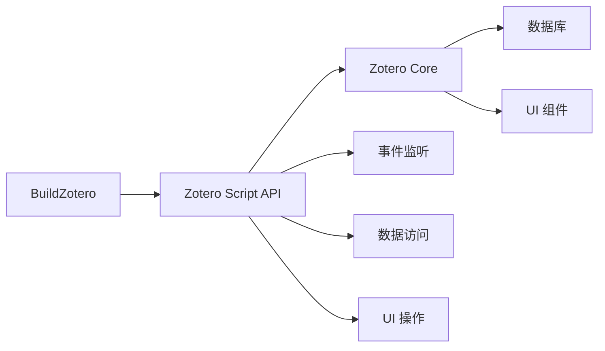

#### 6.2 Obsidian 集成

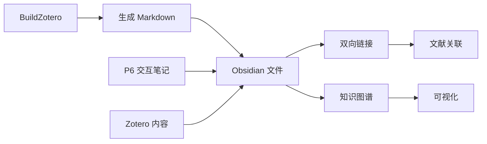

**核心特性**:
- ✅ P6 的交互笔记以及任意的 Zotero 中的任何内容与 Obsidian 都是双向链接的，同步更新
- ✅ 充分利用 Zotero 与 Obsidian 的特性：Zotero 作为自己的文献库以及图书馆，Obsidian 则是笔记看板以及笔记整理

---

#### 6.3 Cursor 终端集成

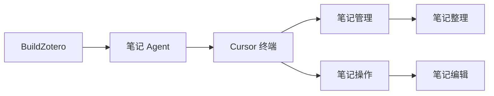

**核心特性**:
- ✅ 利用 Cursor 进行笔记管理以及操作
- ✅ 将整个科研工作流都打通了，让 AI 真正地赋能科研工作

---

#### 6.4 工作流集成架构

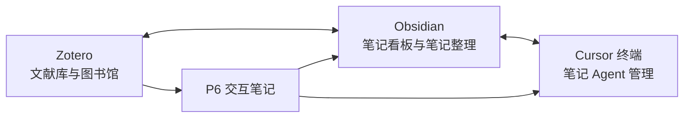

**核心特性**:
- ✅ Zotero ↔ Obsidian ↔ Cursor 双向链接
- ✅ 打通整个科研工作流

---

#### 6.5 AI 服务集成（多模型配置策略）

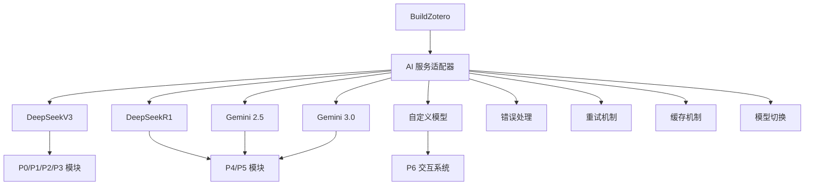

**模型配置策略**:
- **P0/P1/P2/P3**: 默认使用 DeepSeekV3（轻量级任务）
- **P4/P5**: 默认使用 DeepSeekR1 / Gemini 2.5 / Gemini 3.0（复杂推理任务）
- **P6**: 根据交互任务自定义模型
- **所有任务**: 都可以自由切换模型

---

### 7. 安全架构

#### 7.1 安全考虑

| 安全领域 | 措施 | 说明 |
|---------|------|------|
| **数据安全** | 本地存储 | 所有数据存储在本地 Zotero 数据库 |
| **API 安全** | API Key 管理 | 用户自行管理 AI API Key |
| **隐私保护** | 数据不上传 | 文献内容不上传到第三方服务器 |
| **访问控制** | 本地权限 | 遵循 Zotero 本地权限设置 |

#### 7.2 数据隐私

- ✅ 所有数据处理在本地完成
- ✅ AI API 调用仅发送必要的文本内容
- ✅ 不存储用户的 API Key
- ✅ 支持离线模式（部分功能）

---

### 8. 性能架构

#### 8.1 性能优化策略

| 优化策略 | 实现方式 | 效果 |
|---------|---------|------|
| **批量处理** | 异步处理多篇文献 | 提升 50%+ 处理速度 |
| **缓存机制** | 缓存 AI 分析结果 | 减少 API 调用 |
| **并发控制** | 限制并发请求数 | 避免 API 限流 |
| **增量更新** | 仅处理新文献 | 节省处理时间 |

#### 8.2 性能指标

| 指标 | 目标值 | 当前值 |
|------|--------|--------|
| 单篇文献处理时间 | < 30 秒 | 20-30 秒 |
| 批量处理能力 | 50 篇/批次 | 50 篇/批次 |
| API 响应时间 | < 5 秒 | 3-5 秒 |
| 系统可用性 | > 99% | 99%+ |

---

### 9. 扩展架构

#### 9.1 插件系统（规划中）

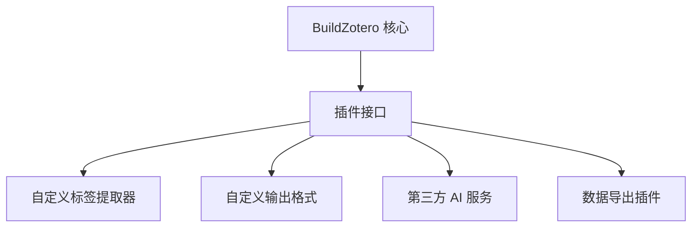

#### 9.2 API 开放（规划中）

- RESTful API 接口
- Webhook 支持
- 第三方应用集成
- 移动端 API

---

**文档状态**: ✅ 已完成  
**最后更新**: 2026-01-12
