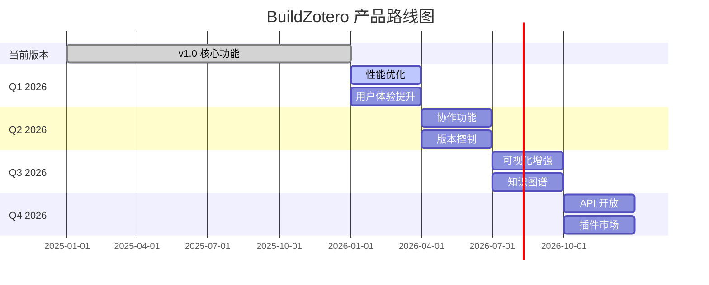
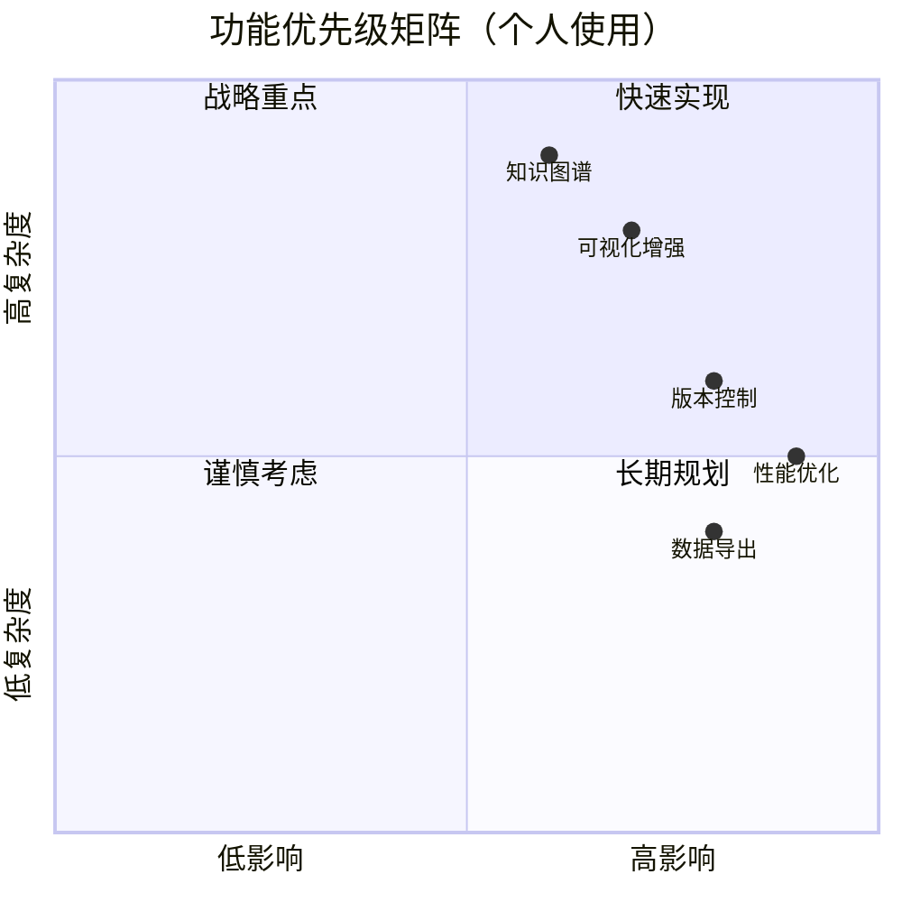

---
System:
Process:
Class:
Project:
Title: 05-产品路线图
DateCreated: 2026-01-17 17:37
DateModified: 2026-01-28 13:03
Status:
Version:
Type:
CardStatus:
CardType:
tags: []
RelatedNote:
CardRecord:
---

## BuildZotero - 产品路线图 (Product Roadmap)

**文档版本**: v3.0  
**创建日期**: 2026-01-12  
**最后更新**: 2026-01-14  
**项目性质**: 个人项目 / 开源项目

---

### 📋 路线图总览

BuildZotero 产品路线图基于科研群体需求调研规划，聚焦于性能优化、功能增强和用户体验提升。

---

### 🎯 当前版本 (v1.0) - 已完成 ✅

#### 核心功能模块

- ✅ **P0- 基础操作模块** (4 个功能)
  - M1- 标签展示
  - M2- 标签清理
  - M3- 标签删除
  - M4- 标题清理

- ✅ **P1- 文献标签解构模块** (21 个功能)
  - Tag1- 主题标签 (V5, V5-R, V5-Rnote)
  - Tag3- 方法标签 (V6, V6-R, V6-Rnote)
  - Tag4- 样本标签 (V4, V4-R, V4-Rnote)
  - Tag5- 理论标签 (V6, V6-R, V6-Rnote)
  - Tag6- 结论标签 (V2, V2-R)
  - Tag7- 变量标签 (V2, V2-R, V2-Rnote)
  - Tag8- 条目细节标签 (V2, V2-R, V2-Rnote)

- ✅ **P2- 文献标签统计模块** (2 个功能)
  - Table1- 统计条目
  - Table2- 统计标签

- ✅ **P3- 文献自定义筛选模块** (4 个功能)
  - TagM1- 变量定义与衡量
  - TagM2- 主题变量分类
  - TagM3- 控制变量类型
  - TagM4- 地区固定效应

- ✅ **P4- 文献综述模块** (7 个功能)
  - LR0- 摘要简洁
  - LR1- 矩阵标签生成 (3 个版本)
  - LR2- 矩阵标签要点
  - LR3- 矩阵标签测量
  - LR4- 文献综述

- ✅ **P5- 文献引用模块** (3 个功能)
  - Cite1- 文献引用添加 (3 个版本)

- ✅ **P6- 交互系统模块** (11 个功能)
  - ASK- 文献阅读交互 (9 个子功能)
  - Upload- 文件上传 (2 个子功能)

**完成度**: 100% (52/52 功能)

---

### 📅 Q1 2026 - 性能优化与用户体验提升

#### 目标

- 提升系统性能和稳定性
- 改善用户体验
- 完善文档和教程
- 理论库完善与优化
- 工作流集成优化

#### 关键功能

##### 1. 性能优化 🔧

- **批量处理优化**
  - 异步处理机制
  - 并发控制优化
  - 处理速度提升 50%+
  - **预期完成**: 2026-02-28

- **缓存机制**
  - AI 分析结果缓存
  - 标签数据缓存
  - 减少 API 调用 30%+
  - **预期完成**: 2026-02-15

- **错误处理增强**
  - 完善的错误提示
  - 自动重试机制
  - 错误日志记录
  - **预期完成**: 2026-03-15

##### 2. 准确性提升 🎯

- **Prompt 优化**
  - 持续优化 AI Prompt
  - 标签提取准确率提升至 85%+
  - A/B 测试不同 Prompt 版本
  - **预期完成**: 2026-03-31

- **质量控制**
  - 标签验证机制
  - 异常检测
  - 用户反馈收集
  - **预期完成**: 2026-03-31

##### 3. 用户体验提升 👥

- **安装和配置简化**
  - 一键安装脚本
  - 自动配置检测
  - 配置向导
  - **预期完成**: 2026-02-28

- **文档完善**
  - 视频教程（5-10 个）
  - 最佳实践指南
  - 常见问题解答
  - **预期完成**: 2026-03-31

- **界面优化**
  - 更清晰的进度提示
  - 更好的错误提示
  - 操作反馈优化
  - **预期完成**: 2026-03-15

#### 成功指标（个人使用）

| 指标 | 目标值 | 当前值 |
|------|--------|--------|
| 处理速度 | 提升 50% | - |
| 准确率 | > 85% | 80-90% |
| 个人使用满意度 | 持续优化 | - |
| 文档完整性 | 100% | 80% |

---

### 📅 Q2 2026 - 功能增强与版本控制（个人使用）

#### 目标

- 实现版本控制
- 增强数据管理
- 完善功能模块

#### 关键功能

##### 1. 版本控制 📚

- **标签版本历史**
  - 标签变更记录
  - 版本对比
  - 回滚功能
  - **预期完成**: 2026-05-15

- **脚本版本管理**
  - 版本自动检测
  - 更新通知
  - 版本兼容性检查
  - **预期完成**: 2026-04-30

##### 2. 数据管理 💾

- **数据备份与恢复**
  - 自动备份机制
  - 数据恢复功能
  - 备份策略配置
  - **预期完成**: 2026-05-31

- **数据导出**
  - 多种格式导出（JSON, CSV, Excel）
  - 批量导出
  - 自定义导出字段
  - **预期完成**: 2026-06-15

##### 3. 模板系统 📝

- **可自定义模板**
  - 综述模板自定义
  - 标签模板管理
  - 模板分享（如开源）
  - **预期完成**: 2026-06-30

#### 成功指标（个人使用）

| 指标 | 目标值 |
|------|--------|
| 版本控制使用率 | 持续使用 |
| 数据备份覆盖率 | 100% |
| 模板使用率 | 提升工作效率 |

---

### 📅 Q3 2026 - 可视化增强与知识图谱（个人使用）

#### 目标

- 增强数据可视化
- 构建知识图谱
- 提供分析工具

#### 关键功能

##### 1. 可视化增强 📊

- **交互式知识图谱**
  - 文献关系可视化
  - 理论关系图谱
  - 变量关系网络
  - **预期完成**: 2026-08-31

- **个人数据仪表盘**
  - 个人研究进度看板
  - 标签使用趋势
  - 研究统计图表
  - **预期完成**: 2026-09-15

- **图表生成**
  - 标签分布图
  - 研究热点图
  - 时间趋势图
  - **预期完成**: 2026-09-30

##### 2. 分析工具 🔍

- **研究热点分析**
  - 自动识别研究热点
  - 热点趋势分析
  - 个人研究领域分析
  - **预期完成**: 2026-08-15

- **理论演进分析**
  - 理论发展脉络
  - 理论关系分析
  - 理论空白识别
  - **预期完成**: 2026-09-30

- **变量关系分析**
  - 变量关系网络
  - 变量使用统计
  - 变量组合分析
  - **预期完成**: 2026-09-15

##### 3. 报告生成 📄

- **自动报告生成**
  - 研究领域报告
  - 文献综述报告
  - 个人研究进展报告
  - **预期完成**: 2026-09-30

#### 成功指标（个人使用）

| 指标 | 目标值 |
|------|--------|
| 可视化功能使用率 | 持续使用 |
| 知识图谱节点数 | 支持 1000+ 节点 |
| 报告生成质量 | 提升研究效率 |

---

### 📅 Q4 2026 - 功能完善与文档优化（个人使用）

#### 目标

- 完善功能模块
- 优化文档体系
- 提升使用体验

#### 关键功能

##### 1. 功能完善 🔧

- **高级筛选功能**
  - 更复杂的标签组合查询
  - 时间范围筛选
  - 期刊质量筛选
  - **预期完成**: 2026-11-30

- **批量操作增强**
  - 批量标签更新
  - 批量导出功能
  - 批量统计分析
  - **预期完成**: 2026-12-15

##### 2. 文档优化 📚

- **使用教程**
  - 视频教程制作
  - 最佳实践指南
  - 常见问题解答
  - **预期完成**: 2026-12-31

- **代码文档**
  - 代码注释完善
  - API 文档（如需要）
  - 开发指南
  - **预期完成**: 2026-12-15

##### 3. 开源社区（可选）🌐

- **开源准备**
  - 代码整理
  - 许可证选择
  - 贡献指南
  - **预期完成**: 2026-12-31
  - **预期完成**: 2026-12-31

#### 成功指标（个人使用）

| 指标 | 目标值 |
|------|--------|
| 功能完善度 | 持续优化 |
| 文档完整性 | 100% |
| 使用体验 | 持续提升 |

---

### 🎯 长期愿景 (2027+)

#### 1. AI 能力增强（个人使用）

- 多模态 AI（支持图片、表格识别）
- 个性化 Prompt 优化
- 领域特定知识注入

#### 2. 功能扩展（个人使用）

- 更多分析维度
- 企业版功能
- 教育版定制

#### 3. 个人使用优化

- 持续优化 Prompt 设计
- 提升标签提取准确率
- 完善文档和使用指南

---

### 📊 路线图优先级矩阵（个人使用）

---

### 🔄 迭代计划（个人使用）

#### 迭代节奏

- **迭代频率**: 根据个人使用需求灵活调整
- **版本发布**: 功能完善后发布新版本
- **Bug 修复**: 发现问题及时修复

#### 版本命名规则

- **主版本号**: 重大功能更新
- **次版本号**: 新功能添加
- **修订版本号**: Bug 修复和小改进

**当前版本**: v1.0.0  
**下一版本**: v1.1.0 (Q1 2026)

---

**文档状态**: ✅ 已完成（v3.0）  
**最后更新**: 2026-01-14
