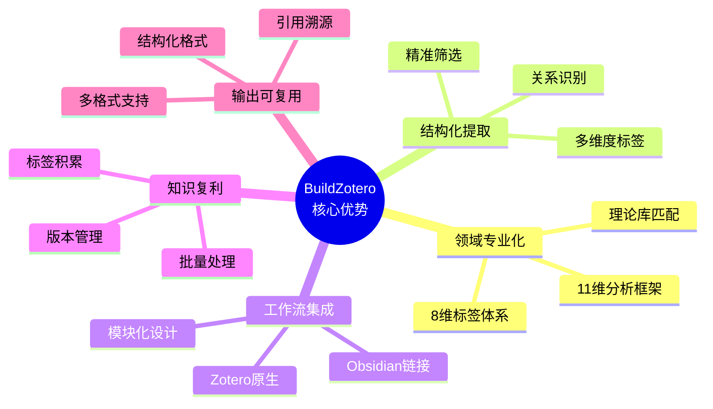

---
System:
Process:
Class:
Project:
Title: 06-技术架构与产品优势分析
DateCreated: 2026-01-17 17:37
DateModified: 2026-02-27 10:45
Type:
Status:
Version:
CardStatus:
CardType:
tags: []
RelatedNote:
RelatedProjects:
CardRecord:
---


## BuildZotero - 技术架构与产品优势分析
**文档版本**: v3.0  
**创建日期**: 2026-01-12  
**最后更新**: 2026-01-14  
**项目性质**: 个人项目 / 开源项目

**产品定位**：基于 Zotero，专属于科研工作者的文献 AI Agent，连通 Zotero + Obsidian + Cursor。

---

### 📋 核心洞察
**BuildZotero 的本质是一个基于 Prompt 工程的 AI 辅助文献分析系统**，通过精心设计的 Prompt 模板和领域知识注入，实现智能化的文献内容提取和结构化标签生成。

---


### 1. 技术架构识别

#### 1.1 BuildZotero 的技术架构


#### 1.2 三阶段处理流程拆解
| 阶段            | BuildZotero 实现                  | 技术特点             |
| ------------- | ------------------------------- | ---------------- |
| **内容获取**      | 从 Zotero 文献库提取内容（PDF > 笔记 > 摘要） | 多源数据融合、优先级策略     |
| **Prompt 构建** | 基于 11 维分析框架构建结构化 Prompt         | Prompt 工程、领域知识注入 |
| **AI 生成**     | 调用大语言模型生成标签、综述、引用               | 结构化输出、格式标准化      |

---


### 2. 核心技术难点

#### 2.1 内容获取质量（Content Retrieval Quality）

##### 难点分析
**问题**: 如何从文献中准确提取相关信息？

**BuildZotero 的挑战**:
- 文献库规模：用户可能有 500-5000+ 篇文献
- 信息分散：关键信息分布在 PDF、摘要、笔记、元数据中
- 内容质量：不同来源的内容质量差异大

**我们的解决方案**:
1. **多源数据获取策略** - 优先级排序

   ```
   PDF 全文（前 8000 字符）> 用户笔记 > 摘要 > 元数据
   ```

   - 优先使用最准确的信息源
   - 笔记优先版本（Rnote）体现用户知识
   - 支持增量处理，避免重复

2. **内容提取优化**
   - PDF 全文提取（前 8000 字符，保证关键信息）
   - 笔记内容优先（体现用户理解）
   - 摘要作为备选（保证覆盖率）

3. **增量处理机制**
   - 只处理新文献，避免重复处理
   - 支持标签更新和删除（V-R 系列）
   - 支持大规模文献库处理


#### 2.2 Prompt 工程（Prompt Engineering）

##### 难点分析
**问题**: 如何设计 Prompt 让 AI 生成准确、结构化的输出？

**BuildZotero 的挑战**:
- 信息量巨大：单篇文献可能包含数万字
- 结构化要求：需要按照 11 维分析框架组织
- 领域知识：需要理解学术研究的概念体系

**我们的解决方案**:
1. **11 维分析框架** - 标准化分析维度

   ```
   研究背景 → 构念定义 → 测量方法 → 理论视角 → ...
   ```

   - 每个维度都有明确的 Prompt 模板
   - 确保分析的一致性和完整性
   - 符合学术研究规范

2. **领域知识注入** - Prompt 中包含专业知识
   - 学术写作规范
   - 研究设计知识
   - 理论框架理解
   - 变量关系识别

3. **输出格式约束** - 强制结构化输出
   - Markdown 表格格式
   - 引用格式标准化
   - 确保输出可解析、可复用


#### 2.3 生成质量（Generation Quality）

##### 难点分析
**问题**: 如何确保 AI 生成的内容准确、有用？

**BuildZotero 的挑战**:
- 准确性：标签提取准确率需要 > 80%
- 一致性：相同概念在不同文献中应该提取相同标签
- 完整性：不能遗漏关键信息

**我们的解决方案**:
1. **版本迭代优化** - 持续改进 Prompt
   - V 系列：标准版本（PDF 优先）
   - V-R 系列：支持更新和删除（重新处理）
   - V-Rnote 系列：优先使用用户笔记

2. **质量控制机制**
   - 标签验证规则（格式检查）
   - 异常检测（空标签、格式错误）
   - 用户反馈收集（持续优化）

3. **多策略生成**
   - 精准匹配 vs 穷尽式（根据场景选择）
   - 不同模块使用不同策略
   - 支持自定义 Prompt 模板

---


### 3. 核心技术优势

#### 3.1 领域知识融合优势
**优势**: 将领域专业知识（8 维标签体系、11 维分析框架）与 AI 的生成能力结合

**BuildZotero 的体现**:
- ✅ **领域知识注入**: 8 维标签体系是领域知识的结构化表达
- ✅ **实时知识更新**: 新文献自动处理，标签自动生成
- ✅ **知识关系理解**: 理解理论关系、变量关系、研究关系


#### 3.2 可解释性优势
**优势**: 输出可以追溯到具体的文献来源和 Prompt 设计

**BuildZotero 的体现**:
- ✅ **引用溯源**: 每个标签、每个结论都可以追溯到具体文献
- ✅ **文献编号**: 使用 `[编号]` 格式，点击可查看原文
- ✅ **标签统计**: 可以看到哪些文献使用了相同标签


#### 3.3 可控性优势
**优势**: 通过 Prompt 设计控制生成内容

**BuildZotero 的体现**:
- ✅ **标签筛选**: P3 模块可以基于标签筛选文献
- ✅ **优先级控制**: 星级优先、年份优先等排序策略
- ✅ **格式控制**: 强制输出格式（表格、引用格式）


#### 3.4 规模化优势
**优势**: 可以处理大规模文献库

**BuildZotero 的体现**:
- ✅ **批量处理**: 支持 50-100 篇文献批量处理
- ✅ **增量更新**: 只处理新文献，支持大规模文献库
- ✅ **性能优化**: 异步处理、错误重试机制

---


### 4. 主流 AI 产品分析（以 ChatGPT、豆包为例）

#### 4.1 通用 AI 工具的核心功能

##### 功能特点
1. **通用知识问答**
   - 基于互联网知识库
   - 实时信息检索
   - 多轮对话

2. **文档理解**
   - 上传文档进行问答
   - 文档摘要生成
   - 关键信息提取

3. **自由对话**
   - 用户自由输入
   - 灵活的回答方式
   - 多场景应用


##### 应用场景
| 场景 | 功能 | 优势 | 局限 |
|------|------|------|------|
| **日常问答** | 通用知识检索 | 信息全面、实时 | 缺乏深度分析 |
| **文档理解** | 单文档问答 | 快速理解文档 | 无法跨文档分析 |
| **知识管理** | 企业知识库 | 统一管理 | 缺乏结构化 |


#### 4.2 通用 AI 工具不能解决的问题

##### 1. 领域深度问题
**问题**: 通用 AI 缺乏领域专业知识

**表现**:
- ❌ 不理解学术研究的概念体系
- ❌ 无法识别理论框架和变量关系
- ❌ 缺乏研究设计知识

**BuildZotero 的解决方案**:
- ✅ 8 维标签体系是领域知识的编码
- ✅ Prompt 中包含学术写作规范
- ✅ 理解研究设计、理论框架、变量关系


##### 2. 结构化输出问题
**问题**: 通用 AI 输出格式不固定

**表现**:
- ❌ 每次输出格式可能不同
- ❌ 难以进行后续处理和分析
- ❌ 无法保证输出的一致性

**BuildZotero 的解决方案**:
- ✅ 强制输出 Markdown 表格格式
- ✅ 引用格式标准化
- ✅ 输出可解析、可复用


##### 3. 跨文档分析问题
**问题**: 通用 AI 难以进行跨文档的深度分析

**表现**:
- ❌ 无法识别文献间的理论关系
- ❌ 无法进行变量关系分析
- ❌ 无法生成研究议程矩阵

**BuildZotero 的解决方案**:
- ✅ 11 维分析框架支持跨文献分析
- ✅ 标签体系支持关系识别
- ✅ 生成研究议程、理论框架、变量关系


##### 4. 工作流集成问题
**问题**: 通用 AI 是独立工具，难以集成到现有工作流

**表现**:
- ❌ 需要手动上传文档
- ❌ 输出结果需要手动整理
- ❌ 无法与文献管理工具集成

**BuildZotero 的解决方案**:
- ✅ 深度集成 Zotero
- ✅ 自动处理文献库
- ✅ 输出直接写入 Zotero 标签
- ✅ 与 Obsidian 双向链接


##### 5. 知识积累问题
**问题**: 通用 AI 的知识是临时的，无法积累

**表现**:
- ❌ 每次查询都是独立的
- ❌ 无法形成知识网络
- ❌ 无法发挥复利效应

**BuildZotero 的解决方案**:
- ✅ 标签体系是知识的结构化积累
- ✅ 支持知识网络构建（Obsidian）
- ✅ 支持增量更新和版本管理

---


### 5. BuildZotero 的核心优势

#### 5.1 领域专业化 AI 分析
**优势**: 不是通用 AI，而是学术研究领域的专业化 AI 分析

**体现**:
1. **8 维标签体系** = 领域知识的结构化编码
   - 不是简单的关键词提取
   - 而是研究概念的系统化表达
   
2. **11 维分析框架** = 学术研究的标准化分析维度
   - 不是随意的信息提取
   - 而是符合学术规范的深度分析

3. **理论库匹配** = 领域知识的积累和复用
   - 识别新理论
   - 匹配已有理论
   - 标准化理论表达


#### 5.2 结构化信息提取
**优势**: 不是自由文本输出，而是结构化信息提取

**体现**:
1. **多维度标签提取**

   ```
   主题维度 → Item/
   方法维度 → sMeth/
   理论维度 → Theory/
   变量维度 → A1-DV/, A2-IV/, ...
   ```

2. **关系识别**
   - 变量关系识别（A1-DV 与 A2-IV 的关系）
   - 理论关系识别（Theory/ 标签的关系）
   - 研究关系识别（研究议程、研究脉络）

3. **精准筛选**
   - P3 模块支持基于标签的精准筛选
   - 不是关键词匹配，而是语义理解


#### 5.3 工作流深度集成
**优势**: 不是独立工具，而是深度集成到研究者的工作流

**体现**:
1. **Zotero 原生集成**
   - 直接在 Zotero 中运行
   - 自动处理文献库
   - 输出直接写入标签

2. **Obsidian 双向链接**
   - 生成 Markdown 文件
   - 支持双向链接
   - 构建知识网络

3. **模块化设计**
   - 按需使用
   - 灵活组合
   - 支持自定义工作流


#### 5.4 知识复利效应
**优势**: 不是一次性查询，而是知识的持续积累和复用

**体现**:
1. **标签体系 = 知识资产**
   - 每次标注都是知识积累
   - 标签可以复用
   - 支持知识网络构建

2. **版本管理**
   - 支持标签更新
   - 支持版本回滚
   - 知识演进可追溯

3. **批量处理**
   - 支持大规模文献处理
   - 发挥规模效应
   - 时间复利


#### 5.5 输出可复用性
**优势**: 不是一次性输出，而是可复用、可分析的结构化数据

**体现**:
1. **结构化输出**
   - Markdown 表格格式
   - 可解析、可处理
   - 支持后续分析

2. **引用溯源**
   - 每个输出都可以追溯到文献
   - 支持深度分析
   - 支持知识网络构建

3. **多格式支持**
   - 5 列表格（详细版）
   - 2 列表格（简洁版）
   - 按需选择

---


### 6. 产品定位重新定义

#### 6.1 从工具到平台
**旧定位**: 基于 Zotero 的智能文献管理工具

**新定位**: **学术研究领域的专业化 AI 辅助分析平台**


#### 6.2 核心价值重新表述
| 价值维度 | 旧表述 | 新表述（技术视角） |
|---------|--------|------------------|
| **效率提升** | 自动化文献标签提取 | Prompt 工程驱动的自动化分析，减少 70% 整理时间 |
| **智能化** | AI 驱动的多维度内容理解 | 领域知识注入的 Prompt 工程，准确率 80-90% |
| **结构化** | 生成标准化文献综述矩阵 | 结构化 Prompt + 标准化输出，11 维分析框架 |
| **工作流集成** | 与 Obsidian 等工具无缝对接 | 深度集成研究工具链，非独立工具 |


#### 6.3 差异化优势总结



---


### 7. 与主流 AI 产品的对比
| 维度 | ChatGPT/豆包（通用 AI） | BuildZotero（专业 AI） |
|------|----------------|----------------------|
| **数据源** | 互联网通用知识 | 用户文献库（领域知识） |
| **处理方式** | 自由文本对话 | 结构化多维度分析 |
| **Prompt 设计** | 用户自由输入 | 11 维分析框架（标准化） |
| **输出格式** | 自由文本 | 结构化表格（Markdown） |
| **领域知识** | 通用知识 | 学术研究专业知识 |
| **工作流集成** | 独立工具 | 深度集成 Zotero/Obsidian |
| **知识积累** | 临时查询 | 持续积累（标签体系） |
| **跨文档分析** | 单文档问答 | 跨文献深度分析 |
| **输出可复用性** | 一次性输出 | 可解析、可复用 |

---


### 8. 产品战略意义

#### 8.1 技术护城河
1. **领域知识编码** - 8 维标签体系是领域知识的系统化编码
2. **Prompt 工程** - 11 维分析框架的 Prompt 模板是核心资产
3. **工作流集成** - 深度集成 Zotero/Obsidian 形成生态壁垒


#### 8.2 商业价值
1. **用户粘性** - 标签体系是用户的知识资产，迁移成本高
2. **网络效应** - 用户越多，理论库越丰富，价值越大
3. **数据价值** - 结构化标签数据具有研究价值


#### 8.3 未来扩展
1. **平台化** - 从工具到平台，支持第三方插件
2. **API 化** - 开放 API，支持第三方应用集成
3. **生态化** - 构建学术研究工具生态

---


### 9. PRD 更新建议

#### 9.1 需要在 PRD 中明确的内容
1. **技术架构章节**
   - 明确 Prompt 工程架构
   - 说明内容获取、Prompt 构建、AI 生成三个阶段
   - 对比通用 AI 和专业 AI

2. **产品定位章节**
   - 从 " 工具 " 升级为 " 平台 "
   - 明确 " 专业化 AI 分析 " 定位
   - 说明与通用 AI 的差异化

3. **核心优势章节**
   - 领域专业化
   - 结构化提取
   - 工作流集成
   - 知识复利效应

4. **竞品分析章节**
   - 对比 ChatGPT、豆包等通用 AI
   - 说明我们的差异化优势
   - 分析市场定位

---

**文档状态**: ✅ 已完成（v3.0）  
**最后更新**: 2026-01-14
