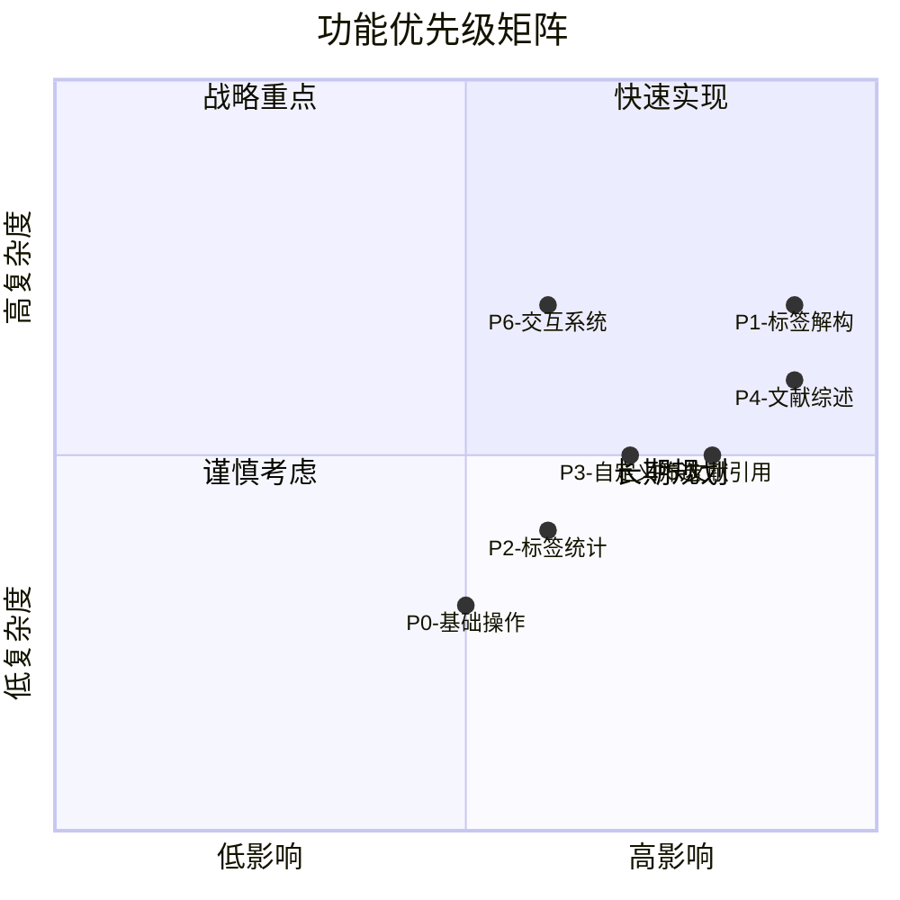

---
System:
- Project
Process:
- 4-WorkProjects
Class:
- 02TS
Project:
- BuildZotero
Title: BuildZotero-功能清单
DateCreated: 2026-01-17 17:37
DateModified: 2026-04-18 17:38
Type:
- publish
Status:
- doing
Version:
- v1.0
CardStatus: true
CardType:
- card-project
tags:
- Topic/工具技能/工作笔记
- Pattern/Memo
RelatedNote:
RelatedProjects:
CardRecord: 围绕 BuildZotero 下的 BuildZotero-功能清单 沉淀可复用经验，支持检索、复盘与迭代。
---

> [!summary] 项目概览｜BuildZotero 功能清单
> 7 个核心模块、52 个功能点，覆盖文献管理全流程；多维标注体系驱动的 Prompt 工程架构。

# 功能总览

> [!info] 功能总览
> BuildZotero 共包含 7 个核心模块，52 个功能点，覆盖文献管理的全流程。核心架构：多维标注体系驱动的 Prompt 工程架构，通过 8 维标签体系（标准化标注规范）实现智能化的文献内容提取。

| 模块 | 功能数 | 状态 | 优先级 |
|------|--------|------|--------|
| P0- 基础操作 | 4 | ✅ 已完成 | P1 |
| P1- 文献标签解构 | 21 | ✅ 已完成 | P0 |
| P2- 文献标签统计 | 2 | ✅ 已完成 | P1 |
| P3- 文献自定义筛选 | 4 | ✅ 已完成 | P1 |
| P4- 文献综述 | 7 | ✅ 已完成 | P0 |
| P5- 文献引用 | 3 | ✅ 已完成 | P0 |
| P6- 交互系统 | 11 | ✅ 已完成 | P1 |
| 总计 | 52 | ✅ 已完成 | - |

---

## P0 - 基础操作模块

### M1- 标签展示
- 功能 ID: P0-M1
- 状态: ✅ 已完成 (V2)
- 优先级: P1
- 描述: 自定义标签属性列的需要展示的标签，可根据当前的需求自定义，比如，当前学者正在做方法论上的研究，那么就可以只显示方法标签，如果正在做专题研究，则可以显示主题、变量等标签，所有的标签高度自定义，按照正则表达式，随意组合和展示
- 输入: 文献库的所有文献
- 输出: 标签列表
- 使用场景: 快速检查文献标签状态，根据研究需求自定义展示

### M2- 标签清理
- 功能 ID: P0-M2
- 状态: ✅ 已完成 (V4)
- 优先级: P1
- 描述: 智能清理重复或无效标签，保留系统标签
- 输入: 选中文献
- 输出: 清理后的标签列表
- 使用场景: 数据清洗、标签规范化

### M3- 标签删除
- 功能 ID: P0-M3
- 状态: ✅ 已完成 (V4)
- 优先级: P1
- 描述: 批量删除指定前缀的标签
- 输入: 选中文献 + 标签前缀
- 输出: 删除结果统计
- 使用场景: 批量标签管理

### M4- 标题清理
- 功能 ID: P0-M4
- 状态: ✅ 已完成 (V1)
- 优先级: P1
- 描述: 规范化文献标题格式
- 输入: 选中文献
- 输出: 清理后的标题
- 使用场景: 标题标准化

---

## P1 - 文献标签解构模块（核心 - 多维标注体系）
核心目标：利用 Prompt 工程将 PDF 全文强制映射为一套标准化的学术标注规范（逻辑结构协议）

多维标注体系与标准化治理:
- 分析规范设计：独立设计一套包含 11 个核心维度的学术分析协议（Standardized Protocol），涵盖核心变量（IV/DV）、理论架构、研究方法与样本特征等
- 数据结构化映射：利用提示词工程驱动 LLM 将长文本核心逻辑映射为 Zotero 的标准化标签体系，实现了从"非结构化文献"向"标准化知识组件"的物理级转换

资产维护特性：
- ✅ 生成的标签直接写入 Zotero 数据库
- ✅ 白盒化维护：用户可在阅读过程中随时手动修改标签，确保数据库的 100% 准确性
- ✅ 支持增量更新，避免重复处理

理论库构建与循环更新机制:
- ✅ 标准理论库匹配：理论标签基于标准理论库进行标准匹配
- ✅ **新理论标记**：AI 从文献中总结出的理论标签将会加上 `new` 标记
- ✅ 用户核对：用户可以去根据文献内容去核对
- ✅ 理论库更新：如果这是一项标准理论库没有的，那么则可以纳入标准理论库
- ✅ 循环更新：循环下去，自己的标准理论库就会一直更新与完善
- ✅ 标签正确性：确保了所有理论标签的正确性，解决了理论查找困难的问题
- ✅ 知识资产：这些理论库是自己的知识资产

### Tag1- 主题标签
- 功能 ID: P1-Tag1
- 状态: ✅ 已完成
- 优先级: P0
- 版本: V5, V5-R, V5-Rnote
- 描述: 提取研究主题与核心概念
- **输出格式**: `Item/序号`
- AI 能力: 基于 PDF/摘要/笔记提取主题
- 标注规范设计: 关键变量、核心概念
- 使用场景: 主题聚类、研究方向识别

### Tag3- 方法标签
- 功能 ID: P1-Tag3
- 状态: ✅ 已完成
- 优先级: P0
- 版本: V6, V6-R, V6-Rnote
- 描述: 识别研究方法与技术
- **输出格式**: `sMeth/1-6`
- 分类: 定性、定量、综述、方法
- 使用场景: 方法比较、研究设计分析

### Tag4- 样本标签
- 功能 ID: P1-Tag4
- 状态: ✅ 已完成
- 优先级: P0
- 版本: V4, V4-R, V4-Rnote
- 描述: 提取研究层次与样本特征
- **输出格式**: `Sample/1-3`
- 分类: 宏观、中观、微观
- 使用场景: 样本特征统计、研究范围分析

### Tag5- 理论标签
- 功能 ID: P1-Tag5
- 状态: ✅ 已完成
- 优先级: P0
- 版本: V6, V6-R, V6-Rnote
- 描述: 提取理论框架与机制
- **输出格式**: `Theory/序号`（标准理论库匹配）或 `Theory/new-序号`（新理论标记）
- 特点: 
  - 标准理论库匹配：理论标签基于标准理论库进行标准匹配
  - **新理论标记**：AI 从文献中总结出的理论标签将会加上 `new` 标记
  - 用户核对：用户可以去根据文献内容去核对
  - 理论库更新：如果这是一项标准理论库没有的，那么则可以纳入标准理论库
  - 循环更新：理论库持续更新与完善，确保所有理论标签的正确性
- 使用场景: 理论梳理、机制分析、理论库构建

### Tag6- 结论标签
- 功能 ID: P1-Tag6
- 状态: ✅ 已完成
- 优先级: P0
- 版本: V2, V2-R
- 描述: 提取研究发现与结论
- **输出格式**: `Result/序号`
- 分类: 主要、次要、其他
- 使用场景: 结果对比、发现汇总

### Tag7- 变量标签
- 功能 ID: P1-Tag7
- 状态: ✅ 已完成
- 优先级: P0
- 版本: V2, V2-R, V2-Rnote
- 描述: 提取变量定义与关系
- 输出格式: 
  - `A1-DV/` (因变量)
  - `A2-IV/` (自变量)
  - `A3-MO/` (调节变量)
  - `A4-ME/` (中介变量)
  - `A5-INV/` (工具变量)
  - `A6-CV/` (控制变量)
- 标注规范设计: 因果链条 - 自动识别并标注变量关系
- 使用场景: 变量关系分析、模型构建

### Tag8- 条目细节标签
- 功能 ID: P1-Tag8
- 状态: ✅ 已完成
- 优先级: P0
- 版本: V2, V2-R, V2-Rnote
- 描述: 提取研究贡献与展望
- 输出格式:
  - `V1-def/` (变量定义)
  - `V2-mea/` (测量方法)
  - `V3-con/` (研究贡献)
  - `V4-fut/` (研究展望)
  - `V5-sor/` (样本数据来源)
- 使用场景: 研究贡献分析、未来方向识别

---

## P2 - 文献标签统计模块（全景情报看板与统计透视）
全景情报看板与统计透视:
- 全局态势感知（Situational Awareness）：开发 P2 统计模块，打破了"单点检索"的局限。通过将文献库情报表格化、看板化呈现，实现了从"条目逻辑"到"标签逻辑"的全量透视
- 动态回溯与穿透：支持对研究议题分布、方法论占比等核心指标进行统计。所有统计结果均支持秒级回溯（Traceability），确保研究者在掌握宏观趋势的同时，能瞬间下钻定位至具体的文献来源

### Table1- 统计条目
- 功能 ID: P2-Table1
- 状态: ✅ 已完成 (V4)
- 优先级: P1
- 描述: 生成文献条目统计表格
- 输出: Markdown 表格
- 统计维度: 年份、期刊、作者、标签
- 使用场景: 研究领域概览、全局态势感知

### Table2- 统计标签
- 功能 ID: P2-Table2
- 状态: ✅ 已完成 (V6)
- 优先级: P1
- 描述: 生成标签使用频率统计
- 输出: Markdown 表格
- 统计维度: 标签内容、次数、年份、文献编号
- 使用场景: 标签使用趋势分析、动态回溯与穿透

---

## P3 - 文献自定义筛选模块（多维逻辑检索）
核心目标：利用打标后的结构化数据，实现"逻辑组合寻找文献"

原生功能赋能与二层检索架构:
- 激活原生搜索价值：通过注入结构化标签，极大程度发挥了 Zotero 高级检索（Advanced Search）的实战价值，将原本单一的关键词搜索升级为"变量+方法+样本"的复合逻辑筛选
- 二层检索逻辑（Two-tier Retrieval）：支持流程化、高度自定义的二次检索与标注。该设计确保了 AI 结构化标签与用户原有标签架构的解耦（Decoupling），用户可完全自主地进行标签清理与删除管理，不干扰原有的分类秩序

典型场景：
> "帮我找出所有：[变量包含：数字化] 且 [方法包含：双重差分] 且 [样本包含：制造业] 的文献。"

价值点：彻底解决"我记得读过这类文章，但死活找不到"的科研痛点。

### TagM1- 变量定义与衡量
- 功能 ID: P3-TagM1
- 状态: ✅ 已完成 (V2)
- 优先级: P1
- 描述: 筛选特定变量的定义与测量方法
- **筛选规则**: 基于 `V1-def/`, `V2-mea/` 标签
- 输出: 筛选结果 + 自定义标签
- 使用场景: 变量定义与衡量方法整理

### TagM2- 主题变量分类
- 功能 ID: P3-TagM2
- 状态: ✅ 已完成 (V3)
- 优先级: P1
- 描述: 筛选特定主题的变量研究
- 筛选规则: 基于变量标签 + 关键词匹配
- 输出: 筛选结果 + 主题标签
- 使用场景: 主题变量研究筛选

### TagM3- 控制变量类型
- 功能 ID: P3-TagM3
- 状态: ✅ 已完成 (V2)
- 优先级: P1
- 描述: 筛选特定类型的控制变量
- **筛选规则**: 基于 `A6-CV/` 标签 + 关键词
- 输出: 筛选结果 + 控制变量类型标签
- 使用场景: 控制变量类型分析

### TagM4- 地区固定效应
- 功能 ID: P3-TagM4
- 状态: ✅ 已完成 (V2)
- 优先级: P1
- 描述: 筛选固定效应相关研究
- 筛选规则: 基于地区、年份、行业关键词
- 输出: 筛选结果 + 固定效应标签
- 使用场景: 固定效应研究筛选

---

## P4 - 文献综述模块（结构化综述矩阵生成）
核心目标：将"数据库数据"转化为"学术产出文稿"，不再是基于摘要乱写，而是读取已校准的 P1 标签，自动填充 11 维综述矩阵

逻辑驱动的智能生产:
- 高质量生成任务：利用"预先治理、逻辑对齐"的输入策略，显著提升了 RAG 在文献综述、文档问答场景下的严谨性。由于输入端是高度逻辑化的"知识组件"，生成内容的逻辑深度远超常规 AI 阅读工具
- 全链路证据溯源：确保所有生成任务均具备物理级溯源能力，支持一键回溯来源，从根源抑制 AI 幻觉，确保科研产出的 100% 确定性
- 大规模输入能力：本系统一次性同时将两三百篇文献作为输入，这是目前的 AI 阅读工具以及其他的 AI 科研工具无法达到的

### LR0- 摘要简洁
- 功能 ID: P4-LR0
- 状态: ✅ 已完成 (V1)
- 优先级: P1
- 描述: 清理摘要中的翻译标记
- 输出: 清理后的摘要
- 使用场景: 摘要预处理

### LR1- 矩阵标签生成
- 功能 ID: P4-LR1
- 状态: ✅ 已完成
- 优先级: P0
- 版本: V1-5AY, V1-2AYJ, V1-2YJ
- 描述: 生成 11 维文献综述矩阵
- 输出格式:
  - V1-5AY: 5 列表格（详细版）
  - V1-2AYJ: 2 列表格（作者 - 年份 - 期刊）
  - V1-2YJ: 2 列表格（年份 - 期刊）
- 分析维度: 11 个标准化维度
- 使用场景: 文献综述撰写

### LR2- 矩阵标签要点
- 功能 ID: P4-LR2
- 状态: ✅ 已完成 (V3-AY)
- 优先级: P1
- 描述: 生成要点式文献综述
- 输出格式: 3-7 列表格
- 特点: 要点式、知识图谱矩阵
- 使用场景: 要点式综述

### LR3- 矩阵标签测量
- 功能 ID: P4-LR3
- 状态: ✅ 已完成 (V2- 测度)
- 优先级: P1
- 描述: 生成变量定义与衡量的专门综述
- 输出格式: 6 列表格
- 列内容: 测量方法、核心内涵、常用指标、数据来源、应用层次、优缺点
- 使用场景: 变量定义与衡量方法整理

### LR4- 文献综述（研究议程识别）
- 功能 ID: P4-LR4
- 状态: ✅ 已完成 (V1)
- 优先级: P1
- 描述: 生成研究议程矩阵
- 输出格式: 4 列表格
- 特点: 基于标签分布，自动识别该领域的 3-5 个核心研究议程（Research Agendas）
- 使用场景: 研究议程识别

---

## P5 - 文献引用模块

### Cite1- 文献引用添加
- 功能 ID: P5-Cite1
- 状态: ✅ 已完成
- 优先级: P0
- 版本: V1-AY, V1-AYN, V1-YJ
- 描述: 智能添加文献引用
- 核心原则:
  - V1-AY: 精准匹配（1-2 个最相关）
  - V1-AYN: 穷尽式（所有相关）
  - V1-YJ: 穷尽式（年份 - 期刊格式）
- 引用格式:
  - AY: (作者, 年份, 期刊) 编号
  - YJ: (年份, 期刊) 编号
- 使用场景: 论文写作、引用添加

---

## P6 - 交互系统模块（证据溯源型对话）
**核心目标**：基于已治理的库，进行零幻觉的对话。对话不仅基于 PDF 全文，还参考 P1 提取的结构化标签，回答必须带 `[number]` 锚点

逻辑驱动的智能生产与问答:
- 高质量生成任务：利用"预先治理、逻辑对齐"的输入策略，显著提升了 RAG 在文献综述、文档问答场景下的严谨性。由于输入端是高度逻辑化的"知识组件"，生成内容的逻辑深度远超常规 AI 阅读工具
- 全链路证据溯源：确保所有生成任务均具备物理级溯源能力，支持一键回溯来源，从根源抑制 AI 幻觉，确保科研产出的 100% 确定性

核心特性:
- ✅ 嵌入式交互系统：能够将这些交互笔记直接添加在 Zotero 中，而不是其他软件中
- ✅ 直接跳转特定段落：由于是嵌入式的，还可以直接跳转特定段落
- ✅ 知识库问答：能够作为自己的知识库，将自己的文献库作为知识来源，提问，然后根据文献库的内容继续进行回答
- ✅ 多源输入支持：可以自由选择输入来源，不论是 Zotero 中的文献、标记、标注，还是剪贴板内容、外部文件，都可以进行交互
- ✅ 工作流集成：P6 的交互笔记以及任意的 Zotero 中的任何内容与 Obsidian 都是双向链接的，同步更新，这样可以充分利用 Zotero 与 Obsidian 的特性

### ASK- 文献阅读交互
- 功能 ID: P6-ASK
- 状态: ✅ 已完成
- 优先级: P1
- 子功能:
  - ASK0: 文献阅读交互系统设计
  - AskS1: AskSelection (选中文本查询)
  - AskS2: AskAnnotations (注释查询)
  - AskS3: AskClipboard (剪贴板查询)
  - AskS4: AskPDF (PDF 查询)
  - AskS5: AskPDFFullText (PDF 全文查询)
  - AskS6: AskNote (笔记查询)
  - AskS8: AskItemMeta (元数据查询)
  - **AskS9: AskZotero (Zotero 查询)** - 核心功能，对话不仅基于 PDF 全文，还参考 P1 提取的结构化标签，回答必须带 `[number]` 锚点
- 描述: 对话式文献查询与问答，证据溯源型对话
- 技术特点: 基于已校准标签，确保可追溯性
- 使用场景: 快速文献查询、内容理解、知识库问答

### Upload- 文件上传
- 功能 ID: P6-Upload
- 状态: ✅ 已完成
- 优先级: P2
- 子功能:
  - Upload1: UploadFile (文件上传)
  - UploadS2: UploadPDF (PDF 上传)
- 描述: 支持文件上传与处理
- 使用场景: 文件管理、内容提取

---

## 功能优先级矩阵

---

## 功能完成度统计
| 模块 | 计划功能 | 已完成 | 进行中 | 待开发 | 完成率 |
|------|---------|--------|--------|--------|--------|
| P0 | 4 | 4 | 0 | 0 | 100% |
| P1 | 21 | 21 | 0 | 0 | 100% |
| P2 | 2 | 2 | 0 | 0 | 100% |
| P3 | 4 | 4 | 0 | 0 | 100% |
| P4 | 7 | 7 | 0 | 0 | 100% |
| P5 | 3 | 3 | 0 | 0 | 100% |
| P6 | 11 | 11 | 0 | 0 | 100% |
| 总计 | 52 | 52 | 0 | 0 | 100% |

---

## 未来功能规划

### Q1 2026
- 🔲 性能优化功能
- 🔲 批量处理增强
- 🔲 错误处理改进

### Q2 2026
- 🔲 协作功能
- 🔲 版本控制
- 🔲 权限管理

### Q3 2026
- 🔲 可视化增强
- 🔲 知识图谱
- 🔲 数据仪表盘

### Q4 2026
- 🔲 API 开放
- 🔲 插件市场
- 🔲 移动端支持

---

文档状态: ✅ 已完成（v3.0）  
最后更新: 2026-01-14

